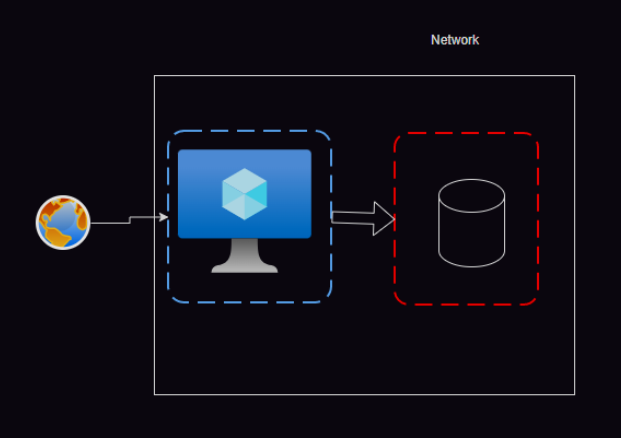
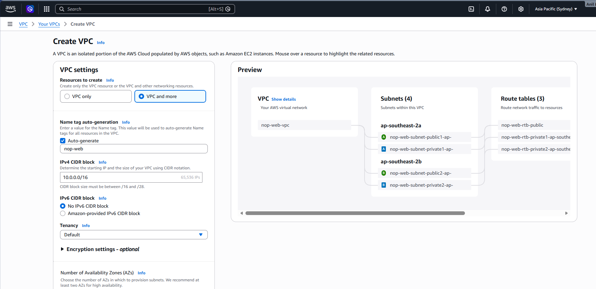
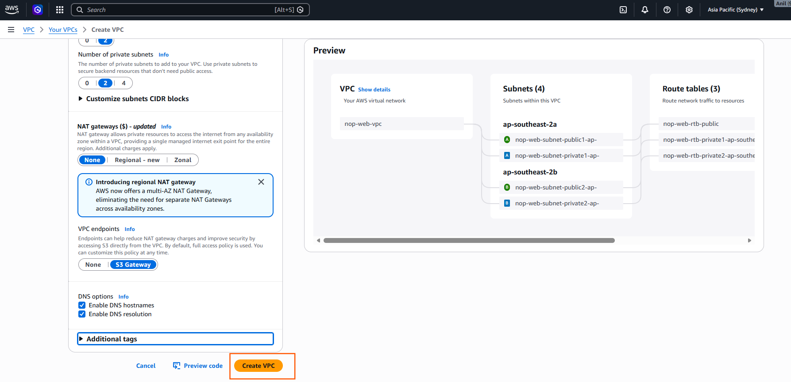
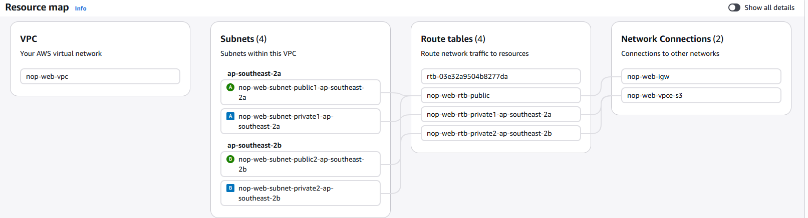
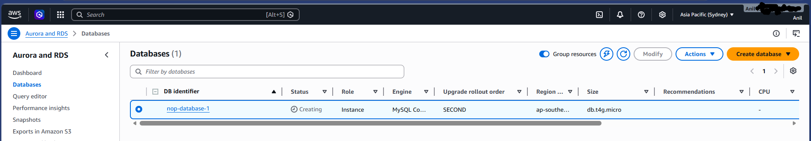
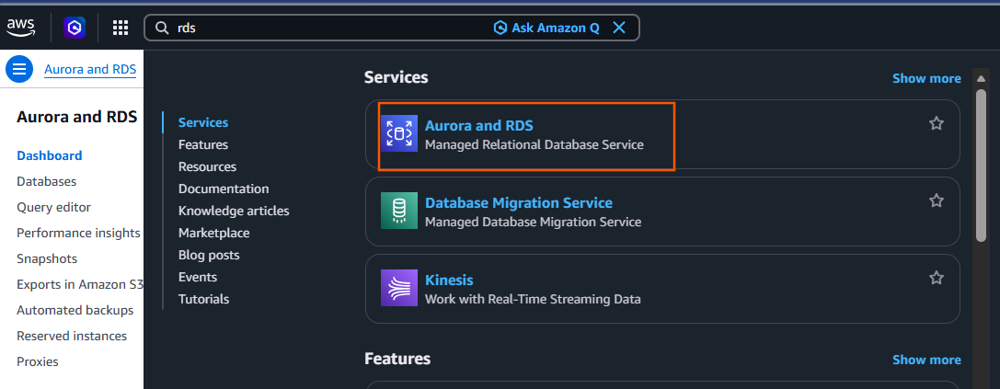

# Platform as a Service

* PaaS = Managed service where cloud handles backend work, and you focus on usage.
* In PaaS like AWS RDS, the cloud provider manages infrastructure, OS, and database setup, while we only focus on using the database. This reduces operational overhead and improves reliability
* In real projects, we prefer RDS over self-managed DB because it provides automated backups, high availability, and easy scaling

1.  First understand the problem

    * Before cloud (old way), if you want a database:
    * You had to do EVERYTHING manually:
        * Create a server (VM)
        * Install OS (Linux/Windows)
        * Install database (MySQL, etc.)
        * Configure it
        * Take backups
        * Handle crashes
        * Update patches

    * This takes time + effort + risk

2. What PaaS solves
    * PaaS says: You don’t worry about servers. I will manage everything. You just use the service.

    * Lets evaluate Platform as a Service w.r.t Databases

* __AWS__: 
    * Offers mysql, postgres, microsoft sql server, oracle and IBM DB2 as a service

    * AWS calls this service as RDS (Relational Database services)

    * What happens when you create RDS?
        * When you click “Create Database” in AWS:
        * Behind the scenes AWS does:
            * Creates server (VM)
            * Installs OS
            * Installs database (MySQL/Postgres etc.)
            * Configures it
            * Sets up backup
            * Enables monitoring
            * Prepares scaling
            * All automatically
        
        * What YOU see
            * Endpoint (like URL)
            * Username/password
            * You connect and start using DB

    * Free tier

* Azure 
    * We restrict database access using private endpoints and network security groups instead of exposing it publicly
    * Azure PaaS databases are fully managed and should always be deployed in a private network for security
    * Azure also gives managed database services (PaaS) like AWS RDS.
        * Azure supports:
            * MySQL
            * PostgreSQL
            * Microsoft SQL Server
        * Azure has different names:
            * Azure SQL Database → for Microsoft SQL Server
            * Azure Database for MySQL
            * Azure Database for PostgreSQL
        * All of these are PaaS services and Azure does for you Same like AWS RDS. 

    * Database and Networks

* Steps:
    * Ensure network is present, if not create it
    * AWS by default in every region have one network created where as azure has no default networks

* AWS Screen shots
* VPC and security group

 
* Create mysql Datbase

* create same as in azure cloud also for practice

# BCDR ( Business continuity and Disaster Recovery) 
   * Think of a website or application as a shop.
       * Business Continuity (BC) means: 
           *  How can we keep the business running even if something goes wrong?
           * Example: 
                * Your website is running.
                * One server fails
                * Customers should still be able to use the website.
       
       * Disaster Recovery (DR) means: 
          * How can we recover after a major problem or disaster?
          * Examples:
                * Server crashes
                * Data center catches fire
                * Database gets corrupted 
          * The goal is to restore the application and data as quickly as possible.
* 
* Single Point of Failure (SPOF) Running stuff on one server
* To avoid SPOF we have two options
    * backups: it is a cheaper solution but will lead to downtime while restore.
    * redundant servers: Have primary and secondary servers
* Here are simple one-line definitions:

* **BCDR (Business Continuity and Disaster Recovery):** A strategy to keep a business running during problems and recover quickly after a disaster.
* **SPOF (Single Point of Failure):** A component whose failure can cause the entire system to stop working.
* **Backup:** A copy of data or systems used to restore services after a failure, though it may cause downtime.
* **Redundant Servers:** Additional servers that take over when the main server fails, reducing downtime.
* **Active-Passive:** One server handles traffic while a standby server waits to take over if the main server fails.
* **Active-Active:** Multiple servers handle traffic simultaneously, so if one fails, the others continue serving users without interruption.
* **Failover:** The automatic switching from a failed server to a backup server.
* **Downtime:** The period during which a system or service is unavailable to users.

