# IaaS offerings to run Virtual Machines

* All clouds offer virtual machines as a service
    * AWS
        * EC2 Machine (Elastic Compute Cloud)
        * Azure: Virtual Machine
        * GCP: Compute Engine
    * A Virtual Machine is a software-based computer that behaves like a physical server.
---

* ## 2. Hypervisors
    * All cloud providers use a **Hypervisor** to create and manage Virtual Machines.
* ### What is a Hypervisor?
    * A hypervisor is software that allows multiple virtual machines to run on a single physical server.
    * ### Example
```text
Physical Server
│
├── VM 1 (Ubuntu)
├── VM 2 (Windows)
└── VM 3 (CentOS)
```
* The hypervisor manages CPU, memory, storage, and networking for each VM.

## 3. Selecting an Operating System
* When creating a VM, you must choose an **Image**.
* ### What is an Image?
* An image is a pre-configured snapshot of a disk containing an operating system.
### Examples
- Ubuntu 24.04
- Ubuntu 22.04
- Red Hat Enterprise Linux
- CentOS
- Windows Server

```text
Image = Operating System + Preconfigured Files
```
* The selected image determines the OS installed on the VM.

* ## 4. Authentication Methods

Cloud providers allow you to configure login credentials while creating a VM.

### Option 1: Username and Password

```text
Username: ubuntu
Password: ********
```

### Option 2: Key-Based Authentication (Recommended)

More secure than passwords.

#### Components

**Private Key**
- Stored securely by the user.
- Used to connect to the VM.
- Never share it.

**Public Key**
- Stored by the cloud provider or placed on the VM.
- Used to verify the private key.

```text
Your Laptop
    │
    ├── Private Key (.pem)
    │
Cloud VM
    │
    └── Public Key
```

### SSH Login Example

```bash
ssh -i mykey.pem ubuntu@<public-ip>
```

---

## 5. Machine Size

When creating a VM, you must select the machine size.

This determines:

- CPU (vCPUs)
- RAM (Memory)

### Example

| Instance Type | CPU | RAM |
|--------------|-----|-----|
| t2.micro | 1 vCPU | 1 GB |
| t3.small | 2 vCPU | 2 GB |

Larger workloads require more CPU and memory.

---

## 6. Disk Size

Every VM needs storage.

You can choose the disk size during VM creation.

### Examples

- 8 GB
- 20 GB
- 50 GB
- 100 GB

The disk stores:

- Operating System
- Applications
- Logs
- User Data

---

## 7. Networking

A VM must be connected to a network to communicate with other systems.

Networking configuration includes:

- VPC / Virtual Network
- Subnet
- IP Addresses
- Security Rules

---

## 8. Public IP Address

A Public IP allows access to the VM from the internet.

### Example

```text
54.123.45.67
```

Used for:

- SSH access
- Web applications
- Public services

---

## 9. Private IP Address

A Private IP is used for internal communication within the cloud network.

### Example

```text
172.31.10.5
```

Used for:

- Database connections
- Internal services
- Communication between servers

Private IPs are not accessible from the internet.

---

## 10. Final Result

After configuring:

- Operating System Image
- Credentials
- CPU and RAM
- Disk Size
- Network Settings
- Public and Private IPs

The cloud provider creates a Virtual Machine for you.

```text
Cloud Provider
      │
      ▼
+------------------+
| Virtual Machine  |
|------------------|
| Ubuntu OS        |
| CPU & RAM        |
| Storage          |
| Public IP        |
| Private IP       |
+------------------+
```
---

# Creating an Ubuntu 24.04 EC2 Instance in AWS (Free Tier)

## Goal

Create an Ubuntu 24.04 Virtual Machine (EC2 Instance) in AWS and connect to it securely using SSH.

---

# Step 1: Create a Network (VPC)

## What is a VPC?

A VPC (Virtual Private Cloud) is your private network inside AWS.

Think of it as a virtual data center where all your servers will run.

```text
AWS Account
    │
    ▼
+------------------+
|      VPC         |
|                  |
|  EC2 Instances   |
|  Databases       |
|  Load Balancers  |
+------------------+
```

### Why do we need it?

Every EC2 instance must be launched inside a network.

### Note

AWS usually creates a **Default VPC** automatically.

If a VPC already exists, you can use it.

---

# Step 2: Create a Key Pair

## What is a Key Pair?

A key pair is used for secure login to your Linux server.

It consists of:

### Private Key

* Downloaded to your computer.
* Kept secret.
* Used while connecting to the server.

Example:

```text
my-key.pem
```

### Public Key

* Stored by AWS on the EC2 instance.
* Used to verify your private key.

```text
Your Laptop                     AWS EC2
-------------                   --------
Private Key (.pem)  <------->   Public Key
```

### Why is it needed?

Instead of entering a password, AWS uses SSH key authentication.

### Important

Never share your `.pem` file.

---

# Step 3: Select the Instance Size

## What is Instance Size?

Instance size determines:

* CPU
* RAM

### Free Tier Example

```text
t2.micro
```

or

```text
t3.micro
```

Typical resources:

* 1 vCPU
* 1 GB RAM

### Why choose carefully?

More CPU and RAM = Higher cost.

For learning purposes, Free Tier instances are sufficient.

---

# Step 4: Select a Subnet

## What is a Subnet?

A subnet is a smaller network inside a VPC.

Example:

```text
VPC
│
├── Public Subnet
│
└── Private Subnet
```

### Public Subnet

Servers can receive internet traffic.

Example:

* Web Servers
* Bastion Hosts

### Private Subnet

Servers are hidden from the internet.

Example:

* Databases
* Internal Services

### For Learning

Choose a Public Subnet so you can connect from your laptop.

---

# Step 5: Create Security Fencing (Security Group)

## What is a Security Group?

A Security Group acts like a firewall.

It controls:

* Who can access your server
* Which ports are open

### Example Rules

| Port | Protocol | Purpose         |
| ---- | -------- | --------------- |
| 22   | SSH      | Remote Login    |
| 80   | HTTP     | Websites        |
| 443  | HTTPS    | Secure Websites |

### Minimum Rule for Linux Access

```text
Port: 22
Protocol: TCP
Source: Your IP Address
```

### Why is it important?

Without opening Port 22, SSH connection will fail.

---

# Step 6: Launch the EC2 Instance

AWS now creates:

* Virtual Machine
* Disk
* Network Interface
* Security Configuration

The selected operating system is installed automatically.

Example:

```text
Ubuntu 24.04 LTS
```

---

# Step 7: Understand the Two IP Addresses

After creation, AWS assigns two IPs.

---

## Public IP

Example:

```text
13.234.45.100
```

### Purpose

Used to connect from the internet.

Example:

```bash
ssh -i my-key.pem ubuntu@13.234.45.100
```

Anyone on the internet can reach this IP (if allowed by Security Group).

---

## Private IP

Example:

```text
172.31.10.20
```

### Purpose

Used for communication inside AWS.

Example:

```text
Web Server
    │
    ▼
Database Server
```

Both servers communicate using Private IPs.

Private IPs are not accessible from the internet.

---

# Step 8: Connect to the Server

After the instance is running:

### Set Key Permissions

```bash
chmod 400 my-key.pem
```

### Connect Using SSH

```bash
ssh -i my-key.pem ubuntu@<public-ip>
```

Example:

```bash
ssh -i my-key.pem ubuntu@13.234.45.100
```

### Successful Login

You will see something similar to:

```text
Welcome to Ubuntu 24.04 LTS
ubuntu@ip-172-31-10-20:~$
```

Now you have access to your Linux server.

---

# Summary

1. Create or use an existing VPC.
2. Create a Key Pair and download the private key.
3. Select an EC2 instance size (t2.micro/t3.micro).
4. Choose a Public Subnet.
5. Create a Security Group and allow SSH (Port 22).
6. Launch the Ubuntu 24.04 EC2 instance.
7. Note the Public IP and Private IP.
8. Connect using SSH and the private key.

```text
Laptop
   │
   │ SSH using .pem file
   ▼
Public IP
   │
   ▼
Ubuntu 24.04 EC2 Instance
   │
   ▼
Private IP (Internal AWS Communication)
```
# Excercise 

# Step 1: Create VPC (Buy the Land)

* What is VPC? It's your private piece of land in the cloud where everything else will live.
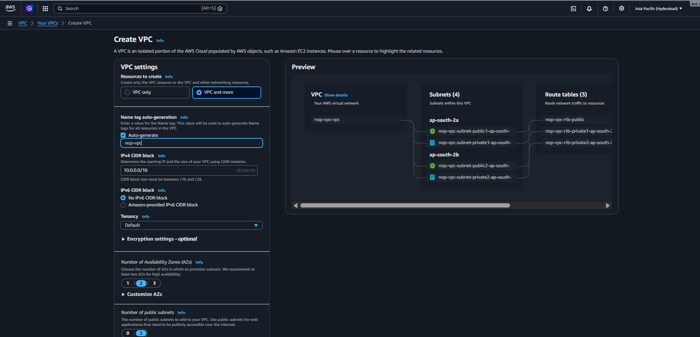
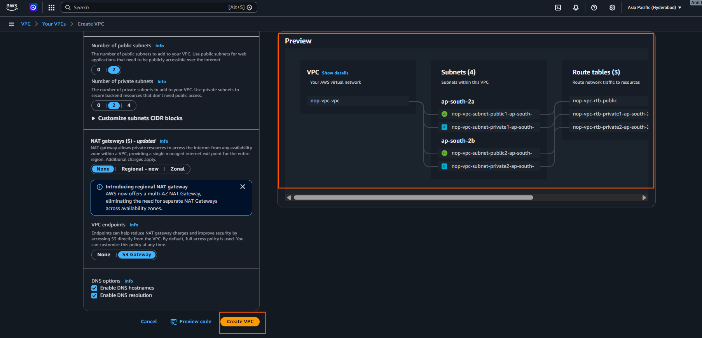
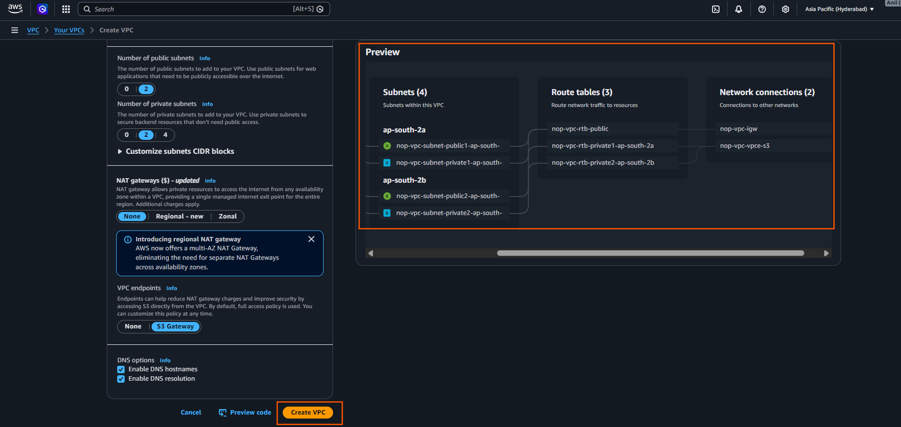

# Step 2: Create Database (Build the Water Tank)

* What is a Database? It's where your data (like user information, messages, products) is stored permanently. We use Amazon RDS (Relational Database Service).

* [Sharding with Amazon Relational Database Service](https://aws.amazon.com/blogs/database/sharding-with-amazon-relational-database-service/)

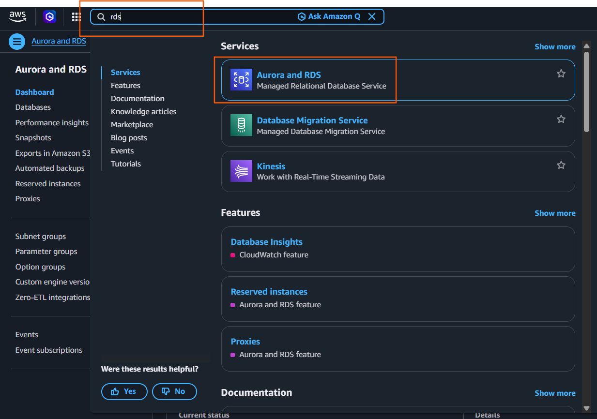
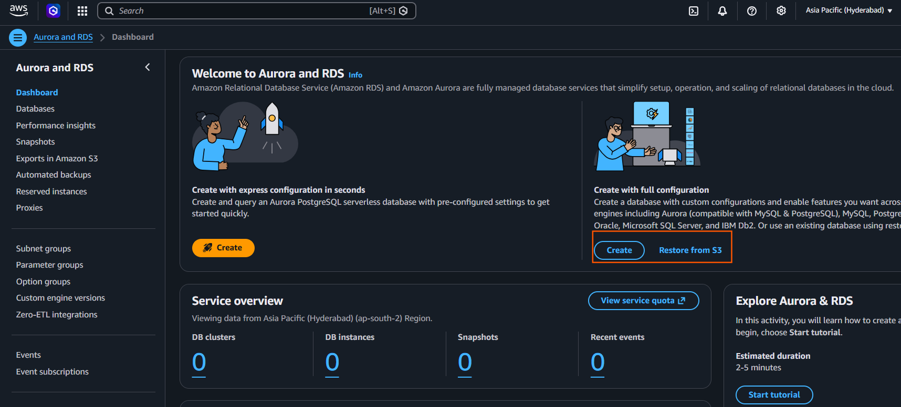
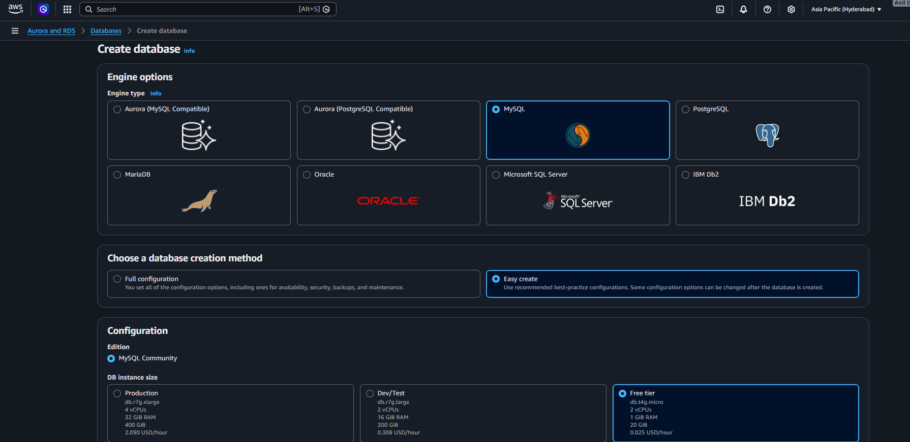
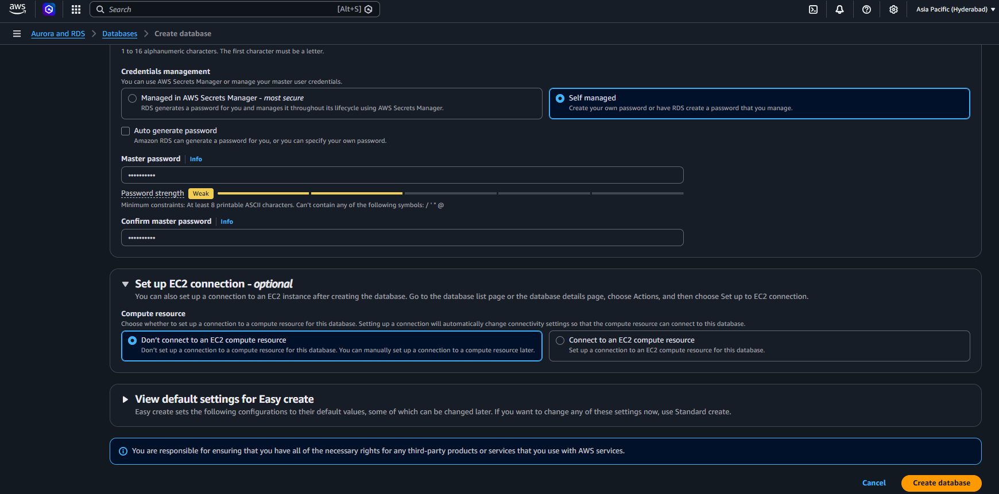

# Step 3: Create Security Group (Build the Gate)
* What is a Security Group? It's like a gate with rules about who can enter. It controls what traffic (data) can come in or go out.
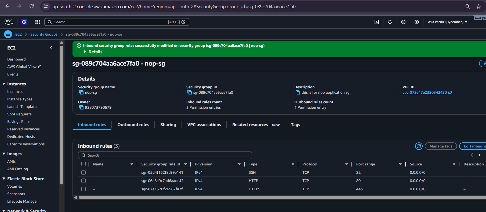

# step 4: create an ec2 instance 
* Amazon EC2 allows you to create virtual machines, or instances, that run on the AWS Cloud. 
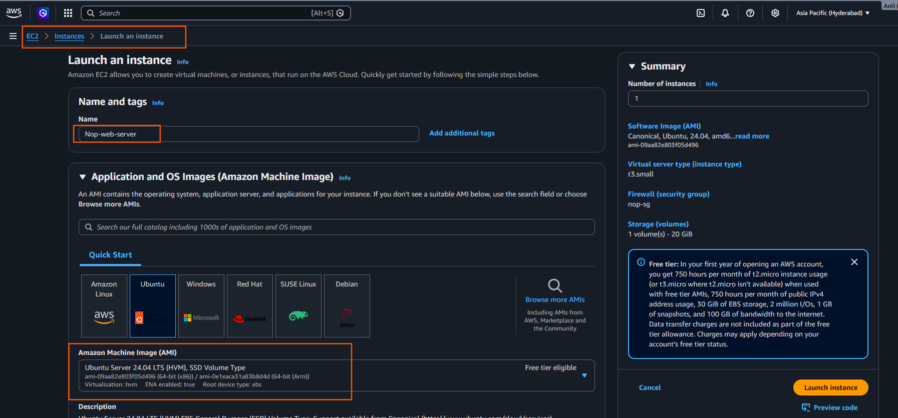
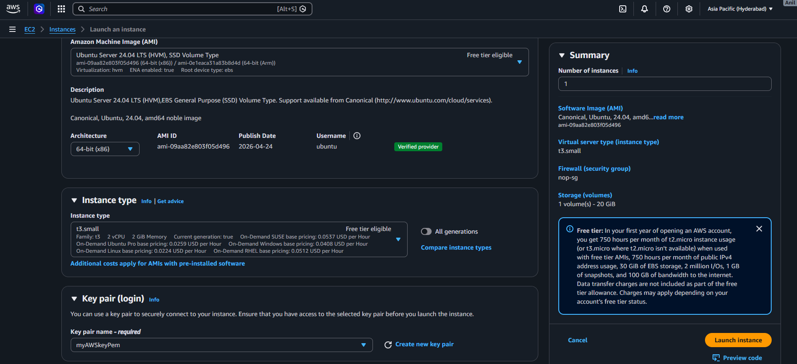
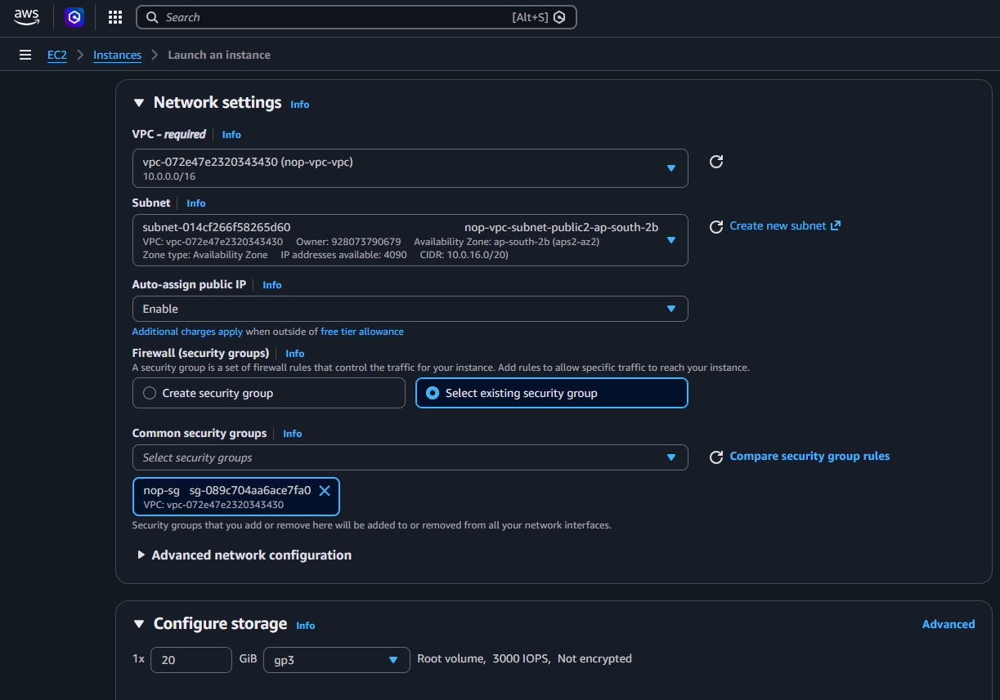
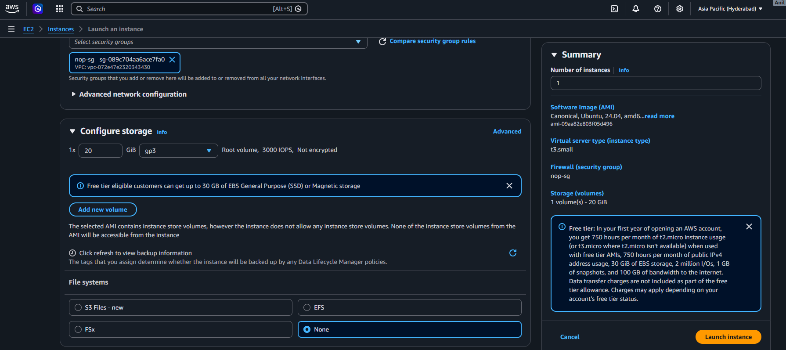
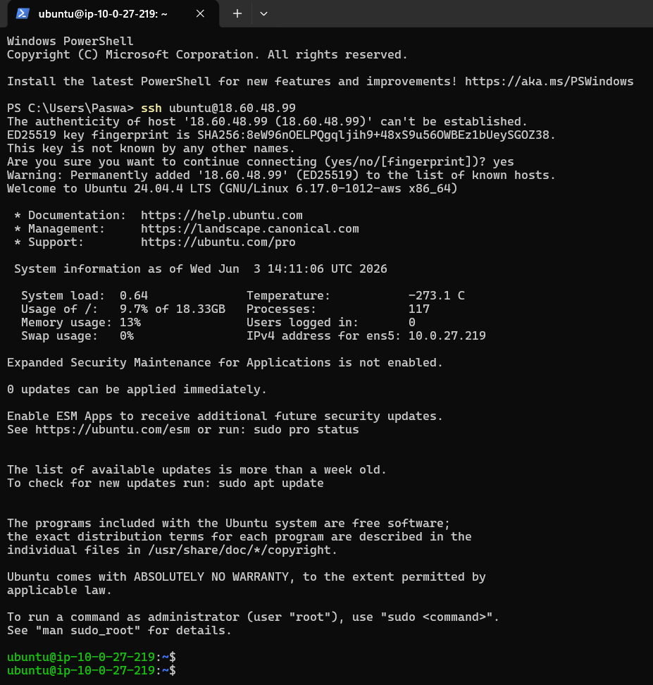

# What does Swap do?
* Think of Swap space as a backup safety net. It converts a small slice of your 20 GB hard drive storage into temporary virtual RAM.
* If the compiler needs 3 GB of memory, it uses your 1.5 GB of real RAM first, and then seamlessly borrows the extra 1.5 GB from the hard drive Swap space. It makes the compilation slightly slower, but it guarantees your build finishes successfully without crashing your server.


* [nopCommerce](https://www.nopcommerce.com/en)

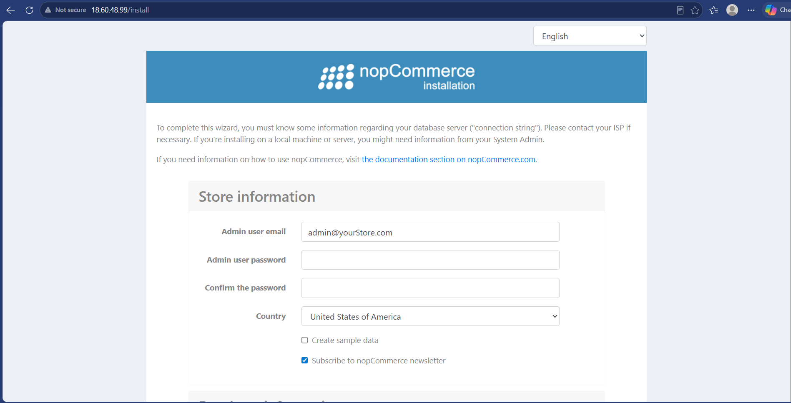
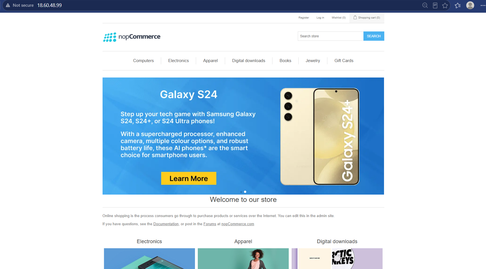

* commands we use 
```text
ubuntu@ip-10-0-27-219:/opt/nop$ history
    1  swapon --show
    2  ls
    3  sudo apt-get update
    4  sudo apt-get install -y aspnetcore-runtime-9.0
    5  dotnet --list-runtimes
    6  sudo adduser nop
    7  whoami
    8  cat /etc/passwd
    9  sudo mkdir -p /opt/nop
   10  sudo chown -R nop:nop /opt/nop/
   11  cd /opt/nop/
   12  sudo wget https://github.com/nopSolutions/nopCommerce/releases/download/release-4.80.1/nopCommerce_4.80.1_NoSource_linux_x64.zip
   13  sudo unzip nopCommerce_4.80.1_NoSource_linux_x64.zip
   14  sudo rm nopCommerce_4.80.1_NoSource_linux_x64.zip
   15  sudo chown -R nop:nop /opt/nop
   16  sudo dotnet Nop.Web.dll --urls="http://0.0.0.0:80"
   17  sudo apt update
   18  sudo apt install git unzip wget apt-transport-https -y
   19  wget https://packages.microsoft.com/config/ubuntu/24.04/packages-microsoft-prod.deb -O packages-microsoft-prod.deb
   20  sudo dpkg -i packages-microsoft-prod.deb
   21  rm packages-microsoft-prod.deb
   22  sudo apt update
   23  sudo apt install -y dotnet-sdk-8.0 aspnetcore-runtime-8.0
   24  dotnet --version
   25  free -m
   26  sudo fallocate -l 3G /swapfile
   27  sudo chmod 600 /swapfile
   28  sudo swapon /swapfile
   29  sudo mkswap /swapfile
   30  sudo swapon /swapfile
   31  echo '/swapfile none swap sw 0 0' | sudo tee -a /etc/fstab
   32  sudo fallocate -l 3G /swapfile && sudo chmod 600 /swapfile && sudo mkswap /swapfile && sudo swapon /swapfile && echo '/swapfile none swap sw 0 0' | sudo tee -a /etc/fstab
   33  swapon --show
   34  cd /opt/nop
   35  sudo dotnet Nop.Web.dll --urls="http://0.0.0.0:80"
   36  history
ubuntu@ip-10-0-27-219:/opt/nop$
```
* To keep the application running continuously even if you close your PowerShell window or disconnect your laptop, you can run it in detached (background) mode.

* Here are the two ways to run it:

* Option 1: Run in the Foreground (To watch logs live)
If you just want to run it normally and see everything print to the screen, use this command:

```text
cd /opt/nop && sudo dotnet Nop.Web.dll --urls="http://0.0.0.0:80"

(Note: If you close your terminal window using this method, the website will stop working.)
```
* Option 2: Run in the Background (Recommended for Labs/Production)

* To run the store so it stays online forever (even after you log out of SSH), use nohup:
```text
cd /opt/nop && sudo nohup dotnet Nop.Web.dll --urls="http://0.0.0.0:80" > /dev/null 2>&1 &
```
* How to stop the background application later:
```text
sudo pkill -f Nop.Web.dll
```

---

# 📝 Project Notes: 2-Tier E-Commerce Architecture Deployment on AWS

## 🗺️ 1. Architecture Overview
We deployed a decoupled, production-ready **2-Tier Web Application Architecture** on Amazon Web Services (AWS):
*   **Web/Compute Tier (Frontend):** An Amazon EC2 instance running Ubuntu Linux hosting the compiled .NET Core **nopCommerce** application framework.
*   **Database Tier (Backend):** A managed Amazon RDS instance running **MySQL Community Edition** serving as the centralized data store.

---

## 🛠️ 2. Step-by-Step Implementation

### Step 1: Infrastructure Deployment & Access
*   Provisioned an **Amazon EC2 Instance** inside a public subnet to handle incoming web traffic.
*   Provisioned an **Amazon RDS MySQL instance** (`nop-database-server`) inside a private subnet to securely store site data.
*   Established an SSH session via a local PowerShell terminal to interface directly with the EC2 web server command line (`ubuntu@ip-10-0-27-219`).

### Step 2: Hosting Environment Initialization
*   Navigated to the application directory `/opt/nop` on the Linux filesystem where the pre-compiled binaries are stored.
*   Executed the .NET Core runtime to spin up the web engine, binding it to standard HTTP Port 80 using the command:
```bash
    sudo dotnet Nop.Web.dll --urls="[http://0.0.0.0:80](http://0.0.0.0:80)"
    ```
*   Accessed the installation wizard for the first time via the EC2 instance's public IP address: `http://18.60.48.99/install`.

### Step 3: Network Troubleshooting & Security Group Modification
During the initial database configuration link, the web installation wizard threw a network timeout error: 
`Setup failed: Database does not exist or you don't have permissions to connect to it.`

We analyzed the infrastructure components and resolved this issue with two specific administrative fixes:
1.  **Schema Auto-Creation:** Toggled the setup flag **"Create database if it doesn't exist"** to allow the installer to build the container schemas dynamically.
2.  **AWS Security Group Rule Adjustment:** Identified that the RDS database instance was assigned to a restricted `default` security group (`sg-0a81c00d69b3502c7`). We modified its **Inbound Rules** in the AWS RDS Management Console, explicitly adding a rule to allow inbound **MySQL/Aurora traffic over Port 3306** from any IPv4 source (`0.0.0.0/0`).

### Step 4: System Integration & Database Connectivity
With the networking pipeline open, we provided the application wizard with the exact technical parameters of the isolated database layer:
*   **Database Engine:** `MySQL`
*   **Server Name (RDS Endpoint):** `nop-database-server.c542ge2kozl9.ap-south-2.rds.amazonaws.com`
*   **Database Name:** `nopcommerce_db`
*   **SQL Username:** `admin`
*   **SQL Password:** *[*******************************************]*

### Step 5: Data Migration & Production Go-Live
*   Upon clicking **Install**, the application's built-in migration tool (`FluentMigrator`) initiated an internal transaction over the newly cleared network pipeline.
*   The system successfully processed SQL data definition scripts (creating essential structural tables like `PayPalToken`, `FacebookPixelConfiguration`, `TaxRate`, and `StorePickupPoint`) along with foundational demo datasets.
*   The installation completed successfully, shifting the runtime environment into a live production status (`Application started. Press Ctrl+C to shut down.`).
*   The finished storefront went fully operational over the internet at `http://18.60.48.99`.

---

## 🚀 3. Core Commands Reference Guide

### Run Application in the Foreground (Logs Visible)
Use this command to check errors in real-time. Closing your terminal session will turn off the web server:
```bash
cd /opt/nop && sudo dotnet Nop.Web.dll --urls="[http://0.0.0.0:80](http://0.0.0.0:80)"
---

## Run Application in the Background (Persistent Production)
```text 
cd /opt/nop && sudo nohup dotnet Nop.Web.dll --urls="[http://0.0.0.0:80](http://0.0.0.0:80)" > /dev/null 2>&1 &
```
---
----------------------------------------------------------------------------------------------------------------------------------
---
# 2nd way to deploy application 
---


# 📝 Lab Notes: IaaS Virtual Machines & Automated nopCommerce Deployment

## 🗺️ 1. Theoretical Concepts: Infrastructure as a Service (IaaS)

### Virtual Machines in the Cloud
All major cloud providers offer Virtual Machines (VMs) as a core IaaS service under different naming conventions:
* **AWS:** Elastic Compute Cloud (EC2)
* **Azure:** Virtual Machines
* **GCP:** Compute Engine

### Core Components Required to Provision a Cloud VM
1.  **Hypervisor:** The underlying virtualization software used by cloud providers to split physical hardware into virtual instances.
2.  **Operating System Image:** A snapshot of a pre-configured disk (e.g., Ubuntu 24.04 LTS distribution) used to boot the machine.
3.  **Authentication Mechanism:** Cloud instances use **Key-Based Authentication** to secure remote access:
    * **Public Key:** Stored securely by the cloud provider (AWS/Azure) inside the VM.
    * **Private Key:** Downloaded and kept locally by the user to sign into the machine.
4.  **Compute Capacity (Sizing):** Choosing the allocation size of CPU and RAM based on workloads.
5.  **Storage:** Allocation of a specific virtual root disk size.
6.  **Network Architecture:** Provisioning an isolated layout that assigns two distinct IP addresses:
    * **Public IP:** Used to route traffic from the external internet to your machine.
    * **Private IP:** Used for internal communication inside the cloud provider's network.

---

## 🛠️ 2. Step-by-Step Implementation Guide

### Phase A: AWS EC2 Provisioning Checklist
1.  Create a network infrastructure (VPC/Subnet) if it does not already exist.
2.  Generate an AWS Key Pair, downloading and saving the private key securely on your local computer.
3.  Select the machine instance sizing (e.g., AWS Free Tier eligible shapes).
4.  Choose the specific subnet zone where the virtual machine should execute.
5.  Configure a **Security Group** acting as a firewall fence to govern inbound and outbound ports.

---

### Phase B: Host Pre-requisites & Package Installation

#### 1. Add .NET 9 Backports Repository & Install the SDK
nopCommerce requires the modern .NET runtime environment. Add the official backport repository, update packages, and install the complete .NET 9.0 SDK using:
```bash
sudo add-apt-repository ppa:dotnet/backports -y
sudo apt-get update
sudo apt-get install -y dotnet-sdk-9.0
```
2. Verify the .NET Installation

* Confirm the framework runtime is present on the machine:
```bash
dotnet --list-runtimes
```

* Phase C: Dedicated User & Directory Setup
1. Isolate Application Execution Permissions
For production security, do not run application code under the default root or ubuntu user. Create a dedicated system user group named nop:

```bash
sudo adduser nop
```
2. Create the Application Directory
Generate the explicit target application folder structure under the system binaries storage tree:
```bash
sudo mkdir /opt/nop
cd /opt/nop
```

3. Download and Unzip nopCommerce Binaries

* Retrieve the compiled distribution bundle directly from the official source release repository, install the unzip package manager tool, and extract the content:

```bash
sudo wget [https://github.com/nopSolutions/nopCommerce/releases/download/release-4.80.1/nopCommerce_4.80.1_NoSource_linux_x64.zip](https://github.com/nopSolutions/nopCommerce/releases/download/release-4.80.1/nopCommerce_4.80.1_NoSource_linux_x64.zip)
sudo apt-get install unzip -y
sudo unzip nopCommerce_4.80.1_NoSource_linux_x64.zip
```
4. Setup Supporting Directories & Update File Permissions
Generate the explicit bin and logs file folders required by the engine, then recursively transfer ownership of the entire directory tree to the newly created nop service user:

```bash
sudo mkdir bin logs
cd ..
sudo chgrp -R nop nop/
sudo chown -R nop nop/
```

Phase D: Background Automation (Systemd Linux Service)
To prevent the web application from stopping when you close your terminal session, configure it as a background system engine managed automatically by Linux.

* 1. Create the Service Definition Configuration File
Open and write the following profile properties inside 
`/etc/systemd/system/nopCommerce.service:`
```bash
[Unit]
Description=Example nopCommerce app running on Xubuntu

[Service]
WorkingDirectory=/opt/nop
ExecStart=/usr/bin/dotnet /opt/nop/Nop.Web.dll --urls [http://0.0.0.0:5000](http://0.0.0.0:5000)
Restart=always
# Restart service after 10 seconds if the dotnet service crashes:
RestartSec=10
KillSignal=SIGINT
SyslogIdentifier=nopCommerce-example
User=nop
Environment=ASPNETCORE_ENVIRONMENT=Production
Environment=DOTNET_PRINT_TELEMETRY_MESSAGE=false

[Install]
WantedBy=multi-user.target
```
2. Activate and Initialize the System Service
Instruct the Linux system daemon engine to reload its configuration profiles, enable the app service to start automatically during boot cycles, and run the site immediately:
```bash
sudo systemctl daemon-reload
sudo systemctl enable nopCommerce.service
sudo systemctl start nopCommerce.service
```
3. Verify Operational Service Runtime Status
```bash
sudo systemctl status nopCommerce.service
```

4. Troubleshooting & Fallback Controls

If the automated background service experiences failures during initialization, manually execute the compiled application binary assembly straight within the foreground terminal pool to view error codes live:

```bash
cd /opt/nop
sudo dotnet Nop.Web.dll --urls "[http://0.0.0.0:5000](http://0.0.0.0:5000)"
```
---

---

# 📊 Architectural Comparison: Our Deployment vs. Tutor's Deployment

The differences between the deployment method executed in our lab session and the layout outlined by your tutor come down to three major structural elements: **Database Isolation**, **Process Lifecycle Management**, and **Network Binding**.

---

## 🗄️ 1. Database Location (2-Tier Decoupled vs. 1-Tier All-in-One)

### Our Method: 2-Tier Decoupled Architecture
* **How it works:** The frontend compute framework was hosted on an **EC2 instance**, while the persistent data engine was hosted on a completely separate, dedicated **Amazon RDS managed database**.
* **Infrastructure Impact:** This method mirrors enterprise production standards. If the web server runs out of memory or crashes due to high traffic, the customer data store remains completely safe and isolated.
* **Networking Requirements:** Because data must travel across two different servers, we had to manually modify the AWS RDS **Security Group Inbound Rules** to open **Port 3306** (MySQL), creating a secure network bridge between the tiers.

### Your Tutor's Method: 1-Tier Architecture Baseline
* **How it works:** The tutor’s workspace profile is designed around a single-machine paradigm. The frontend application files and the target database system are intended to live inside the *same* virtual host machine.
* **Infrastructure Impact:** Excellent for rapid local prototyping and reducing cloud costs during development, but introduces a single point of failure (if the server crashes, the database goes down with it).
* **Networking Requirements:** Minimal network configuration is needed for the database layer because all traffic routes internally via localhost loopbacks (`127.0.0.1`).

---

## ⚙️ 2. Process Lifecycle Management (Manual vs. Automated)

### Our Method: Manual Foreground Process
* **Command used:** `sudo dotnet Nop.Web.dll --urls="http://0.0.0.0:80"`
* **Behavior:** The application binds directly to the active SSH terminal shell session. 
* **Pros/Cons:** It is highly useful for diagnostic analysis because you can watch the raw data migrations and connection queries stream across the screen in real-time. However, the execution lifecycle is bound to your user session; closing your terminal or disconnecting your laptop immediately terminates the website process.

### Your Tutor's Method: Automated Systemd Background Daemon
* **Mechanism used:** Linux `systemd` service manager via `/etc/systemd/system/nopCommerce.service`.
* **Behavior:** The application runs as an isolated system daemon in the background, completely detached from human interaction.
* **Pros/Cons:** Production-grade management. The website boots automatically if the underlying EC2 server restarts. Furthermore, if the code experiences a fatal crash, the `RestartSec=10` policy instructs Linux to automatically self-heal and spin the server back up after 10 seconds without human intervention.

---

## 🌐 3. Network Port Binding (Standard HTTP Port 80 vs. Custom Dev Port 5000)

### Our Method: Global Web Port 80
* **Configuration:** Bound via `--urls "http://0.0.0.0:80"`
* **User Experience:** Port 80 is the designated global protocol port for unencrypted HTTP web traffic. Because web browsers query this port by default, users can access your storefront instantly by typing just the raw public IP address (`http://18.60.48.99`) into their URL bar.

### Your Tutor's Method: Development Port 5000
* **Configuration:** Bound via `ExecStart=/usr/bin/dotnet ... --urls http://0.0.0.0:5000`
* **User Experience:** Port 5000 is the standard default development/testing port for Microsoft .NET Core applications. To view a site hosted on this architecture directly over the internet, a user must explicitly specify the port token in their browser address bar (e.g., `http://18.60.48.99:5000`). 

---

## 📋 4. Direct Comparison Matrix

| Operational Feature | Our Lab Deployment | Your Tutor's Deployment |
| :--- | :--- | :--- |
| **Architectural Model** | **2-Tier Decoupled** | **1-Tier All-in-One** |
| **Compute Layer** | Amazon EC2 (Ubuntu 24.04) | Amazon EC2 (Ubuntu 24.04) |
| **Data Layer Location** | External Managed Amazon RDS Instance | Internal Local Machine System Storage |
| **Network Security Requirements** | Requires opening Inbound Port 3306 on RDS | Restricted to local loopback interfaces |
| **Process Lifecycle** | Foreground execution (bound to SSH window) | Background system service daemon (`systemd`) |
| **Self-Healing Capabilities** | Manual recovery required if app crashes | Automated restart scripts trigger every 10s |
| **Public Routing Port** | **Port 80** (Standard Web Address) | **Port 5000** (Explicit Dev Port String Required) |
| **Primary Use Case** | Highly available production scale environments | Fast environment prototyping and local labs |
---


