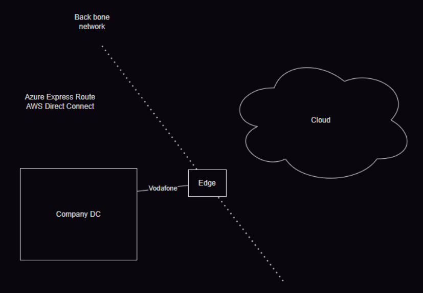

# Cloud Deployment Models, Hybrid Architectures, and Enterprise Case Studies

## 1. Before we deploy an application, we have to choose where our physical hardware lives. There are three primary types of cloud deployment models:

### A. Public Cloud
*   **The Analogy:** Think of this like renting an apartment in a massive high-rise building.
*   **How it works:** The physical hardware (servers, cooling, building) is entirely owned and operated by a **Cloud Service Provider (CSP)** like Amazon (AWS), Microsoft (Azure), or Google (GCP).
*   **Key Concept:** The resources inside your account belong to you, but you are sharing the physical host machine with other customers (multi-tenancy). You pay only for what you use.

### B. Private Cloud
*  **The Analogy:** This is like owning your own standalone house.
*   **How it works:** Both the physical hardware and the virtual software applications are completely owned, isolated, and operated by a single enterprise.
*   **Key Concept:** This is heavily used by banks or healthcare companies who need absolute, total control over their data infrastructure for legal and security compliance.

### C. Community Cloud
*   **How it works:** A shared cloud space built for a specific group of organizations that have the exact same compliance rules.
*   **Prime Example:** **Gov-Cloud**. This is an isolated cloud region restricted strictly to government agencies (like military or federal systems) and certified contractors.

## 2. Hybrid Cloud Environments: Connecting the Old with the New

Most large companies don't put everything in the public cloud on day one. Instead, they use a **Hybrid Cloud**, which is a smart mix of **Public Cloud** and **On-Premises (your own physical data center)**.

### Why use a Hybrid Cloud? (Core Use Cases)
1.  **Data Sovereignty:** You keep super sensitive customer data locked away on-premises inside your private servers, but you use the public cloud to run your fast, scalable consumer website.
2.  **BCDR (Business Continuity & Disaster Recovery):** You run your business out of your local data center every day. However, if an earthquake or power outage hits your building, the Public Cloud acts as an automated backup site to keep your company online.
3.  **Identity Management:** Linking your local office login systems (like Active Directory) seamlessly with software platforms like Microsoft Office 365 or Google Workspace.
4.  **VDI (Virtual Desktop Infrastructure):** Streaming high-performance virtual desktop environments directly from the cloud to remote employees working on low-spec laptops at home.

###  How do we link them together? (Connectivity Strategies)
To make your on-premises servers talk to your cloud servers, you have two routing paths:
*   **Over the Internet (VPN):** You create an encrypted, secure tunnel over the public internet lines. This is highly affordable but can experience speed bumps depending on public web traffic.
*   **Without the Internet (Dedicated Private Lines):** You pay a telecom company to lay a direct, physical fiber-optic cable from your building straight into the AWS or Azure data center.
    *   *AWS calls this:* **Direct Connect**
    *   *Azure calls this:* **ExpressRoute**

---

## 3. Case Study Analysis: Pinterest’s Massive Migration

Let’s look at a real-world scenario. When **Pinterest** launched in 2010, they ran everything out of traditional on-premises hardware. As they grew into a massive visual discovery engine, they hit a giant brick wall.

### The Technical Challenges
*   **Storage Chaos:** Users were uploading millions of heavy images and videos every hour.
*   **Unpredictable Traffic:** They couldn't predict when a post would go viral. If traffic spiked by 500% in one afternoon, their physical on-premises servers would crash because they couldn't buy and plug in new hardware fast enough.
*   **Heavy Compute:** They needed to run complex machine learning formulas to recommend relevant pins to users.

### 🛠️ The AWS Solution Architecture
Pinterest moved everything to Amazon Web Services (AWS) using these key tools:
1.  **Amazon EC2 + Auto Scaling:** They replaced their physical servers with virtual EC2 instances. With Auto Scaling enabled, if millions of users log on at 8:00 PM, AWS automatically spawns new servers to handle the load, and deletes them at midnight when users go to sleep to save money.
2.  **Amazon S3:** They offloaded all images and videos into S3 object storage, which scales infinitely and guarantees your media will never be lost.
3.  **Amazon DynamoDB:** A high-speed, NoSQL database used to store text data (user comments, posts, and pin links) that can load information in milliseconds.
4.  **Amazon EMR (Elastic MapReduce):** A big data processing tool used to analyze user behavior and power features like **Pinterest Lens** (where you snap a picture with your phone camera, and AI instantly finds similar items).

---

## 4. Case Study Analysis: C.H. Robinson (AI Email Automation)

**C.H. Robinson** is a massive global supply chain and logistics company. They faced an efficiency problem: workers were spending hours every day manually reading and replying to thousands of customer emails asking, *"Where is my order? Can you track it?"*

### 🛠️ The Azure OpenAI Solution
They automated this entire workflow by building an AI pipeline in Microsoft Azure:
1.  **Email Receipt:** An automated script intercepts customer emails.
2.  **Classification & Storage:** The system determines the intent of the email, extracts the order details, and saves this metadata into **Azure Cosmos DB** (Azure's ultra-fast, globally distributed NoSQL database).
3.  **The AI Agent:** The tracking data is passed to an **Azure OpenAI Service Agent**. The AI safely reads the customer's question, securely queries the internal tracking systems to find the shipment's current coordinates, summarizes the delivery time, and drafts and sends a professional email response back to the client in seconds.

---

## 5. Critical Thinking Classroom Exercises

Let’s evaluate two famous infrastructure reversals that every cloud engineer needs to study.

### Question 1: Why did Amazon Prime Video move away from Serverless and go BACK to standard EC2 Virtual Machines?
*   **The Background:** Prime Video built a tool to monitor video stream quality for customers. They originally used a "Serverless" architecture (**AWS Step Functions** and **AWS Lambda**).
*   **The Problem:** Serverless is amazing for short, occasional tasks (like running code only when someone uploads a file). But Prime Video was running continuous, heavy media streams 24 hours a day, 7 days a week. Because AWS charges you for every micro-transaction in serverless orchestration, Prime Video's bills skyrocketed, and they hit strict data scaling limits.
*   **The Fix:** They pulled their code out of serverless and re-compiled it into a consolidated application running continuously on permanent **Amazon EC2 instances**. By owning the server execution space completely, they eliminated the massive transactional step-function fees and slashed their infrastructure costs by **up to 90%**!

### Question 2: Post-Elon Musk takeover, why did Twitter (X) shift mostly back to On-Premises data centers?
*   **The Background:** Twitter previously spent millions of dollars renting compute and storage resources inside Google Cloud and AWS. After the buyout, they migrated the vast majority of their primary systems back onto bare-metal, on-premises corporate data centers.
*   **The Engineering Reasons:**
    1.  **Predictable Scale vs. Premium Elasticity:** Public cloud is a premium service designed for *unpredictable* growth. Twitter's traffic is consistently massive and highly predictable. When you are operating at the multi-petabyte scale 24/7, renting hardware from Amazon or Google becomes significantly more expensive than just buying the hard drives and CPU racks yourself.
    2.  **Eliminating Cloud Data Fees:** Public clouds charge heavy penalties called "Data Egress Fees" whenever you move large volumes of data out of their network. By running their own networking switches in private facilities, Twitter avoids paying cloud vendor transit tolls.
    3.  **Custom Hardware Tuning:** They can design custom, bare-metal server configurations optimized explicitly for real-time data streaming feeds, maximizing hardware efficiency down to the chip level.