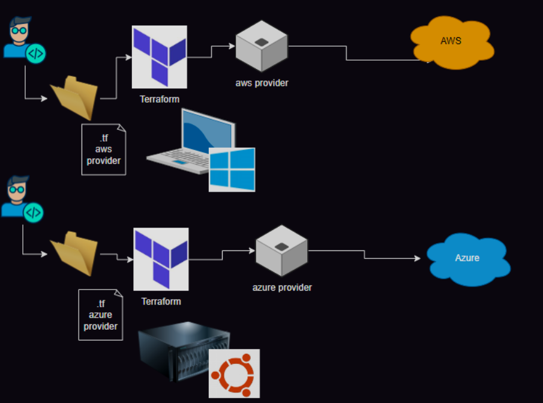
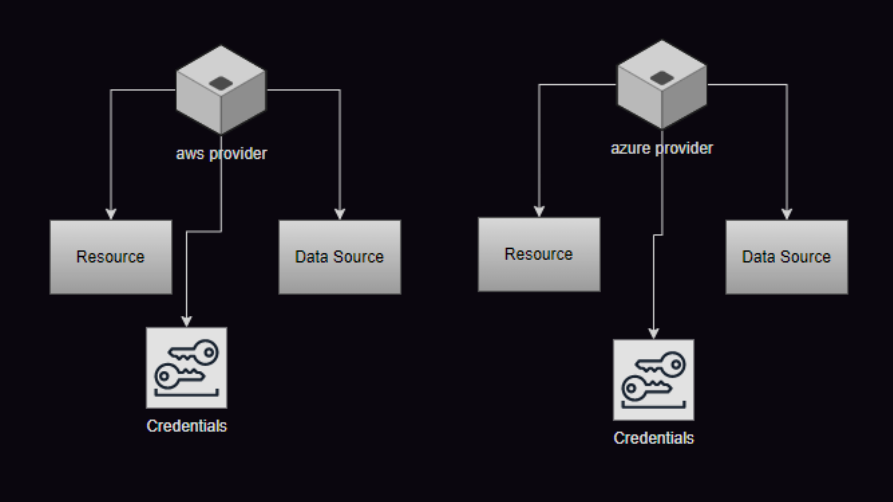
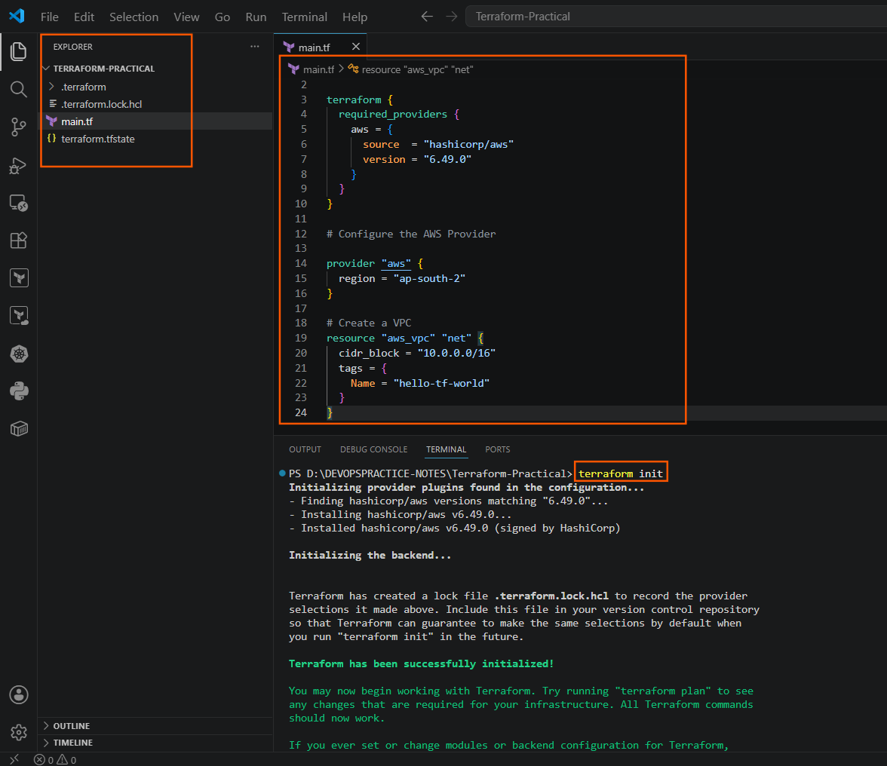
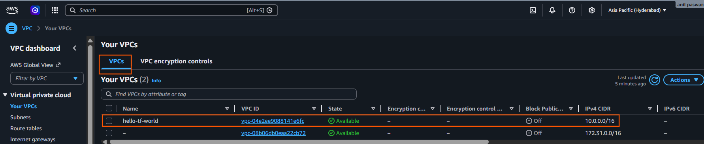
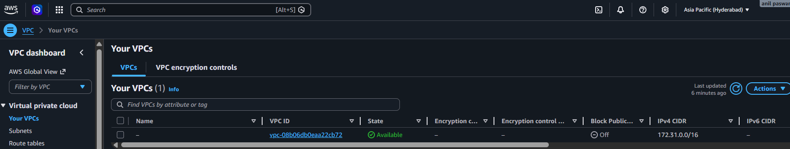
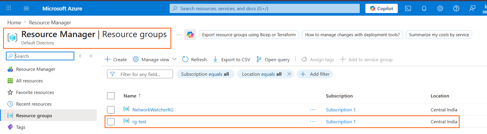
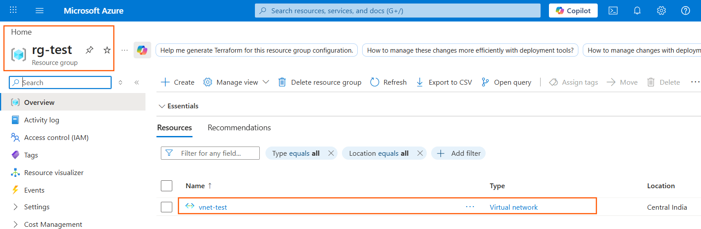
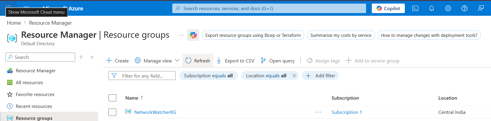

# Infrastructure Provisioning & Getting Started with Terraform

* Hello class! Today we are discussing **Infrastructure Provisioning** and how the industry has shifted away from manual scripting toward **Infrastructure as Code (IaC)**. We will cover the core concepts and write our very first configuration using **Terraform**. Let's get started!

## 1. Understanding Infrastructure Provisioning

When we talk about "infrastructure provisioning," we mean the act of creating, setting up, and preparing IT infrastructure (like virtual machines, networks, and databases) so applications can run.
Historically, engineers had to go into a cloud console and click buttons manually. To automate this, two different programming approaches evolved:                     

### Approach A: Scripting / Procedural (The "How")
*   **Tools used:** AWS CLI, Azure CLI, or custom Python scripts.
*   **The Philosophy:** Focuses entirely on the **steps** required to reach a goal. You have to tell the computer exactly *how* to build it step-by-step.
*   **The Problem:** If a script fails halfway through, or if you run the script a second time, it might try to create duplicate resources or throw an error. It does not understand what already exists.

### Approach B: Infrastructure as Code / Declarative (The "What")
*   **The Philosophy:** Focuses entirely on the **desired state**. You simply state *what* you need (e.g., "I need a VPC with this specific network range"), and the tool figures out how to make it happen.
*   **The Benefit:** It is smart enough to look at your cloud account, realize if the resource already exists, and only make changes if something is missing.

---

##  2. Popular Infrastructure as Code (IaC) Tools

Depending on where you work and what cloud vendor you use, you will encounter different IaC tools:

| Tool Name | Cloud Provider | Language Type | Key Constraint |
| :--- | :--- | :--- | :--- |
| **CloudFormation** | AWS Only | Declarative | Will not work on any other cloud platform. |
| **ARM Templates** | Azure Only | Declarative | Microsoft's legacy JSON-based format. |
| **Bicep** | Azure Only | Declarative | Microsoft's modern, cleaner replacement for ARM templates. |
| **Terraform** | **Multi-Cloud** | Declarative | Works with AWS, Azure, GCP, and even local hypervisors like VMware. |
| **OpenTofu** | **Multi-Cloud** | Declarative | An open-source fork of Terraform created to ensure the tool remains fully open-source. |


---

## 3. Deep Dive into Terraform

Terraform is the industry standard tool for managing multi-cloud setups. Here is what you need to know about its DNA:
*   **Creator:** Developed by a company called **HashiCorp**.
*   **Under the Hood:** Written entirely in **Golang** (Go language).
*   **The Syntax:** Uses a clean, human-readable language called **HCL (HashiCorp Configuration Language)**.

### Core Components of Terraform
1.  **Template:** The configuration file (ending in `.tf`) where you declare what architecture you want.
2.  **Providers:** The plugins that connect Terraform to specific cloud APIs (like AWS, Azure, or Google Cloud). 
3.  **Resources:** The actual infrastructure objects you want to build (like virtual networks, storage buckets, or virtual machines).

# Providers



# Resources


### Critical Terminology
*   **Arguments (Inputs):** These are the configurations you *pass into* a block (e.g., setting the size or name of a resource).
*   **Attributes (Outputs):** These are the properties that the cloud provider *gives back to you* after a resource is made (e.g., an automatically generated IP address or a creation timestamp).

# Installing Terraform
* [for documentation](https://developer.hashicorp.com/terraform/install)

---

## 4. Guided Exercise: Your First "Hello World" Terraform Template

Let's build a real Virtual Private Cloud (VPC) network in AWS using HCL syntax.

### Step 1: Create Your Workspace
Open your laptop terminal, create a brand-new folder for this lab, navigate inside it, and create a file named `main.tf`.

### Step 2: Write the Code
Open `main.tf` in your text editor and copy the following configuration block:

```bash
terraform {
# 1. Define what provider plugins are required to download
  required_providers {
    aws = {
      source  = "hashicorp/aws"
      version = "5.82.2"
    }
  }
}

# 2. Configure the provider and state what region to deploy to
provider "aws" {
  region = "ap-south-1" # Mumbai region
}

# 3. Declare the actual resource you want to create
resource "aws_vpc" "net" {
  cidr_block = "10.10.0.0/16" # Network IP range allocation
  
  tags = {
    Name = "hello-tf"
  }
}

```
* Step 3: Run the Operational Commands
Open your terminal inside that specific project folder and execute the following two commands:

1. Initialize the Directory
```Bash
terraform init
```
What this does: Terraform reads your required_providers block, reaches out to the online registry, and downloads the specific AWS plugin version needed to communicate with the AWS API.

2. Apply and Execute the Blueprint
```Bash
terraform apply
```
What this does: Terraform builds a deployment plan, shows you what it is going to create, and prompts you to type yes. Once confirmed, it sends the request to AWS and builds your network instantly!

# Pro-Tip 
One of the greatest architectural advantages of Terraform is that you can connect to multiple different cloud platforms within the exact same template file. You can declare an aws_vpc and an azure_virtual_network side-by-side, allowing you to orchestrate complex hybrid or multi-cloud network pipelines simultaneously! 

------------------
------------------

# Step 1: Install Required Tools

# 1. Terraform
  * [Install Terraform](https://developer.hashicorp.com/terraform/install)
  * After install, verify: `terrafrom -v`
```bash
choco install terraform --pre 
choco upgrade terraform --pre 
choco uninstall terraform --pre 
```


# 2. AWS CLI Install  
* AWS Command Line Interface v2 (Install) 2.34.64
  * Installing via `choco`
```bash
choco install awscli
choco upgrade awscli
choco uninstall awscli
Check: aws --version
```
# 3. Azure CLI
  * To install Azure CLI, run the following command from the command line or from PowerShell:
```bash
choco install azure-cli
choco upgrade azure-cli
choco uninstall azure-cli
```

# Step 2: Create Cloud Accounts
  * AWS → https://aws.amazon.com/
  * Azure → https://portal.azure.com/

# Step 3: Configure AWS CLI (VERY IMPORTANT)
  * Terraform uses AWS credentials internally.

* Step 3.1: Create Access Key
Go to AWS:
  * IAM → Users → Your user
  * Security Credentials
  * Create Access Key

You’ll get: 
  * Access Key ID and Secret Access Key 
  * paste this into Terminal and configure it 


```bash
aws configure
#Enter
AWS Access Key ID: XXXX
AWS Secret Access Key: XXXX
Region: ap-south-1   (Mumbai recommended)
Output: json
```
* Test AWS Connection 
```bash
aws s3 ls
```
# Step 4: Configure Azure CLI

Step 4.1: Login
  * Run 
```bash
az login
```
Step 4.2: Set Subscription
```bash
az account set --subscription "Your-Subscription-Name"
#chech 
az account show 
```

# Step 5: First Terraform Project (AWS Example)

* Create a folder:
```bash
mkdir terraform-Practical
cd terraform-Practical
```
# Create file: in terminal
```bash
new-Item main.tf
main.tf
```
# then do 
* `code .` to open vs code 

```sh

terraform {
  required_providers {
    aws = {
      source  = "hashicorp/aws"
      version = "6.49.0"
    }
  }
}

# Configure the AWS Provider

provider "aws" {
  region = "ap-south-2"
}

# Create a VPC 
resource "aws_vpc" "net" {
  cidr_block = "10.0.0.0/16"
  tags = {
    Name = "hello-tf-world"
  }
}
```
*  ***what we did see below***
```sh
PS D:\DEVOPSPRACTICE-NOTES\Terraform-Practical> terraform init
Initializing provider plugins found in the configuration...
- Finding hashicorp/aws versions matching "6.49.0"...
- Installing hashicorp/aws v6.49.0...
- Installed hashicorp/aws v6.49.0 (signed by HashiCorp)

Initializing the backend...


Terraform has created a lock file .terraform.lock.hcl to record the provider
selections it made above. Include this file in your version control repository
so that Terraform can guarantee to make the same selections by default when
you run "terraform init" in the future.

Terraform has been successfully initialized!

You may now begin working with Terraform. Try running "terraform plan" to see
any changes that are required for your infrastructure. All Terraform commands
should now work.

If you ever set or change modules or backend configuration for Terraform,
rerun this command to reinitialize your working directory. If you forget, other
commands will detect it and remind you to do so if necessary.
PS D:\DEVOPSPRACTICE-NOTES\Terraform-Practical> terraform plan

Terraform used the selected providers to generate the following execution plan. Resource actions are indicated with the following symbols:
  + create

Terraform will perform the following actions:

  # aws_vpc.net will be created
  + resource "aws_vpc" "net" {
      + arn                                  = (known after apply)
      + cidr_block                           = "10.0.0.0/16"
      + default_network_acl_id               = (known after apply)
      + default_route_table_id               = (known after apply)
      + default_security_group_id            = (known after apply)
      + dhcp_options_id                      = (known after apply)
      + enable_dns_hostnames                 = (known after apply)
      + enable_dns_support                   = true
      + enable_network_address_usage_metrics = (known after apply)
      + id                                   = (known after apply)
      + instance_tenancy                     = "default"
      + ipv6_association_id                  = (known after apply)
      + ipv6_cidr_block                      = (known after apply)
      + ipv6_cidr_block_network_border_group = (known after apply)
      + main_route_table_id                  = (known after apply)
      + owner_id                             = (known after apply)
      + region                               = "ap-south-2"
      + tags                                 = {
          + "Name" = "hello-tf-world"
        }
      + tags_all                             = {
          + "Name" = "hello-tf-world"
        }
    }

Plan: 1 to add, 0 to change, 0 to destroy.

───────────────────────────────────────────────────────────────────────────────────────────────────────────────────────────────────────────────────────────────

Note: You didn't use the -out option to save this plan, so Terraform can't guarantee to take exactly these actions if you run "terraform apply" now.
PS D:\DEVOPSPRACTICE-NOTES\Terraform-Practical> terraform apply

Terraform used the selected providers to generate the following execution plan. Resource actions are indicated with the following symbols:
  + create

Terraform will perform the following actions:

  # aws_vpc.net will be created
  + resource "aws_vpc" "net" {
      + arn                                  = (known after apply)
      + cidr_block                           = "10.0.0.0/16"
      + default_network_acl_id               = (known after apply)
      + default_route_table_id               = (known after apply)
      + default_security_group_id            = (known after apply)
      + dhcp_options_id                      = (known after apply)
      + enable_dns_hostnames                 = (known after apply)
      + enable_dns_support                   = true
      + enable_network_address_usage_metrics = (known after apply)
      + id                                   = (known after apply)
      + instance_tenancy                     = "default"
      + ipv6_association_id                  = (known after apply)
      + ipv6_cidr_block                      = (known after apply)
      + ipv6_cidr_block_network_border_group = (known after apply)
      + main_route_table_id                  = (known after apply)
      + owner_id                             = (known after apply)
      + region                               = "ap-south-2"
      + tags                                 = {
          + "Name" = "hello-tf-world"
        }
      + tags_all                             = {
          + "Name" = "hello-tf-world"
        }
    }

Plan: 1 to add, 0 to change, 0 to destroy.

Do you want to perform these actions?
  Terraform will perform the actions described above.
  Only 'yes' will be accepted to approve.

  Enter a value: yes

aws_vpc.net: Creating...
aws_vpc.net: Creation complete after 2s [id=vpc-04e2ee9088141e6fc]

Apply complete! Resources: 1 added, 0 changed, 0 destroyed.
PS D:\DEVOPSPRACTICE-NOTES\Terraform-Practical> 
```




* we did to destroy this vpc 
```sh
PS D:\DEVOPSPRACTICE-NOTES\Terraform-Practical> terraform destroy
aws_vpc.net: Refreshing state... [id=vpc-048141e6fc]

Terraform used the selected providers to generate the following execution plan. Resource actions are indicated with the following symbols:
  - destroy

Terraform will perform the following actions:

  # aws_vpc.net will be destroyed
  - resource "aws_vpc" "net" {
      - arn                                  = "arn:aws:ec2:ap-south-2:8596:vpc/vpc-04e6fc" -> null
      - assign_generated_ipv6_cidr_block     = false -> null
      - cidr_block                           = "10.0.0.0/16" -> null
      - default_network_acl_id               = "acl-6ff8289b" -> null
      - default_route_table_id               = "rtb-3d495ef38" -> null
      - default_security_group_id            = "sg-0324dc48e" -> null
      - dhcp_options_id                      = "dopt-04d55e868f" -> null
      - enable_dns_hostnames                 = false -> null
      - enable_dns_support                   = true -> null
      - enable_network_address_usage_metrics = false -> null
      - id                                   = "vpc-9e6fc" -> null
      - instance_tenancy                     = "default" -> null
      - ipv6_netmask_length                  = 0 -> null
      - main_route_table_id                  = "rtb-63d495ef38" -> null
      - owner_id                             = "81" -> null
      - region                               = "ap-south-2" -> null
      - tags                                 = {
          - "Name" = "hello-tf-world"
        } -> null
      - tags_all                             = {
          - "Name" = "hello-tf-world"
        } -> null
        # (4 unchanged attributes hidden)
    }

Plan: 0 to add, 0 to change, 1 to destroy.

Do you really want to destroy all resources?
  Terraform will destroy all your managed infrastructure, as shown above.
  There is no undo. Only 'yes' will be accepted to confirm.

  Enter a value: yes

aws_vpc.net: Destroying... [id=vpc91e6fc]
aws_vpc.net: Destruction complete after 0s

Destroy complete! Resources: 1 destroyed.
PS D:\DEVOPSPRACTICE-NOTES\Terraform-Practical> 


```



# PART 2: Create Azure Resource Group using Terraform

* Step 1: Create New Folder
```bash
mkdir terraform-azure
cd terraform-azure
```
* main.tf file for azure 
```bash
# Create a resource group in Azure cloud

terraform {
  required_providers {
    azurerm = {
      source = "hashicorp/azurerm"
      version = "4.1.0"
    }
  }
}

# Configure the Microsoft Azure Provider

provider "azurerm" {
  subscription_id "xyz" 
  features {}
}

# Create a resource group
resource "azurerm_resource_group" "rg" {
  name = "rg-test"
  location = "Central India"
}
  
```
* ***“First create RG → then create VNet inside This is called: __Implicit Dependency__***
* Creating resource group and then we create virtual network 


```bash
# Create a resource group in Azure cloud

terraform {
  required_providers {
    azurerm = {
      source = "hashicorp/azurerm"
      version = "4.1.0"
    }
  }
}

# Configure the Microsoft Azure Provider

provider "azurerm" {
  features {}
  subscription_id = "79aae"
}

# Create a resource group
resource "azurerm_resource_group" "rg" {
  name = "rg-test"
  location = "Central India"
}
  
# create a virtual network
resource "azurerm_virtual_network" "vnet" {
  name = "vnet-test"
  address_space = ["10.0.0.0/16"]
  location = azurerm_resource_group.rg.location
  resource_group_name = azurerm_resource_group.rg.name
}
```

* see below image 
* Apply complete! Resources: 2 added, 0 changed, 0 destroyed.


* Destroy complete! Resources: 2 destroyed.


---
---
