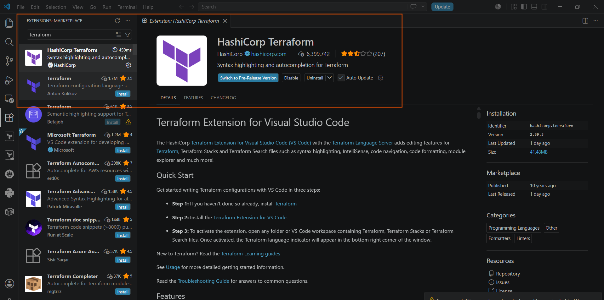
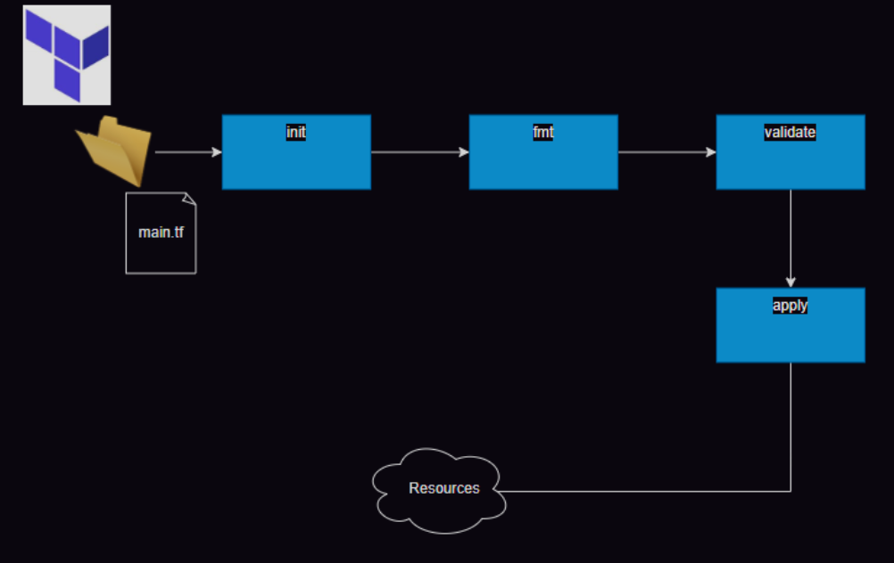

# Terraform Basics & Creating AWS Infrastructure

* Setting up VS Code for terraform
* We need to install an extension for Terraform from hashicorp


##  1. Setting Up Your Workspace (VS Code)
Before writing any code, engineers use a text editor. The industry standard is **Visual Studio Code (VS Code)**.

* **The Extension:** To make writing Terraform code easy, you need to install the official **Terraform extension by HashiCorp** from the VS Code Marketplace.
* **What it does:** It gives you color-coded text (syntax highlighting), auto-completes your code as you type, and catches spelling mistakes before you run your scripts.

## 2. The Project Goal & Prerequisites
### The Goal (Activity 1)
The objective is to create a **VPC (Virtual Private Cloud)** network in AWS with **4 subnets** (smaller divided networks inside the main VPC).
---

### The Prerequisite: AWS Credentials
Terraform needs permission to log into your AWS account to build things.
* **AWS CLI:** You must have the **AWS Command Line Interface (CLI)** installed on your computer.
* **Configuration:** You run the command `aws configure` in your terminal and input your secure **Access Key ID** and **Secret Access Key** (which act as your cloud username and password). Terraform automatically reads these keys to talk to AWS.
---

## 3. Data Types in Terraform (How Data is Structured)
* [official docs](https://developer.hashicorp.com/terraform/language/expressions/types)

Just like in a spreadsheet, data in Terraform must follow specific formats. There are 6 basic types:
1.  **String:** Any text data. It must always be wrapped inside double quotation marks (e.g., `"ap-south-1"` or `"hello-world"`).
2.  **Number:** Any whole number or decimal value. No quotes are used (e.g., `10` or `5.82`).
3.  **Bool (Boolean):** A simple toggle value. It can only be `true` or `false`.
4.  **List:** An ordered sequence of values wrapped in square brackets `[]` (e.g., `["subnet1", "subnet2"]`).
5.  **Set:** Similar to a list, but every item inside a set **must be unique** (no duplicates allowed).
6.  **Map / Object:** A collection of key-value pairs wrapped in curly braces `{}`. It maps a label to a value (e.g., `tags = { Name = "MyVPC" }`).

---

## 4. Understanding the Core Terraform Code Blocks
   * [HCL](https://developer.hashicorp.com/terraform/language/syntax/configuration) 

Terraform files always end with the extension `.tf` (usually named `main.tf`). The code is built using three simple building blocks:
### Block 1: The `terraform {}` Configuration Block
   * [Terraform Block](https://developer.hashicorp.com/terraform/language/block/terraform)

This block tells Terraform which third-party cloud plugins (Providers) it needs to download from the internet to make your code work.

```sh
terraform {
    required_providers {
      aws = {
        source = "hashicorp/aws" #  Where the plugin lives on the internet
        version = "5.82.2"       #  The exact version of the plugin we want to use

        }
    }
}
```
---
# Block 2: The provider {} Block
* [Terraform AWS Provider](https://registry.terraform.io/providers/hashicorp/aws/latest/docs)


Once the plugin is downloaded, this block configures it. Think of it as pointing your cloud tools in the right direction.
```sh
terraform {
    required_providers {
        aws = {
            source = "hashicorp/aws"
            version = "5.82.2"
        }
    }

}

Lets try to configure the provider
provider "<name>" {
    arg1 = value1
    ...
    ..
    argn = valuen

}
```
---
---
* [AWS Provider Argument reference](https://registry.terraform.io/providers/hashicorp/aws/latest/docs#argument-reference)
* As of now our main.tf looks as shown below
```sh
terraform {
    required_providers {
      aws = {
        source = "hashicorp/aws"
        version = "5.82.2"
      }
    }
}

provider "aws" {
    region = "ap-south-1"
}

```
---

```sh
Terraform

provider "aws" {
  region = "ap-south-1" # Tells Terraform to build everything inside the Mumbai, India region
}
```
---

# Block 3: The resource {} Block
   * [Resource Block in Terraform ](https://developer.hashicorp.com/terraform/language/block/resource)
```sh
resource "type" "identifier" {
    arg1 = value1
    ...
    ..
    argn = valuen
}

```
* This is the core block that actually builds things. Its syntax follows a very specific rule:
`resource "resource_type" "your_custom_local_name" {...}`

```sh
Terraform

resource "aws_vpc" "network" {
  cidr_block = "10.0.0.0/16" # The total pool of ip address for this network
  tags = { 
    Name = "from tf"  # Giving the network a friendly name tag inside the AWS Console
  }
}
```
* `aws_vpc`: This is the exact type of resource defined by AWS. You cannot change this spelling.
* `network`: This is a label you choose. It is used to refer to this specific network elsewhere in your code.
---

# 5. The Four Essential Terraform Commands

* Once your `main.tf` file is saved with the code above, open your terminal inside that folder and run these four commands in order:

1. terraform init (Initialization)
    * What it does: Reads your code, looks at the required_providers block, and downloads the AWS plugin into a hidden folder on your computer.
    * When to run it: Every time you start a new folder or add a new provider plugin.

2. terraform fmt (Format)
    * What it does: Automatically cleans up your code formatting. It fixes messy spaces, aligns equal signs, and makes your file neat and readable.

3. terraform validate (Check)
    * What it does: Checks your code for typos, syntax mistakes, or missing arguments before hitting your cloud account. If it says "Success!", your code structure is perfect.

4. terraform apply (Create)
    * What it does: Shows you a blueprint ("Plan") of exactly what it is going to build in AWS. It will ask you to type yes to confirm. Once you type yes, it creates the live VPC network in your AWS account instantly!
---

# How to Find Code Blocks

* You don't need to memorize the code blocks! If you want to build a new resource (like an EC2 instance, an S3 bucket, or a subnet), simply open Google and search:
    * `terraform aws [resource name]` (for example: terraform aws vpc or terraform aws subnet).

# Data types in Terraform
* [official docs](https://developer.hashicorp.com/terraform/language/expressions/types)


# create vpc in aws then create 4 subnets 
* main.tf 
```sh
terraform {
  required_providers {
    aws = {
      source  = "hashicorp/aws"
      version = "5.82.2"
    }
  }
}

provider "aws" {
  region = "ap-south-1"
}


resource "aws_vpc" "network" {
  cidr_block = "10.10.0.0/16"
  tags = {
    Name = "from tf"
  }

}
```
* Now to create infrastructure, execute terraform apply where the plan will be shown


* To be continue...
---
