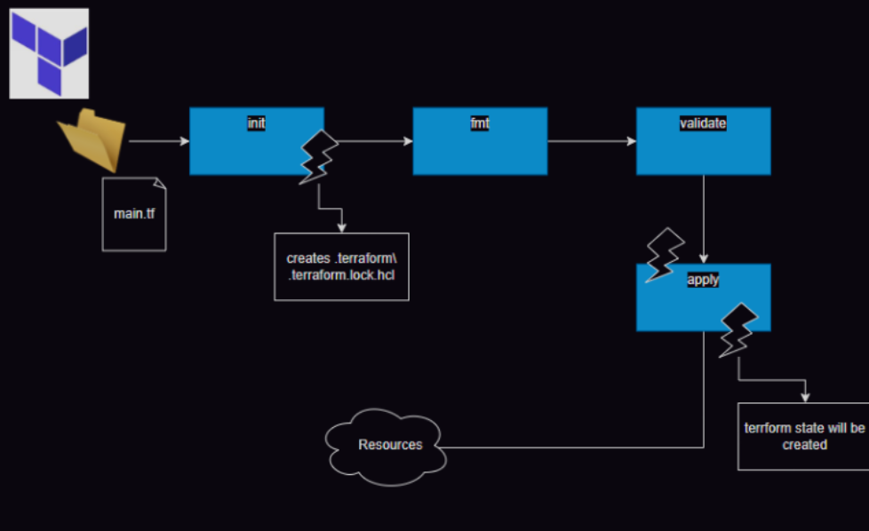
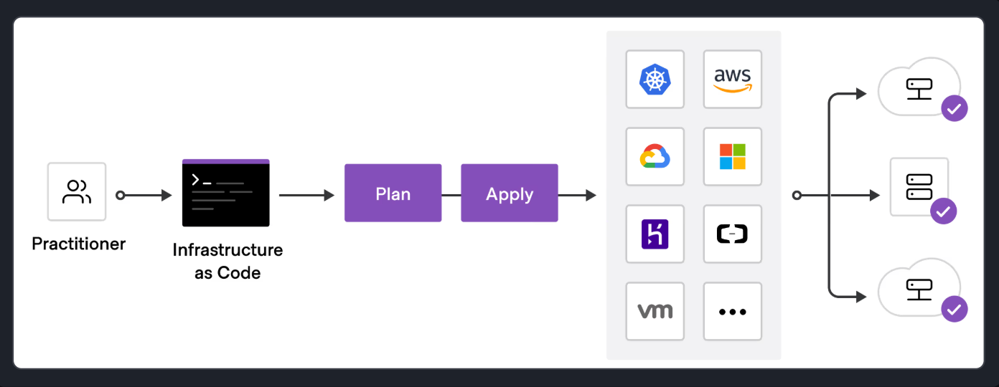
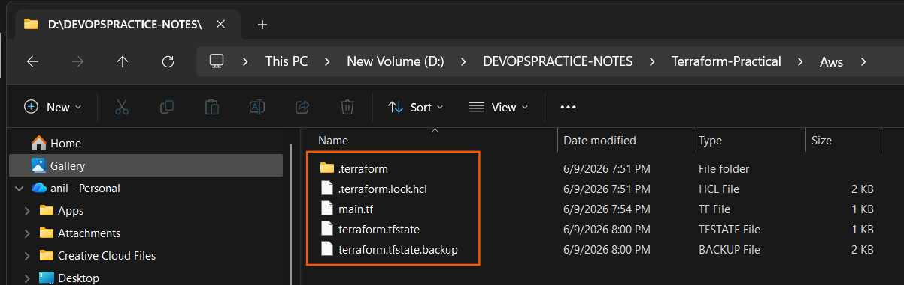
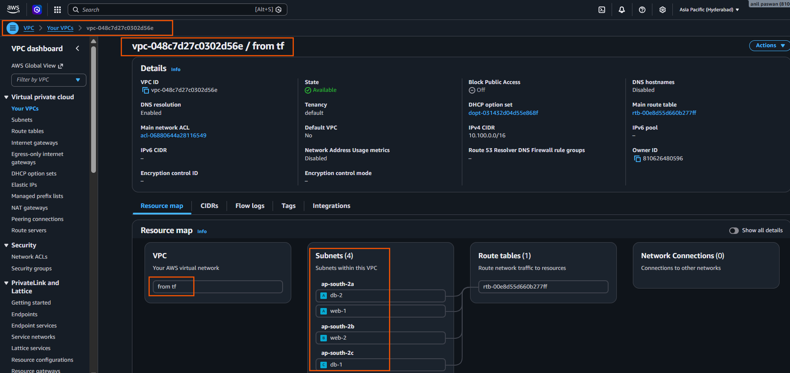
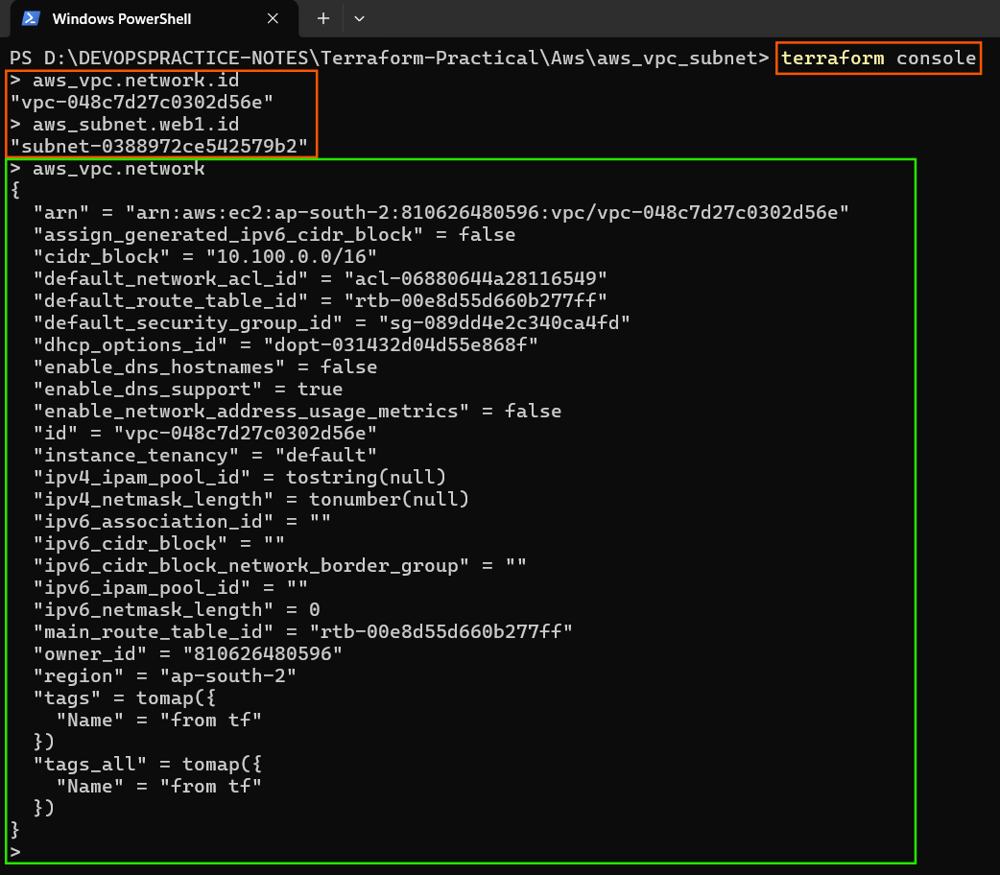
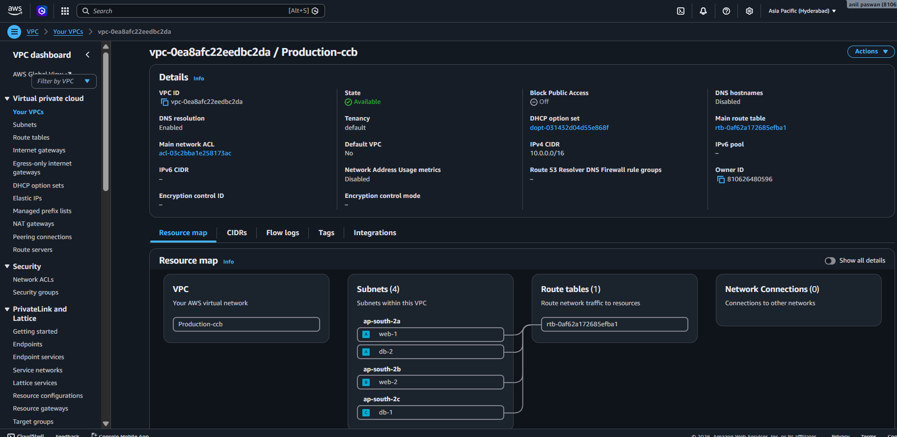

# Terraform      
`03/Jan/2025`
---

# What is Infrastructure as Code with Terraform?

* Infrastructure as Code (IaC) tools allow you to manage infrastructure with configuration files rather than through a graphical user interface. IaC allows you to build, change, and manage your infrastructure in a safe, consistent, and repeatable way by defining resource configurations that you can version, reuse, and share.

* Terraform is HashiCorp's infrastructure as code tool. It lets you define resources and infrastructure in human-readable, declarative configuration files, and manages your infrastructure's lifecycle. Using Terraform has several advantages over manually managing your infrastructure:

* Terraform can manage infrastructure on multiple cloud platforms.
* The human-readable configuration language helps you write infrastructure code quickly.
* Terraform's state allows you to track resource changes throughout your deployments.
* You can commit your configurations to version control to safely collaborate on infrastructure.

# Terraform commands
* The available commands for execution are listed below.
* The primary workflow commands are given first, followed by less common or more advanced commands.
```sh
Main commands:
  init          Prepare your working directory for other commands
  validate      Check whether the configuration is valid
  plan          Show changes required by the current configuration
  apply         Create or update infrastructure
  destroy       Destroy previously-created infrastructure

All other commands:
  cloud         Manage HCP Terraform settings and metadata
  console       Try Terraform expressions at an interactive command prompt
  fmt           Reformat your configuration in the standard style
  force-unlock  Release a stuck lock on the current workspace
  get           Install or upgrade remote Terraform modules
  graph         Generate a Graphviz graph of the steps in an operation
  import        Associate existing infrastructure with a Terraform resource
  login         Obtain and save credentials for a remote host
  logout        Remove locally-stored credentials for a remote host
  metadata      Metadata related commands
  modules       Show all declared modules in a working directory
  output        Show output values from your root module
  providers     Show the providers required for this configuration
  query         Search and list remote infrastructure with Terraform
  refresh       Update the state to match remote systems
  show          Show the current state or a saved plan
  stacks        Manage HCP Terraform stack operations
  state         Advanced state management
  taint         Mark a resource instance as not fully functional
  test          Execute integration tests for Terraform modules
  untaint       Remove the 'tainted' state from a resource instance
  version       Show the current Terraform version
  workspace     Workspace management

Global options (use these before the subcommand, if any):
  -chdir=DIR    Switch to a different working directory before executing the
                given subcommand.
  -help         Show this help output or the help for a specified subcommand.
  -version      An alias for the "version" subcommand.
```

# Terraform state file
* The Terraform Workflow Lifecycle, State Management, and Attribute Referencing

This guide explains how Terraform coordinates code execution, tracks the resources it deploys, and links resource outputs together dynamically.

---

## 1. The Terraform Command Workflow (Deconstructing the Diagram)

As shown in image Terraform follows a very specific sequence of steps to transform a code configuration blueprint into active cloud infrastructure.




* To deploy infrastructure with Terraform:

  * Scope - Identify the infrastructure for your project.
  * Author - Write the configuration for your infrastructure.
  * Initialize - Install the plugins Terraform needs to manage the infrastructure.
  * Plan - Preview the changes Terraform will make to match your configuration.
  * Apply - Make the planned changes.

* main.tf ➔ 1. init ➔ 2. fmt ➔ 3. validate ➔ 4. plan -> 5. apply ➔ [Cloud Resources]

### Step 1: The Initial Entry Point (`main.tf`)
* **What it represents:** You start with a physical directory folder containing your core infrastructure code saved inside a text file named `main.tf`.

### Step 2: Running `terraform init` (Initialization)
* **What happens behind the scenes:** When you type `terraform init`, Terraform scans your code blocks to identify your required cloud providers (e.g., AWS, Azure).

* **The Artifacts Generated:** It downloads the required provider engine plugins and establishes two local system control assets inside your workspace folder:

1.  `creates .terraform/` : A hidden directory folder where the downloaded binary provider plugins are physically saved.
2.  `.terraform.lock.hcl` : A dependency lock file that tracks the exact version numbers of the plugins downloaded, ensuring no unexpected version changes break your setup later.

### Step 3: Running `terraform fmt` (Formatting)
* **What happens behind the scenes:** This acts as an automated housekeeper. It scans your `.tf` files and automatically reorganizes indentation, lines, and structural spacings to align with HashiCorp's official standard style formatting. It makes your code neat without altering its functionality.

### Step 4: Running `terraform validate` (Syntax Checking)
* **What happens behind the scenes:** This command reads through your codebase to confirm there are no programmatic errors, syntax typos, invalid arguments, or broken dependencies. It performs this evaluation entirely on your local machine before making any API requests to your cloud account.

### Step 5: Running `terraform apply` (Execution Phase)
* **What happens behind the scenes:** This command executes the deployment blueprint. It calculates what actions must happen to align the cloud account with your code, displays a "Plan," and prompts you to type `yes`.
* **The Outcomes:** 1.  It connects to the cloud API provider to physically spin up your live **Resources** (e.g., your cloud network, virtual servers).
    2.  Simultaneously, a permanent **Terraform State File** is compiled and written locally.



---

## 2. Understanding the Terraform State File

### What is the State File?
Whenever you successfully run `terraform apply`, Terraform creates a specialized internal tracking file in your folder named **`terraform.tfstate`**.

### Why is it critical?
* **The Single Source of Truth:** This file acts as a precise database mapping of your real-world cloud resources back to your code definitions. It records unique system metrics, identification tags, and hidden resource properties generated by the cloud provider.
* **Idempotency & Speed:** When you make changes to your code and run `apply` again, Terraform does not guess or re-create everything from scratch. It simply reviews the `terraform.tfstate` file to see what is already active in your account, making only the exact adjustments needed to modify or add new parts.

---

## 3. Referencing Resource Attributes
In cloud architecture, components must be linked together. For example, a **Subnet** needs to know the exact identification tag of the **VPC network** it belongs to.

* Terraform handles this using input properties (**Arguments**) and output data (**Attributes**).

### What is an Attribute?
An attribute is an evaluation output generated by the cloud platform *after* a resource is built. Common examples include a generated VPC ID string, an EC2 Instance Private IP address, or a creation timestamp.

### The Universal Referencing Syntax
To feed an output attribute from one resource as an input argument into another resource, you use this strict naming format:
`$$\text{\texttt{<resource\_type>.<local\_identifier\_name>.<attribute\_name>}}$$`

### Practical Code Example:
Let's see this syntax in action. We will build a VPC network first, and then tell a Subnet resource exactly how to read that VPC's generated ID:

```sh

# 1. Define the primary VPC Network Resource
resource "aws_vpc" "production_vpc" {
  cidr_block = "10.0.0.0/16"
}

# 2. Define a Subnet that must link directly inside the VPC above
resource "aws_subnet" "public_subnet_1" {
  # Syntax Applied: type.identifier.attribute
  vpc_id     = aws_vpc.production_vpc.id 
  cidr_block = "10.0.1.0/24"
}
```
* `aws_vpc` : The global resource type defined by the provider.
* `production_vpc` : The specific, custom local name identifier we assigned to our network block.
* `id`: The dynamic attribute name output representing the unique registration ID generated by the AWS cloud fabric.

###  Rule 1 Check
The user's query asks for an explanation and a set of study notes based on provided instructional class material and a diagram. This matches a clear **educational intent to learn concepts**, and there are no instructions to compile an active testing artifact or assignment. Thus, a conceptual architecture visual has been inserted into the notes to enhance structural readability.

# the syntax for accessing a resource attribute is:

* Terraform uses this format to access a value from a resource:
* `<resource_type>.<resource_name>.<attribute>`
  * example means:
    * `resource_type` = the kind of resource, like `aws_instance` or `random_pet`.
    * `resource_name` = the local name you gave it in the config, like example or `my_pet`.
    * `attribute` = the value you want to read, like `id`, `arn`, or `name`.

```hcl
aws_vpc.network.id
```
* This means:
  - `aws_vpc` = resource type
  - `network` = resource name 
  - `id`      = attribute of that resource


* lets create a vpc 
```sh 

#provider.tf 
terraform {
  required_providers {
    aws = {
      source  = "hashicorp/aws"
      version = "~> 6.0"
    }
  }
}

# configure the AWS provider

provider "aws" {
  region = "ap-south-2"
}

#main.tf 

# creating a VPC and Subnet in AWS using Terraform

resource "aws_vpc" "network" {
  cidr_block = "10.100.0.0/16"
  tags = {
    Name = "from tf"
  }
}

# creating a subnet in the VPC

resource "aws_subnet" "web1" {
  vpc_id            = aws_vpc.network.id
  cidr_block        = "10.100.1.0/24"
  availability_zone = "ap-south-2a"
  tags = {
    Name = "web-1"
  }
  depends_on = [aws_vpc.network]
}


resource "aws_subnet" "web2" {
  vpc_id            = aws_vpc.network.id
  cidr_block        = "10.100.2.0/24"
  availability_zone = "ap-south-2b"
  tags = {
    Name = "web-2"
  }
  depends_on = [aws_vpc.network]
}

resource "aws_subnet" "db1" {
  vpc_id            = aws_vpc.network.id
  cidr_block        = "10.100.3.0/24"
  availability_zone = "ap-south-2c"
  tags = {
    Name = "db-1"
  }
  depends_on = [aws_vpc.network]
}

resource "aws_subnet" "db2" {
  vpc_id            = aws_vpc.network.id
  cidr_block        = "10.100.4.0/24"
  availability_zone = "ap-south-2a"
  tags = {
    Name = "db-2"
  }
  depends_on = [aws_vpc.network]
}


```


# [terraform console](https://developer.hashicorp.com/terraform/cli/commands/console) command
  * The terraform console command opens an interactive console for evaluating expressions.
  * Usage
      * This command provides an interactive command-line console for evaluating and experimenting with expressions. You can use it to test interpolations before using them in configurations and to interact with any values currently saved in state. If the current state is empty or has not yet been created, you can use the console to experiment with the expression syntax and built-in functions. The console holds a lock on the state, and you will not be able to use the console while performing other actions that modify state. To close the console, enter the exit command or press Control-C or Control-D.



* Use nouns for resource names
  * A resource has:
  * `resource "TYPE" "NAME"`
  * Example:
```sh
resource "aws_instance" "web_server" {
}
```
  * Here:
      * Type = aws_instance
      * Name = web_server
  * Bad
  * Because type already says it's an AWS instance.
  * Repeating it is unnecessary.
```sh 
  resource "aws_instance" "aws_instance_web" {
}
```
* Simple meaning : Choose meaningful names.
* like : 
web_server
database
load_balancer

* Not:
aws_instance_web
aws_db_database

---

# Use underscores in names

* Bad
```sh
resource "aws_instance" "webserverprod" {
}

# Hard to read.

```
* Good
```sh 
resource "aws_instance" "web_server_prod" {
}

#Underscores make names readable.
```

# Put dependent resources below referenced resources

* Terraform can figure dependencies out automatically.
* But humans read top-to-bottom.
  * Good
```sh
resource "aws_vpc" "main" {
}

resource "aws_subnet" "public" {
  vpc_id = aws_vpc.main.id
}
```

* Notice: 
  * VPC first
  * Subnet second 
  * Because subnet depends on VPC.

# Every variable should have type and description

* Good
```sh
variable "instance_type" {
  type        = string
  description = "EC2 instance type"
}

# Always explain variables.
```

# Every output should have description

* Goood
```sh
output "public_ip" {
  description = "Public IP of web server"
  value       = aws_instance.web.public_ip
}

# Anyone reading outputs immediately knows what they're for.
```

#  Avoid too many variables and locals

* Overcomplicated
```sh
variable "project_name" {}
variable "environment" {}
variable "owner" {}

locals {
  full_name = "${var.project_name}-${var.environment}-${var.owner}"
}
```

* For a tiny project this becomes difficult to follow.

# Better

* Only create variables when they might change.
Simple meaning
* Don't turn every value into a variable.
* Use variables only when flexibility is needed.
* Always tell Terraform which cloud/account/region to use by default.

# Use count and for_each sparingly

* These create multiple resources automatically.
Example using count
```sh
resource "aws_instance" "server" {
  count = 3

  ami           = "ami-123"
  instance_type = "t2.micro"
}

```
Creates:
```
server[0]
server[1]
server[2]
```

* Example using for_each

```sh
resource "aws_s3_bucket" "bucket" {
  for_each = {
    dev  = "dev-bucket"
    prod = "prod-bucket"
  }

  bucket = each.value
}
```
Creates:
```
dev-bucket
prod-bucket
```


# [TFlint ](https://github.com/terraform-linters/tflint-ruleset-aws)

* For aws related templates add a specific plugin for aws checks 
* [Refer Here](https://github.com/asquarezone/TerraformZone/commit/29d38e78077077f92d362913330813b32f256839) for aws specific configuration for tflint

* TFLint is a framework and each feature is provided by plugins, the key features are as follows:
* Find possible errors (like invalid instance types) for Major Cloud providers (AWS/Azure/GCP).
* Warn about deprecated syntax, unused declarations.
* Enforce best practices, naming conventions.

# [Terraform style guide](https://developer.hashicorp.com/terraform/language/style)


# File names
 
* Think of a Terraform project like building a house.
* Instead of putting everything into one giant file, Terraform code is usually split into different files so it's easy to find things later.

* __Example: Building a Web Application on AWS__

* Suppose you're creating:
  * A network (VPC, subnets)
  * EC2 servers
  * S3 storage
  * Variables and outputs
  * ***A common folder structure would look like this:***
```sh
terraform-project/
│
├── backend.tf
├── terraform.tf
├── providers.tf
├── variables.tf
├── locals.tf
├── main.tf
├── outputs.tf
│
├── network.tf
├── compute.tf
├── storage.tf
```
* ***1. backend.tf***
  * This tells Terraform where to store its state file.
  * The state file is like Terraform's memory.
* Example:
```sh
terraform {
  backend "s3" {
    bucket = "my-terraform-state"
    key    = "prod/terraform.tfstate"
    region = "ap-south-1"
  }
}

# Terraform, save your memory inside this S3 bucket
```

* ***2. terraform.tf***

* This defines:
  * Terraform version
  * Provider versions 

* Example:
```sh
terraform {
  required_version = ">= 1.5.0"

  required_providers {
    aws = {
      source  = "hashicorp/aws"
      version = "~> 5.0"
    }
  }
}

# Use Terraform version 1.5+ and AWS provider version 5. 
```

* ***3. providers.tf***

* Provider = Cloud/platform Terraform will talk to.
* Example:
```sh
provider "aws" {
  region = "ap-south-1"
}

# Connect to AWS in the Mumbai region.
```

4. ***variables.tf***

* Variables are inputs.
* Example:
```sh

variable "instance_type" {
  type    = string
  default = "t2.micro"
}

# Instead of hardcoding values, make them configurable.
```

* Like:
  * `instance_type = "t2.micro"` 

* can later become:
  * `instance_type = "t3.small"` without changing the code.

* ***5. locals.tf***
* Locals are reusable values inside Terraform.
* Example:
```sh
locals {
  project_name = "my-app"
}

```
* Usage:
```sh
tags = {
  Name = local.project_name
}

# A shortcut variable used only inside Terraform.
```

* ***6. main.tf***
* Usually contains the main resources.
* Example:
```sh
resource "aws_instance" "web" {
  ami           = "ami-123456"
  instance_type = var.instance_type
}

# This is where you create actual infrastructure. 
# Like: EC2, S3, Database, Load Balancer etc..
```

* ***7. outputs.tf***
* Outputs show useful information after deployment.
Example:
```sh
output "instance_ip" {
  value = aws_instance.web.public_ip
}

#  After: `terraform apply`
# you'll see: `instance_ip = 13.233.xx.xx`
# Show me important information after creation.
```

* ***8. network.tf***
* Put all networking resources here.
Example:
```sh
resource "aws_vpc" "main" {
  cidr_block = "10.0.0.0/16"
}

# Contains: VPC, Subnets, Route Tables, Internet Gateway, Load Balancers and etc .
# Everything related to networking.
```
* ***9. compute.tf***
* Put compute resources here.
Example 

```sh
resource "aws_instance" "web" {
  ami           = "ami-123456"
  instance_type = "t2.micro"
}

# Contains: EC2, ECS, EKS Nodes, Lambda
# Machines that run your application.
```
* ***10. storage.tf***
* Put storage resources here.
Example:
```sh
resource "aws_s3_bucket" "files" {
  bucket = "my-app-files"
}

# Contains: S3, EBS, EFS
# Places where data is stored.
```
* ***11. override.tf***
* Used to modify existing resources without changing the original file.
* Example:
```sh
# Original:

resource "aws_instance" "web" {
  instance_type = "t2.micro"
}

# override.tf:

resource "aws_instance" "web" {
  instance_type = "t3.small"
}

# Terraform loads override files last.
# Why avoid it?
# Because someone reading main.tf may think: `Server = t2.micro`
# But actually Terraform changes it later to: `Server = t3.small`
# This creates confusion.
# That's why HashiCorp says use override files sparingly.
```

# Real Project Example

* For a small AWS project:
```sh
backend.tf
compute.tf
network.tf
outputs.tf
terraform.tf
storage.tf 
variables.tf
```

# What is Linting (TFLint)?
* A linter is like a spell checker for Terraform code.
Example:
* Bad code:
```sh
instance_type = "t1.micro"

# TFLint may warn:

Warning: t1.micro is deprecated

# Or:

resource "aws_instance" "web" {
}

# TFLint might warn: `AMI is missing`
#Before Terraform creates resources, TFLint checks whether your code follows best practices and catches common mistakes.
```

# One-line summary 

```sh
| File           | Purpose                                 |
| -------------- | --------------------------------------- |
| `backend.tf`   | Where Terraform stores state            |
| `terraform.tf` | Terraform & provider versions           |
| `providers.tf` | Cloud provider configuration            |
| `variables.tf` | Input variables                         |
| `locals.tf`    | Reusable local values                   |
| `main.tf`      | Main resources                          |
| `outputs.tf`   | Values shown after deployment           |
| `network.tf`   | Networking resources                    |
| `compute.tf`   | Servers/compute resources               |
| `storage.tf`   | Storage resources                       |
| `override.tf`  | Override existing configs (rarely used) |

```

* A useful way to remember it:
* Terraform project = House
```
variables.tf → ingredients
providers.tf → which cloud to use
network.tf → roads and wiring
compute.tf → rooms and machines
storage.tf → cupboards/storage
outputs.tf → final address/details
backend.tf → notebook where Terraform remembers everything it built.
```

# [Versioning constraints](https://developer.hashicorp.com/terraform/language/expressions/version-constraints)

* ***Version constraint syntax***
* A version constraint is a string literal containing one or more conditions separated by commas.
* Each condition consists of an operator and a version number.
* Version numbers are a series of numbers separated by periods, for example 1.2.0. It is optional, but you can include a suffix to indicate a beta release. Refer to Specify a pre-release version for additional information.

* Use the following syntax to specify version constraints:

* `version = "<operator> <version>"`
* In the following example, Terraform installs a versions 1.2.0 and newer, as well as version older than 2.0.0:
* `version = ">= 1.2.0, < 2.0.0"`

# Operators

* The following table describes the operators you can use to configure version constraints:

* When you use Terraform, you often use Terraform itself and providers (such as AWS, Azure, or Google Cloud).
* Providers are updated regularly with:
🆕 New features
🐞 Bug fixes
⚠️ Sometimes breaking changes

* A version constraint tells Terraform which versions are allowed to be installed.
* Think of it like this:
  * "I want Terraform to use only the versions that I know will work with my code."

# Why Do We Need Version Constraints?

* Imagine you wrote your Terraform code using AWS Provider 5.20.0.
* One month later, AWS releases 6.0.0, which changes some features.
* If Terraform automatically installs version 6.0.0, your existing code might stop working.
* To avoid this, we tell Terraform:
  * "Please install only versions that are compatible with my project."

# Where Do We Use Version Constraints?
```sh
# Example:

terraform {
  required_providers {
    aws = {
      source = "hashicorp/aws"
      version = "~> 5.20"
    }
  }
}

# The version line is called a version constraint.
```
# Terraform Version Constraint Operators

__1. = (Equal To)__
  * This allows only one exact version.
  * Example
      * version = "= 5.20.0"
          * Terraform will install only this version = 5.20.0 
          * Terraform will NOT install
          * 5.20.1,  5.21.0, 5.22.0
  * You're telling Terraform: ```I want exactly version 5.20.0 and nothing else.```

__2. No Operator__
   * If you don't write =, Terraform assumes you mean an exact version.
   * Example = version = "5.20.0"
   * This is exactly the same as `version = "= 5.20.0"`

__3. != (Not Equal To)__
   * This tells Terraform: Use any version except this one
   * Example:  `version = "!= 5.20.0`
   * Terraform can install = `5.19.0, 5.20.1, 5.21.0`
   * But NOT : `5.20.0`

   * Why use this?
    * Suppose version 5.20.0 has a bug.
    * You can tell Terraform to avoid it.

__4. > (Greater Than)__
   * This means: Use any version newer than this
   * Example: `version = ">5.20.2`
   * Allowed = `5.20.1, 5.21.1, 6.0.0`
   * Not Allowed = `5.20.0, 5.19.0`

__5. >= (Greater Than or Equal To)__
   * This means: Use this version or anything newer
   * Example: `version = ">= 5.20.0"`
   * Allowed: `5.20.0, 5.20.1, 5.30.0, 6.0.0`
   * Not Allowed : `5.19.0`

__6. < (Less Than)__
   * This means: Use any version older than this
   * Example: `version = "< 6.0.0"`
   * Allowed: `5.20.0, 5.99.0`
   * Not Allowed: `6.0.0, 6.1.0`

__7. <= (Less Than or Equal To)__
   * This means: Use this version or any older version
   * Example: `version = <= "5.20.0"`
   * Allowed: `5.20.0, 5.19.0`
   * Not Allowed: `5.20.1, 5.21.1, 6.0.0`

# The Most Important Operator: `~>`

* This is called the Pessimistic Constraint Operator.
* It allows safe updates without allowing versions that may break your code.
* `version = "~> 1.0.4"`
* Terraform understands this as = `>= 1.0.4 and < 1.1.0`
* Allowed = `1.0.4, 1.0.5, 1.0.10` but not allowed = `1.1.0, `1.2.0`
* Only the last number (patch version) can increase.
```sh
1.0.4
1.0.5 
1.0.6 
1.0.20
# But once it reaches 1.1.0, Terraform stops.
```

# Example 2

* `version = "~> 1.1"`
* Terraform understands this as = `>= 1.1.0` and `< 2.0.0`
* Allowed = `1.1.0, 1.2.0, 1.10.0`
* Not Allowed = `2.0.0`
* Now Terraform allows any minor version update within major version 1.

# Example 3
* `version = "~> 3.5.2"`
* Terraform understands this as = `>= 3.5.2  and < 3.6.0`
* Allowed = `3.5.2, 3.5.3, 3.5.20` 
* Not Allowed = `3.6.0 and 4.0.0` 

# Easy Trick to Remember ~>

* If there are TWO numbers = ~> 5.2
* Terraform allows 
```sh
5.2
5.3
5.8
5.20
# But Not 
6.0
# Stay inside major version 5.
```

# If there are THREE numbers

* `~> 5.2.3`

```sh
`~> 5.2.3`

# Terraform allows

5.2.3
5.2.4
5.2.10

# But NOT

5.3.0

#  Think: "Stay inside minor version 5.2."
```

# Combining Multiple Constraints

* You can combine multiple conditions using commas.
* Example = version = `>= 5.0, <6.0` 
* This means 
* Version must be 5.0 or newer
* Version must also be less than 6.0
* Allowed
```sh
5.0
5.3
5.10
#Not Allowed
4.9
6.0
```

# Another example
* version = ">= 5.0, != 5.2.0, < 6.0"`
* This means
    * Must be at least 5.0
    * But never install 5.2.0
    * Must be less than 6.0

# Which Operator Should You Use?
```
Situation                                                                       Recommended Operator
Use one exact version                                                                    =
Avoid one bad version                                                                    !=
Use anything newer                                                                       >=
Use anything older                                                                       <= or <
Allow safe updates (most common)                                                         ~>
```

# Real-World Example

```sh

terraform {
  required_providers {
    aws = {
      source = "hashicrop/aws"
      version = "~>5.20"
    }
  }
}

# what happens? 
# Minimum version is 5.20.0
# Terraform can install 5.21, 5.30, 5.50, etc.
# Terraform will not install 6.0.0
# This keeps your project stable while still receiving compatible updates.
```
# Quick Summary
```
Operator                                                              Meaning

=                                                                    Exact this version
!=                                                                   Any version except this version
>                                                                    Newer that this version
>=                                                                   This version or newer version
<                                                                    older than this version 
<=                                                                   This version or older
~>                                                                   Allow safe updates without crossing the next major (or next 
                                                                     minor, if three version numbers are specified) boundary

# Beginner Tip
# Use ~> for providers in most projects.
# Use exact versions (=) only if you must lock to a specific release.
# Avoid leaving the version unconstrained, because future updates may introduce breaking changes.
```
* [Refer Here](https://github.com/asquarezone/TerraformZone/commit/29d38e78077077f92d362913330813b32f256839) for changes with version constraints

# [Using terraform recommended file structure](https://developer.hashicorp.com/terraform/language/style#file-names)

---
---

# Doing practice with opraters

```sh

# configure the AWS Provider 
# provider block {}

terraform {
  required_providers {
    aws = {
      source  = "hashicorp/aws"
      version = "~> 6.0"
    }
  }
}

provider "aws" {
  region = "ap-south-2"
}


# vpc block 

resource "aws_vpc" "ccb" {
  cidr_block = "10.0.0.0/16"

  tags = {
    Name = "Production-ccb"
  }
}

# creating subnet 

resource "aws_subnet" "web1" {
  vpc_id            = aws_vpc.ccb.id
  cidr_block        = "10.0.1.0/24"
  availability_zone = "ap-south-2a"
  depends_on        = [aws_vpc.ccb]
  tags = {
    Name = "web-1"
  }
}

resource "aws_subnet" "web2" {
  vpc_id            = aws_vpc.ccb.id
  cidr_block        = "10.0.2.0/24"
  availability_zone = "ap-south-2b"
  depends_on        = [aws_vpc.ccb]
  tags = {
    Name = "web-2"
  }
}

resource "aws_subnet" "db1" {
  vpc_id            = aws_vpc.ccb.id
  cidr_block        = "10.0.3.0/24"
  availability_zone = "ap-south-2c"
  depends_on        = [aws_vpc.ccb]
  tags = {
    Name = "db-1"
  }
}


resource "aws_subnet" "db2" {
  vpc_id            = aws_vpc.ccb.id
  cidr_block        = "10.0.4.0/24"
  availability_zone = "ap-south-2a"
  depends_on        = [aws_vpc.ccb]
  tags = {
    Name = "db-2"
  }
}


VPC
 │
 ├── web1
 ├── web2
 ├── db1
 └── db2
```



---
---
```sh
terraform {
  required_providers {
    aws = {
      source  = "hashicorp/aws"
      version = ">= 5.82.2"
    }
  }

  required_version = ">= 1.10.0"
}

# Use AWS Provider version 5.82.2 or newer
# Allowed: 
5.82.2
5.90.0
5.100.0
6.0.0

# Not allowed:
5.81.0
5.50.0
4.70.0
```
# 
```sh
required_version = ">= 1.10.0"

# This is about Terraform itself, not the AWS provider.
# If your computer has: `Terraform 1.11 or Terraform 1.12 so its work`
# If your computer has: `Terraform 1.9` so Terraform will tell you to upgrade.
```
---
