#04/Jan/2025
---


# Terraform
---


* What is a String?
  * A string is simply text.
  * It can contain: 
    * Letters Numbers (as text) Symbols. 
    * A string is always written inside double quotes (" ").

* Example: 
  * name = "web"
  *  region = "ap-south-1"
  *  vpc_cidr = "192.168.0.0/16"
  *  location = "East US"
* These are all strings.
* Terraform Example
```
variable "region" {
  type = string
}
```
* means = "The value of region must be text."
  * Example: 
    * `region = "ap-south-1"`

---

* What is a Boolean?
  * A boolean can have only two values.
    * `true` or `false` Nothing else.

* Terraform Examples: 
  * `enable_https = true`
  * or
  * `enable_https = false` 

* Another example:
  * `public_network_access_enabled = true`
    * means: Public access is allowed.
  * If you write
  * `public_network_access_enabled = false`
     * it means: Public access is blocked. 


* Example Together
```sh
variable "vnet_name" {
  type = string 
}


variable "create_vnet" {
  type = bool
}

# Then:

vnet_name = "ntier-net"

create_vnet = true

Here: 
# "ntier-net" is text → string
#  true is Yes → boolean
```

---


# [Variables](https://developer.hashicorp.com/terraform/language/values/variables)

* A Terraform variable is a placeholder that stores a value which can be reused throughout the Terraform configuration. Variables make Terraform code reusable and avoid hardcoding values.

* basic syntax for creating a variable

```
variable "<name>" {
  type        = <datatype of terraform>
  default     = ""
  description = "purpose of variable"
}

#
| Keyword     | Meaning                |
| ----------- | ---------------------- |
| variable    | Creates a new variable |
| aws_region  | Variable name          |
| type        | Allowed data type      |
| default     | Default value          |
| description | Explains the variable  |

```

* To use the variable use syntax `var.<name>`

* Imagine you fill out an online job application.
* Instead of writing your name directly in the website's code, there's a blank field: `Name: __________`
* You type your name into that blank field. 
* That blank field is like a variable.
---

# Real-Life Example
* Suppose your family orders pizza.
* Instead of saying: `Order a Large Veg Pizza`
* every time, you say: "Order a pizza"
* Then each family member decides:
    * Dad → Large Veg
    * Mom → Medium Cheese
    * You → Chicken Pizza
* The pizza type changes, but the order process stays the same. 
* Terraform variables work exactly like that.
---
# Without Variables

* Suppose you want to create an Azure Resource Group.
* You write:
```sh
resource "azurerm_resource_group" "rg" {
  name          = "rg-test"
  location      = "Central India"  
}
```
* Everything is hardcoded.
* If tomorrow you want:
```sh
Name = rg-prod
Location = East US
```
* You must edit the code and that is not good.
---
# With Variables

* Instead:
```sh
resource "azurerm_resource_group" "rg" {
  name          = var.resource_group_name
  location      = var.location  
}
```

* Now the code doesn't care what the values are.
* Terraform will ask for them or read them from another file.

# What does var mean?
* Whenever you see = `var.location`
* Terraform reads it like this: `Go and find the value stored in the variable named location`

---

# Step 1 — Declare Variables

* Create a file named: `variables.tf`
* Inside it:
```sh
variable "resource_group_name" {
  description       = "Azure Resource Group Name"
  type              = "string"
}

variable "location" {
  description       = "Azure region"
  type              = string
}
```
* Here you're only declaring the variables.
* You haven't given them values yet.
---
# Step 2 — Use Variables

* In `main.tf`

```hcl
resource "azurerm_resource_group" "rg" {
  name              = var.resource_group_name 
  location          = var.location
}
```
* Notice: `var.resource_group_name`
* means: use the value of this variable 
---

# Step 3 — Give Values 

* Create another file: `terraform.tfvars`
* Inside:
```hcl
resource_group_name = "rg-test"
location            = "Central India"
```
* Now Terraform automatically reads these values.
---

# How Terraform Reads Everything

* Suppose you have three files.

* __variables.tf__ : `variable "resource_group_name" {} `

* __terraform.tfvars__: `resource_group_name = "rg-test" `

* __main.tf__ : `name = var.resource_group_name`

* Terraform connects them together.

# Visual Flow

```hcl
variables.tf
      │
      │
      ▼

resource_group_name

      │
      ▼

terraform.tfvars

resource_group_name = "rg-test"

      │
      ▼

main.tf

name = var.resource_group_name

```

# Why Do Companies Use Variables?

Imagine you have:

```hcl
Development environment
Testing environment
Production environment
```
* Without variables, you'd have three different Terraform files.

* with variables, you have one codebase and only change the values.

For example:

* __Dev__

```hcl
Name = rg-dev
Location = Central India
```

* __Test__

```hcl
Name = rg-test
Location = East US
```

* ___Production__

```hcl
Name = rg-prod
Location = West Europe
```

* The Terraform code stays exactly the same.

# Best Practice

* As you learn Terraform, organize your code like this:

```
terraform-project/
│
├── main.tf          # Resources
├── variables.tf     # Variable declarations
├── terraform.tfvars # Variable values
├── outputs.tf       # Output values
└── providers.tf     # Provider configuration (optional)
```

* This is the folder structure you'll commonly see in professional Terraform projects.


# Using variables in activity 1

1. `main.tf`

```hcl
# create a vpc with variables cidr_block 

resource "aws_vpc" "pana_vpc" {
  cidr_block = var.vpc_cidr 
  tags = {
    Name = var.vpc_name
  }
}

```

2. `providers.tf`

```
# aws provider

terraform {
  required_providers {
    aws = {
      source  = "hashicorp/aws"
      version = "~> 6.0"
    }
  }
}


# Configure the AWS Provider

provider "aws" {
  region = var.aws_region
}
  
```

3. `variables.tf`

```
# variables 

variable "aws_region" {
  description = "The AWS region to create resources in"
  type        = string
  default     = "ap-south-2"
}

variable "vpc_cidr" {
  description = "The CIDR block for the VPC"
  type        = string
  default     = "10.0.0.0/16"
}

variable "vpc_name" {
  description = "The name of the VPC"
  type        = string
  default     = "awspana_vpc"
}


``` 
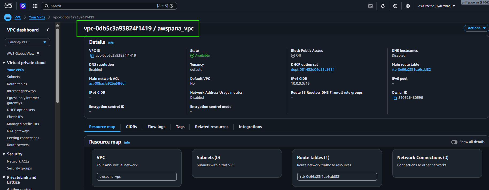
---

# basic syntax for creating a variable

```hcl
variable "<name>" {
    type = <datatypes of terrarform>
    default = ""
    description = "purpose of variable"
}
```
* To use the variable use syntax var.<name>

---

* 
```sh
 D:\DEVOPSPRACTICE-NOTES\Terraform-Practical\Aws\Activity-1> terraform apply -var-file="default.tfvars" 

Terraform used the selected providers to generate the following execution plan. Resource actions are indicated with the following symbols:
  + create

Terraform will perform the following actions:

  # aws_vpc.pana_vpc will be created
  + resource "aws_vpc" "pana_vpc" {
      + arn                                  = (known after apply)
      + cidr_block                           = "10.0.0.0/16"
      + default_network_acl_id               = (known after apply)
      + default_route_table_id               = (known after apply)
      + default_security_group_id            = (known after apply)
      + dhcp_options_id                      = (known after apply)
      + enable_dns_hostnames                 = (known after apply)
      + enable_dns_support                   = true
      + enable_network_address_usage_metrics = (known after apply)
      + id                                   = (known after apply)
      + instance_tenancy                     = "default"
      + ipv6_association_id                  = (known after apply)
      + ipv6_cidr_block                      = (known after apply)
      + ipv6_cidr_block_network_border_group = (known after apply)
      + main_route_table_id                  = (known after apply)
      + owner_id                             = (known after apply)
      + region                               = "ap-south-2"
      + tags                                 = {
          + "Name" = "awspana_vpc"
        }
      + tags_all                             = {
          + "Name" = "awspana_vpc"
        }
    }

Plan: 1 to add, 0 to change, 0 to destroy.

Do you want to perform these actions?
  Terraform will perform the actions described above.
  Only 'yes' will be accepted to approve.

  Enter a value: yes

aws_vpc.pana_vpc: Creating...
aws_vpc.pana_vpc: Creation complete after 2s [id=vpc-073aa5e5bc1a0574d]

Apply complete! Resources: 1 added, 0 changed, 0 destroyed.
```
---

# 3. Explain var.
* Example:
  * `region = var.aws_region`
  * means: Terraform reads: `Go to the variable called aws_region and use its value.`

---

# 4. Mention Other Data Types

* Currently i only mention string.
* Terraform supports many types.
* Example:
```sh
string
number
bool 
list
map
object
```
---

# 5. Explain terraform.tfvars
* This is one of the biggest missing pieces.
* Many beginners think `variables.tf` stores values.
    * Actually, 
    * `variables.tf`     = declares variables.
    * `terraform.tfvars` = stores their values.
    * I would add this.
  
  * ***variables.tf***
```hcl
variable "region" {
  type = string
}

# No value.
```

  * ***terraform.tfvars***
```
region = "ap-south-1"

#Value.
# Then Terraform combines them.
```
---

# 6. Explain Variable Priority

* This is very useful.
* Terraform reads variables in this order (highest priority first):
```hcl
terraform apply -var

↓

terraform.tfvars

↓

*.auto.tfvars

↓

default value
```

* This is important in real projects.

# 7. Explain Why Companies Use tfvars

* Instead of
```
Development

Production

Testing
```

* show an example.
```
dev.tfvars

region = "ap-south-1"

name = "dev-vpc"
```
* or 

```
prod.tfvars

region = "us-east-1"

name = "prod-vpc"
```
* Then run =  `terraform apply -var-file=dev.tfvars`

* Tomorrow = `terraform apply -var-file=prod.tfvars`

***Same code but different infrastructure. This is how companies work.***
---

# 8. Add Variable Flow Diagram

* I love diagrams because they make revision easy.
* Example:
```
variables.tf

↓

Declare Variable

↓

terraform.tfvars

↓

Assign Value

↓

main.tf

↓

Use Variable

↓

Terraform

↓

AWS/Azure
```

---

# 9. Add One Important Rule

* Terraform automatically loads: `terraform.tfvars`
* You don't need to specify = `-var-file` unless the filename is different.
* Example: `terraform.tfvars` Automatic.
* But
* `production.tfvars` 
* Needs `terraform apply -var-file=production.tfvars`
---

# My Suggested Learning Roadmap
* Now that you've understood variables, I'd study Terraform in this order:
```sh
1. Providers
2. Resources
3. Variables
4. Outputs
5. terraform.tfvars
Count
for_each
Functions
Data Sources
Local Values
Remote State
Modules
Workspaces
Backend (S3 + DynamoDB)
Project Structure
```
* This sequence builds naturally from the basics to production-ready Terraform.
---

# [Outputs](https://developer.hashicorp.com/terraform/language/values/outputs)

* Terraform outputs are values displayed after infrastructure is created. They expose useful information such as resource IDs, ARNs, IP addresses, DNS names, and resource names.

***Why Do We Need Outputs?***
* Without outputs:
```hcl
Terraform Apply

↓

Infrastructure Created

↓

Open AWS Console

↓

Find Resource

↓

Copy Resource ID
```
* With outputs:

```hcl
Terraform Apply

↓

Infrastructure Created

↓

Terraform prints Resource ID
```

* Syntax
```hcl
output "<output_name>" {
  value = <resource>.<resource_name>.<attributes>
}

# Example 

output "vpc_id" {
  value = aws_vpc.pana_vpc.id
}


```
* Common Attributes
  * For an AWS VPC

```sh

| Attribute                | Description       |
| ------------------------ | ----------------- |
| `id`                     | VPC ID            |
| `arn`                    | AWS Resource Name |
| `cidr_block`             | Network range     |
| `tags`                   | Resource tags     |
| `default_route_table_id` | Main route table  |
| `owner_id`               | AWS Account ID    |

```

***Output Commands***
* Show all outputs: `terraform outputs`
* Show one output:  `terraform output vpc_id`
* Show JSON:        `terraform output -json`

***Production Use Cases***
  * Outputs are commonly used to expose:
     * VPC ID 
     * EC2 PUBLIC IP
     * EC2 PRIVATE IP
     * Load Balancer DNS
     * RDS Endpoint
     * S3 Bucket Name
     * Azure Resource Group Name
     * Azure VM Public IP

***Best Practice***
* Keep outputs in a separate file: `outputs.tf`

***Q:Why do we use Terraform Outputs?***
   * `Outputs display useful information after Terraform creates infrastructure. They help users retrieve resource details, avoid manual lookups in the cloud console, and allow values to be shared between Terraform modules or automation.`

***how Terraform works internally***
```sh
main.tf
        │
        ▼
terraform init
        │
Downloads Provider
        │
        ▼
terraform plan
        │
Creates Execution Plan
        │
        ▼
terraform apply
        │
Reads State File
        │
        ▼
Calls AWS/Azure APIs
        │
        ▼
Cloud Creates Resources
        │
        ▼
Terraform Updates State
        │
        ▼
Outputs Display

# Understanding this flow will help you troubleshoot problems instead of just following commands.
```
***Learning Paths***

* Phase 1 – Terraform Fundamentals

```sh
✅ Providers
✅ Resources
✅ Variables
✅ Outputs
⏳ terraform.tfvars
⏳ Local values
⏳ Data sources
⏳ Functions
⏳ Count
⏳ for_each
⏳ Dynamic blocks
⏳ Conditional expressions
```

* Phase 2 – State Management

```sh
Terraform state
State file
State locking
Remote backend (S3 + DynamoDB)
Import existing resources
Refresh
Taint / Replace
```

* Phase 3 – Modules
```sh
Module basics
Local modules
Remote modules
Module outputs
Module variables
Versioning
```

* Phase 4 – Production Terraform
```sh
Folder structure
Environments (dev/test/prod)
tfvars strategy
Secrets management
Workspaces
CI/CD with GitHub Actions
Azure DevOps
Jenkins
```

* Phase 5 – Advanced Terraform

```sh
AWS VPC architecture
Azure networking
EKS
AKS
IAM
Security groups
Route tables
NAT Gateway
Load Balancers
Autoscaling
```


* Sample output
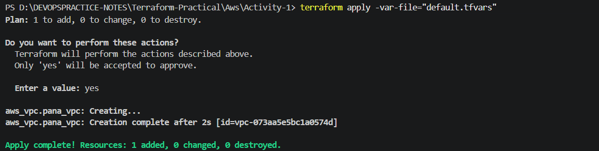
* Imagine you order food online.
* After the order is placed, the app shows:
```
Order ID : 12345
Delivery Partner : Rahul
Expected Time : 25 mins
```
* These details are shown after your order is created.
* Terraform outputs work exactly the same way.
* After Terraform creates infrastructure, it can display important information.

***Without Outputs***
* Suppose you create a VPC.
```hcl
resource "aws_vpc" "pana_vpc" {
  cidr_block = "10.0.0.0/16"
}
```
* Terraform creates the VPC successfully.
* But after terraform apply, you don't know:
    * What is the VPC ID?
    * What is the ARN?
    * What CIDR block was used?
    * You have to open the AWS Console and search for it.

***With Outputs***

* Create a file called: `outputs.tf`
* Add
```hcl
output "vpc_id" {
  value = aws_vpc.pana_vpc.id
}
```
* Now run: `terraform apply`
* Terraform will display: 
```hcl
Apply complete!

Outputs:

vpc_id = "vpc-0a123456789abcdef"
```
* You don't need to open AWS.
* Terraform tells you immediately.
---

# Activit-1 (outputs)

* We are only learning these three things:
    1. ✅ default.tfvars
    2. ✅ Output (outputs.tf)
    3. ✅ Using variables for subnet CIDRs and Availability Zones

* After completing this activity, you'll understand:
    1. Variables
    2. tfvars
    3. Outputs
    4. Lists (list(string))
    5. Then we'll move to `count`.

* By the end of this activity, you'll create the following AWS infrastructure:

```sh
AWS
│
├── VPC
│   └── CIDR: 192.168.0.0/16
│
├── Web Subnet 1
│   └── 192.168.0.0/24
│
├── Web Subnet 2
│   └── 192.168.1.0/24
│
├── DB Subnet 1
│   └── 192.168.2.0/24
│
└── DB Subnet 2
    └── 192.168.3.0/24

# And Terraform will print the VPC ID after deployment.

```

# Step 1 - Create the Project

* Create a folder: Activity-1
* Inside it create these files:
```sh
version.tf
provider.tf
variables.tf
default.tf
main.tf
outputs.tf
```

# Step 2: `versions.tf`

* `create.tf`
```
terraform {
  required_version   = ">= 1.10.0"


  required_providers {
    aws = {
      source = "hashicrop/aws"
      version = "~> 6.3.0"
    }
  }
}
```
* This tells Terraform: `"Before running, download the AWS provider and make sure I'm using a compatible Terraform version."`

# step 3: `default.tfvars`

```sh
# This file contains the actual values.
# Terraform will read these values and use them to create the resources.


region = "ap-south-1"

vpc_cidr = "192.168.0.0/16"

subnet_cidr = [
  "192.168.0.0/24",
  "192.168.1.0/24",
  "192.168.2.0/24",
  "192.168.3.0/24"
]

subnet_azs = [
  "ap-south-1a",
  "ap-south-1b",
  "ap-south-1a",
  "ap-south-1b"
]

```

# Step 4: `main.tf`

```sh
# Main Terraform configuration file 
# Here we will define the resources to be created in AWS using Terraform. 

resource "aws_vpc" "network" {
  cidr_block = var.vpc_cidr

  tags = {
    Name = "pana_vpc"
  }
}

resource "aws_subnet" "web1" {
  vpc_id            = aws_vpc.network.id
  cidr_block        = var.subnet_cidr[0]
  availability_zone = var.subnet_azs[0]

  tags = {
    Name = "pana_subnet1"
  }
}

resource "aws_subnet" "web2" {
  vpc_id            = aws_vpc.network.id
  cidr_block        = var.subnet_cidr[1]
  availability_zone = var.subnet_azs[1]

  tags = {
    Name = "pana_subnet2"
  }
}


resource "aws_subnet" "db1" {
  vpc_id            = aws_vpc.network.id
  cidr_block        = var.subnet_cidr[2]
  availability_zone = var.subnet_azs[2]

  tags = {
    Name = "pana_db1"
  }
}


resource "aws_subnet" "db2" {
  vpc_id            = aws_vpc.network.id
  cidr_block        = var.subnet_cidr[3]
  availability_zone = var.subnet_azs[3]

  tags = {
    Name = "pana_db2"
  }
}
```
# step 5: `outputs.tf`

```sh
# Here we will decide the outputs to be displayed after the resources are created in AWS using Terraform.

output "vpc_id" {
  description = "The ID of the VPC cretaed"
  value       = aws_vpc.network.id
}


```
# step 6: `providers.tf`
```sh
# Terraform asks:  Which AWS region should I connect to?
# Terraform will read the value from default.tfvars.

provider "aws" {
  region = var.region
}

```

# step 7: `variables.tf`

```sh
# Why no default?
# Your tutor has introduced default.tfvars.
# So now:
#variables.tf = declares variables
#default.tfvars = gives values. This separation is considered cleaner.


variable "region" {
  description = "The AWS region to cretae resource in"
  type        = string

}

variable "vpc_cidr" {
  description = "The CIDR block for the VPC"
  type        = string
}

variable "subnet_cidr" {
  description = "The CIDR block for the subnet"
  type        = list(string)
}

variable "subnet_azs" {
  description = " The availability zones for the subnets"
  type        = list(string)
}
```
# step 9: `versions.tf`
```sh
# versions.tf 

terraform {
  required_version = ">= 1.14.2"

  required_providers {
    aws = {
      source  = "hashicorp/aws"
      version = "~> 6.2.0"
    }
  }

}
```

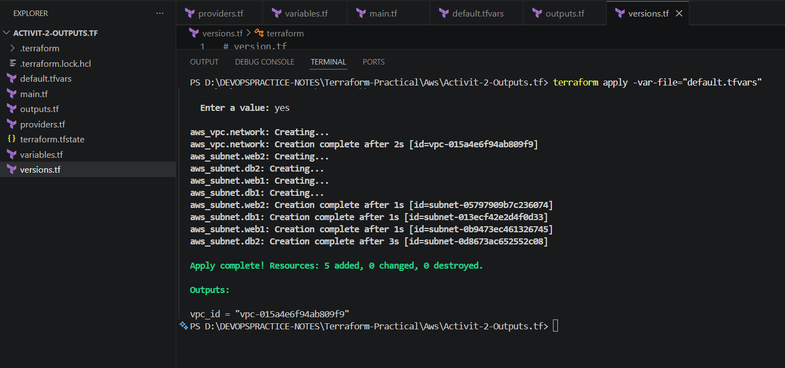
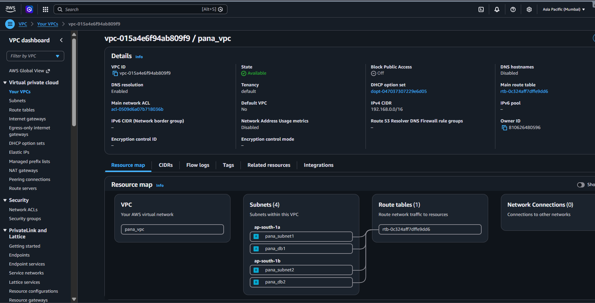
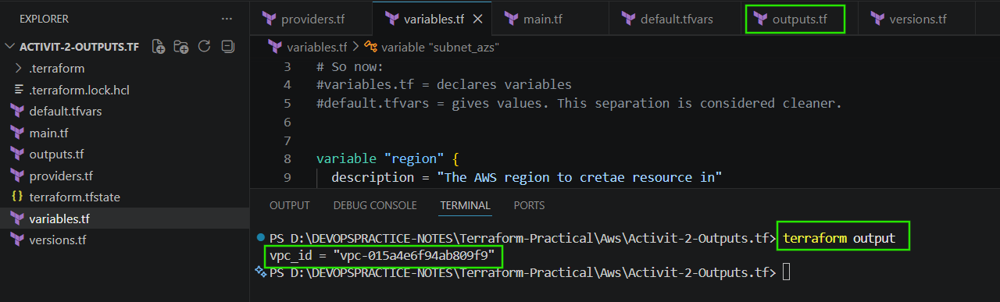
---
---


# [Count ](https://developer.hashicorp.com/terraform/language/meta-arguments/count)

***What is Count?***
  * `count` is a **meta-argument** in Terraform.
  * `count` is a Terraform meta-argument used to create multiple copies of the same resource.
  * Instead of writing the same resource block many times, Terraform can repeat the resource automatically.

***Why do we need `count`?***
* Imagine you want to create:
   - 4 AWS Subnets
   - 10 EC2 Instances
   - 20 Security Groups

* Without `count`, you would have to write the same resource block many times.

Example:


```hcl
resource "aws_subnet" "subnet1" {}

resource "aws_subnet" "subnet2" {}

resource "aws_subnet" "subnet3" {}

resource "aws_subnet" "subnet4" {}

# This creates duplicate code.

# or 

resource "aws_vpc" "network"

resource "aws_subnet" "web1"
resource "aws_subnet" "web2"
resource "aws_subnet" "db1"
resource "aws_subnet" "db2"

#how many subnet resources = 4
```

* Terraform provides `count` to solve this problem.

***Real-Life Example***

* Imagine your mother asks:
* Bring me 4 bottles of water.
* Without count:
 - Bring bottle 1
 - Bring bottle 2
 - Bring bottle 3
 - Bring bottle 4

* With count: Bring Bottle Quantity = 4
* Terraform works exactly the same way.
---

***Basic Syntax***

```sh
`resource "<resource_type>" "<resource_name>" {
  count = 4 
}

# Terraform will create the same resource four times.

```
* Visual Representation
```sh

Terraform
      │
      ▼

One Resource Block

      │
      ▼

count = 4

      │
      ▼

Terraform Creates

Subnet 1

Subnet 2

Subnet 3

Subnet 4
```

***## Benefits of Count***

- Less code
- Easy to maintain
- Easy to scale
- Avoids duplicate resource blocks
- Makes Terraform configuration cleaner

---

***why should we use count?***

* Use `count` when all resources are almost identical.
* Example:
  - Multiple subnets
  - Multiple EC2 instances
  - Multiple disks
  - Multiple virtual machines

---

***Activity Goal***

* Earlier we created: `
  - 1 vpc 
  - 4 subnets
* using four different resource blocks.
* Now we will replace those four subnet resources with only one resource block using `count`.

---

***Now Let's Start the Activity***

* Step 1
  * Don't change anything yet.
  * Let's compare the old code and new code.
* Before Count

```sh
resource "aws_subnet" "web1" {}
resource "aws_subnet" "web2" {}
resource "aws_subnet" "db1" {}
resource "aws_subnet" "db2" {}
```  

***After Count***

```
resource "aws_subnet" "subnets" {

  count = 4 

}
```

* Now how many subnet resource blocks? = only 1 

* But how many subnets will Terraform create? = 4 

* Important Concept
 - Don't think:   `count =4` means Create subnet number 4. 
 - It means:  Repeat this entire resource block four times.
 - Think of it like a for `loop in programming`.

***## What does `count = 10` mean?**

* It tells Terraform to create **10 instances** of the resource where `count` is used.
* Example:

```hcl
resource "aws_instance" "web" {
  count = 10 
}

# Terraform creates 10 EC2 instances.

```

* Similarly,

```hcl
resource "aws_subnet" "subnets" {
  count = 10 
}

# Terraform creates 4 subnet resources.

```

* We are replacing exactly these four resources.
Earlier
```sh
4 Resource Blocks
        │
        ▼
4 Subnets

------------------------

Now

1 Resource Block
        │
        ▼
count = 4
        │
        ▼
Still 4 Subnets
```
* The number of resources in AWS does not change.
* Only the Terraform code becomes smaller.
* This is exactly how a Senior DevOps Engineer thinks
* Many beginners think: "count creates more resources."

* Not necessarily.
* Sometimes we use `count` to create more resources.
* Sometimes we use `count` to create the same number of resources but with better code.
* In our activity, we are doing the second one.

***## Why are we using `count = 4`?***
* In the previous activity, we created four subnet resources using four different resource blocks.
* Now we are replacing those four resource blocks with a single resource block.
* Since we still need four subnets, we set:
```hcl
count = 4
```
* Terraform creates four subnet resources automatically.
* The number of AWS resources remains the same.
* Only the Terraform code becomes shorter and easier to maintain.

* Now Terraform has another problem.
  * It asks itself:
```
Okay...

I'm creating

Subnet 1

Subnet 2

Subnet 3

Subnet 4

But...

How do I know

which subnet I'm creating right now?
```
* It needs something like

```
Current Number

↓

0

1

2

3
```

* Terraform calls this: `count.index`
* This is the heart of the count topic.

* Think Like a Delivery Boy
* Suppose Amazon gives you 4 parcels.
```
Parcel

1

2

3

4
```

* How do you know which parcel you're delivering?
* They put a number on each parcel.
* Terraform does the same thing.
```
Subnet

↓

Number

↓

count.index

↓

0

1

2

3
```

## What happens after `count = 4`?

When Terraform sees:

```hcl
count = 4
```

it creates four instances of the same resource.

Internally Terraform creates:

```
Resource Instance 1

Resource Instance 2

Resource Instance 3

Resource Instance 4
```

Terraform now needs a way to identify each instance.

For this purpose Terraform provides:

```hcl
count.index
```

`count.index` represents the current resource number.

It starts from **0**.

```
First Resource  -> count.index = 0

Second Resource -> count.index = 1

Third Resource  -> count.index = 2

Fourth Resource -> count.index = 3
```

***Imagine Terraform is a Robot***
* you wrote:
```hcl
resource "aws_subnet" "subnets" {
  count = 4 
}
```

* Terraform starts thinking:

```hcl
I have to create

4 subnets

But...

How do I know

which subnet I'm creating?
So Terraform starts a loop.
```

***First Loop***
`count.index =0`

* Terraform says: I am creating the first subnet.

***Second Loop**
`count.index =1`

* Terraform says: I am creating the second subnet

***Third Loop***
`count.index = 2`
* Terraform says: I am creating the third subnet.

***Fourth Loop***
`count.index =3`

* Terraform says: I am creating the fourth subnet.

# Visual Flow

```hcl
count = 4
        │
        ▼
Terraform starts loop
        │
        ▼
count.index = 0
        │
        ▼
subnet_cidr[0]
        │
        ▼
192.168.0.0/24

────────────────────────────

count.index = 1
        │
        ▼
subnet_cidr[1]
        │
        ▼
192.168.1.0/24

────────────────────────────

count.index = 2
        │
        ▼
subnet_cidr[2]
        │
        ▼
192.168.2.0/24

────────────────────────────

count.index = 3
        │
        ▼
subnet_cidr[3]
        │
        ▼
192.168.3.0/24
```

## What is `count.index`?

`count.index` is the index number of the current resource instance.

Terraform starts counting from **0**.

Example:

```hcl
count = 4
```

Terraform creates four resource instances.

| Resource | count.index |
|----------|-------------|
| First | 0 |
| Second | 1 |
| Third | 2 |
| Fourth | 3 |

---

## Why do we use `count.index`?

We use `count.index` to access values from a list.

Example:

```hcl
subnet_cidr = [
  "192.168.0.0/24",
  "192.168.1.0/24",
  "192.168.2.0/24",
  "192.168.3.0/24"
]
```

Terraform reads:

- `count.index = 0` → `subnet_cidr[0]`
- `count.index = 1` → `subnet_cidr[1]`
- `count.index = 2` → `subnet_cidr[2]`
- `count.index = 3` → `subnet_cidr[3]`

This allows Terraform to assign different values to each resource while using a single resource block.

AWS Hierarchy
```sh
AWS Account
      │
      ▼
     VPC
      │
      ▼
   Subnet
      │
      ▼
 EC2 Instance
 ```
 ## Why do we use `vpc_id`?

* Every subnet in AWS must belong to a VPC.

* Terraform uses:

```hcl
vpc_id = aws_vpc.network.id
```

* to associate the subnet with the VPC created earlier. Terraform automatically gets the VPC ID after the VPC is created, so we don't need to hardcode it.

## How Terraform Stores Resources Created Using Count

When a resource uses `count`, Terraform automatically assigns an index to every resource instance.

Example:

```hcl
resource "aws_subnet" "subnets" {
  count = 4
}
```

Terraform creates:

```
aws_subnet.subnets[0]

aws_subnet.subnets[1]

aws_subnet.subnets[2]

aws_subnet.subnets[3]
```

The index starts from **0**.

Each resource gets its own values using:

```hcl
count.index
```

Example:

```
count.index = 0

↓

CIDR = subnet_cidr[0]

↓

Availability Zone = subnet_azs[0]

↓

Name = subnet_names[0]
```

Terraform repeats the same process until all resource instances are created.


# code for `count`

```sh
# This file contains the actual values.
# Terraform will read these values and use them to create the resources.
#default.tfvars 

region = "ap-south-1"

vpc_cidr = "192.168.0.0/16"

subnet_cidr = [
  "192.168.0.0/24",
  "192.168.1.0/24",
  "192.168.2.0/24",
  "192.168.3.0/24"
]

subnet_azs = [
  "ap-south-1a",
  "ap-south-1b",
  "ap-south-1a",
  "ap-south-1b"
]

subnet_names = [
  "web1",
  "web2",
  "db1",
  "db2"
]

###


# we are going to create a new VPC with four subnets 
# Main Terraform configuration file 
# Here we will define the resources to be created in AWS using Terraform. 
# main.tf 

resource "aws_vpc" "network" {
  cidr_block = var.vpc_cidr

  tags = {
    Name = "pana-vpc"
  }
}


resource "aws_subnet" "subnets" {

  count             = 4
  vpc_id            = aws_vpc.network.id
  cidr_block        = var.subnet_cidr[count.index]
  availability_zone = var.subnet_azs[count.index]
  depends_on        = [aws_vpc.network]

  tags = {
    Name = var.subnet_names[count.index]
  }

}

###

# Here we will decide the outputs to be displayed after the resources are created in AWS using Terraform.

output "vpc_id" {
  value       = aws_vpc.network.id
  description = "The ID of the VPC created"
}

###

# This the section of AWS provider configuration. We are using the AWS provider to create resources in Aprovidee  

provider "aws" {
  region = var.region
}

###
# This is for variables section 

variable "region" {
  description = "The AWS region to deploy resources in"
  type        = string
}


variable "vpc_cidr" {
  description = "The CIDR block for the VPC"
  type        = string
}

variable "subnet_cidr" {
  description = "The CIDR blocks for the subnets"
  type        = list(string)
}

variable "subnet_azs" {
  description = "The availability zones for the subnets"
  type        = list(string)
}


variable "subnet_names" {
  description = "The names for the subnets"
  type        = list(string)
}

###

# This the section of Version configuration. We are using the version.tf file to specify the required version of Terraform and the AWS provider.

terraform {
  required_version = ">= 1.10.0"

  required_providers {
    aws = {
      source  = "hashicorp/aws"
      version = "~> 6.3.0"
    }
  }
}


###
```
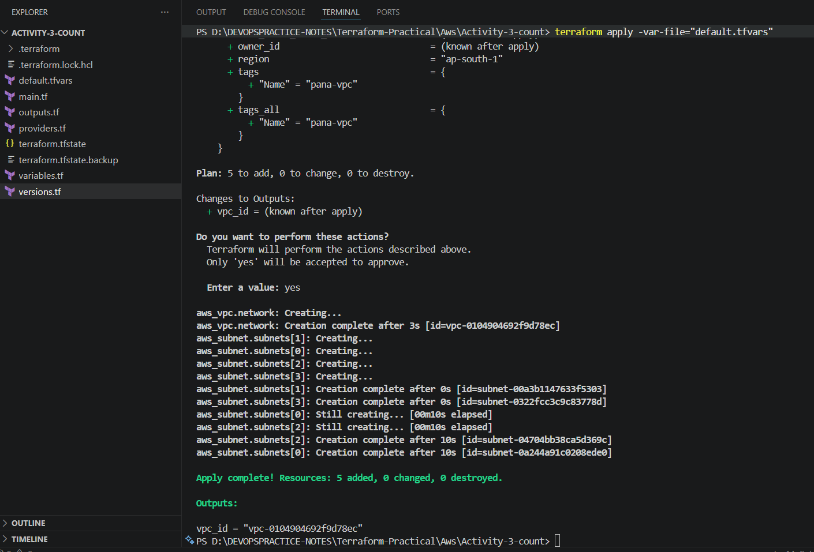

---


# [Terraform functions](https://developer.hashicorp.com/terraform/language/functions)
 
***What are Terraform Functions?***

* Functions are built-in operations provided by Terraform.
* They help us manipulate data and make Terraform code more dynamic.
* Instead of hardcoding values, functions calculate values automatically.

---

***Why do we use Functions?***

* Suppose we have a list of subnet CIDRs.
```hcl
subnet_cidrs = [
  "192.168.0.0/24",
  "192.168.1.0/24",
  "192.168.2.0/24",
  "192.168.3.0/24"
]

Earlier we wrote:

```hcl
count = 4
```

* This is called a **hardcoded value**.

* If tomorrow we add more subnet CIDRs, we must manually update:
```hcl
count = 6
```

* This is not a good practice.

* Terraform provides functions to solve this problem.

* Functions help Terraform calculate values automatically instead of relying on hardcoded numbers.

---

# What is length()?

* `length()` is a built-in Terraform function.
* It returns the number of elements in a list, string, or map.

Syntax
```hcl
length(<collection>)
```
Example: 

```hcl
subnet_cidrs = [
  "192.168.0.0/24",
  "192.168.1.0/24",
  "192.168.2.0/24",
  "192.168.3.0/24"
]
```

```hcl
length(subnet_cidrs)
```
Output: 4 

If the list becomes:

```hcl
subnet_cidrs = [
  "192.168.0.0/24",
  "192.168.1.0/24",
  "192.168.2.0/24",
  "192.168.3.0/24",
  "192.168.4.0/24",
  "192.168.5.0/24"
]
```

```hcl
length(subnet_cidrs)
```
Output:

```
6
```

* Terraform counts the elements automatically.

* Real-Life Example
  * Imagine you have a fruit basket.
  * Today: we have 4 fruits 
  * How many fruits?  `4`

* Tomorrow your mother adds 2 more 
* Now there are: `6`
* You don't count manually every day.
* You simply ask: "How many fruits are in the basket?"
  * `length()` does exactly that.
---

* Before
  * count = 4
  * Terraform always creates 4 subnets.

* After
  * count = length(var.subnet_cidr)
  * Terraform now does this internally:
```sh
Read subnet_cidr list
          │
          ▼
Count elements
          │
          ▼
Answer = 6
          │
          ▼
Create 6 subnets
```

* Why is this better?
  * Suppose next month your company changes the list to:
```sh

subnet_cidr = [
  ...
  10 CIDRs
]
```
* Your code does not change.
* Terraform automatically calculates:
```sh
length(var.subnet_cidr)

↓

10
```

* This is called dynamic code.

### depends_on

* `depends_on` is used to explicitly tell Terraform that one resource depends on another resource.

Syntax : `depends_on = [aws_vpc.network]`
  * Terraform creates the VPC first and then creates the subnets.
  * In this activity, `depends_on` is not required because:
```hcl
vpc_id = aws_vpc.network.id
```
  * already creates an implicit dependency.
  * However, it is useful to learn because some resources require explicit dependencies that Terraform cannot detect automatically.
---

# What is [*]?
  * Think of it like this.
  * Suppose you have six books.

```
Book 1

Book 2

Book 3

Book 4

Book 5

Book 6
```

* If I ask: give me book 3 
* You choose one.
* But if I ask: 
  * Give me all books
  * You collect every book.
  * Terraform's [*] means: "Take all resource instances."
    * So: `aws_subnet.subnets[*]`
    * means: "All subnet resources created by count."

* Visual Flow
```sh
aws_subnet.subnets

↓

subnets[0]

↓

subnets[1]

↓

subnets[2]

↓

subnets[3]

↓

subnets[4]

↓

subnets[5]

↓

Collect IDs

↓

Print Output
```

# Multiple Resource Outputs

* When a resource is created using `count`, Terraform creates multiple instances.
* Example:
```hcl
resource "aws_subnet" "subnets" {
  count = length(var.subnet_cidr)
}
```
* Terraform creates:

```sh
aws_subnet.subnets[0]

aws_subnet.subnets[1]

aws_subnet.subnets[2]

...

```
* To retrieve values from all resource instances, Terraform uses the **Splat Expression (`[*]`)**.
  * Example 

```
output "aws_subnet" "subnets" {
  value = aws_subnet.subnets[*].id 
}
```

* This returns the IDs of all subnet resources.

* Similarly:

```
output "subnet_names" {
  value = aws_subnet.subnets[*].tags["Name"]
}
```

# One Small Best Practice

```sh
output "subnet_id" {
  value = aws_subnet.subnets[*].id
}

output "vpc_id" {
  value = aws_vpc.network.id 
}

output "subnet_names" {
  value = aws_subnet.subnets[*].tags["Names"]


}

output "vpc_cidr" {
  value = aws_vpc.network.cidr_block
}
```

* Q: Why does a resource block have two labels while an output block has only one?
    Answer:
            A resource needs two labels because Terraform must know what type of resource to create (e.g., aws_subnet) and the local name used to reference it (e.g., subnets).
            An output doesn't create anything. It only displays a value, so it only needs a single name to identify that output.
---
---


# Terraform functions

* [Terraform functions](https://developer.hashicorp.com/terraform/language/functions) official link

```sh
# default.tfvars

region = "ap-south-1"

vpc_cidr = "192.168.0.0/16"

subnet_cidr = [

  "192.168.0.0/24",
  "192.168.1.0/24",
  "192.168.2.0/24",
  "192.168.3.0/24",
  "192.168.4.0/24",
  "192.168.5.0/24"
]

subnet_azs = [
  "ap-south-1a",
  "ap-south-1b",
  "ap-south-1a",
  "ap-south-1b",
  "ap-south-1a",
  "ap-south-1b"
]

subnet_names = [
  "web1",
  "web2",
  "app1",
  "app2",
  "db1",
  "db2"
]

#
#

#main.tf


resource "aws_vpc" "network" {
  cidr_block = var.vpc_cidr


  tags = {
    Name = "ccb-vpc"
  }

}

resource "aws_subnet" "subnets" {
  count             = length(var.subnet_cidr)
  vpc_id            = aws_vpc.network.id
  cidr_block        = var.subnet_cidr[count.index]
  availability_zone = var.subnet_azs[count.index]
  depends_on        = [aws_vpc.network]

  tags = {
    Name = var.subnet_names[count.index]
  }

}


#output.tf 


# Q: Why did you use [*]?
#Because the subnet resource is created using count, Terraform creates multiple resource instances.
#The [*] operator (Splat Expression) retrieves a specific attribute from all resource instances, such as IDs or tags.

output "vpc_id" {
  value       = aws_vpc.network.id
  description = "The ID of the VPC created"
}

output "subnet_ids" {
  value       = aws_subnet.subnets[*].id
  description = "List of subnet IDs"
}

output "subnet_names" {
  value       = aws_subnet.subnets[*].tags["Name"]
  description = "List of subnet names"
}

output "vpc_cidr" {
  value       = aws_vpc.network.cidr_block
  description = "The CIDR block of the VPC"
}


# provider.tf 


provider "aws" {
  region = var.region
}

### variables.tf 


variable "vpc_cidr" {
  description = "The CIDR block for the VPC"
  type        = string
}

variable "region" {
  description = "The AWS region to deploy resources in"
  type        = string
  default     = "ap-south-1"
}

variable "subnet_cidr" {
  description = "List of CIDR blocks for the subnets"
  type        = list(string)

}

variable "subnet_azs" {
  description = "List of availability zones for the subnets"
  type        = list(string)
}

variable "subnet_names" {
  description = "List of names for the subnets"
  type        = list(string)
}


### version.tf 


terraform {
  required_version = ">= 1.3.0"


  required_providers {
    aws = {
      source  = "hashicorp/aws"
      version = "~> 6.3.0"
    }
  }
}


```

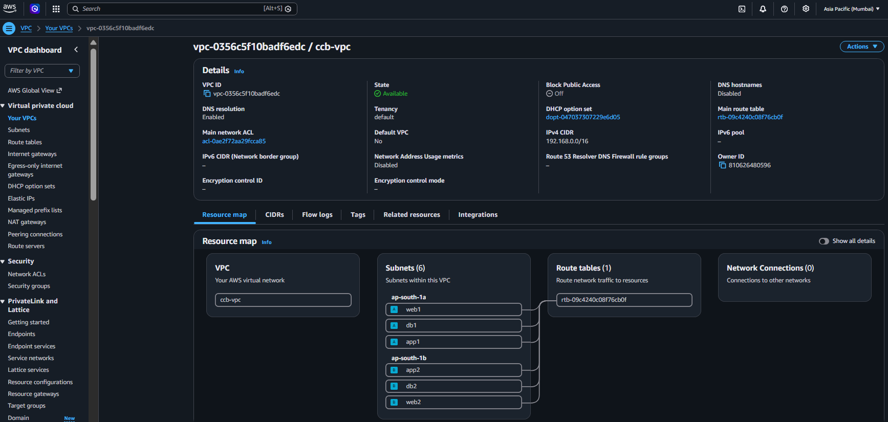

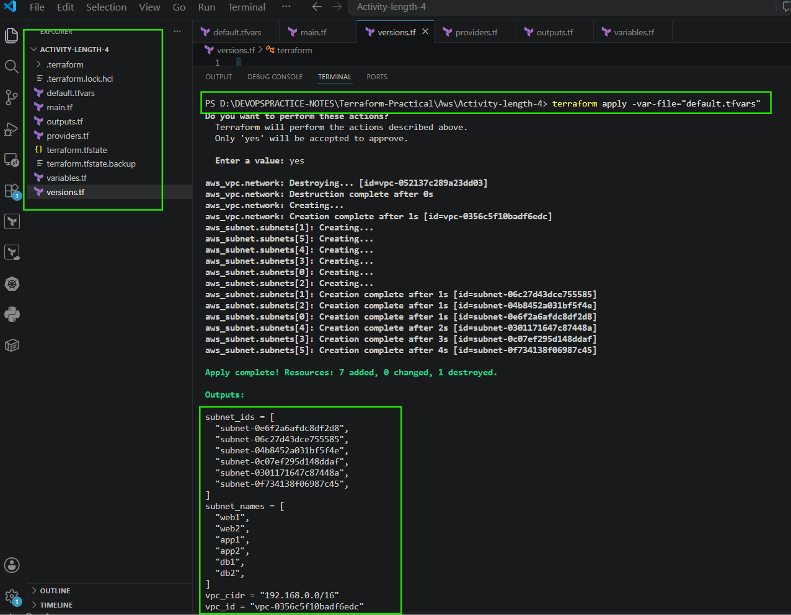

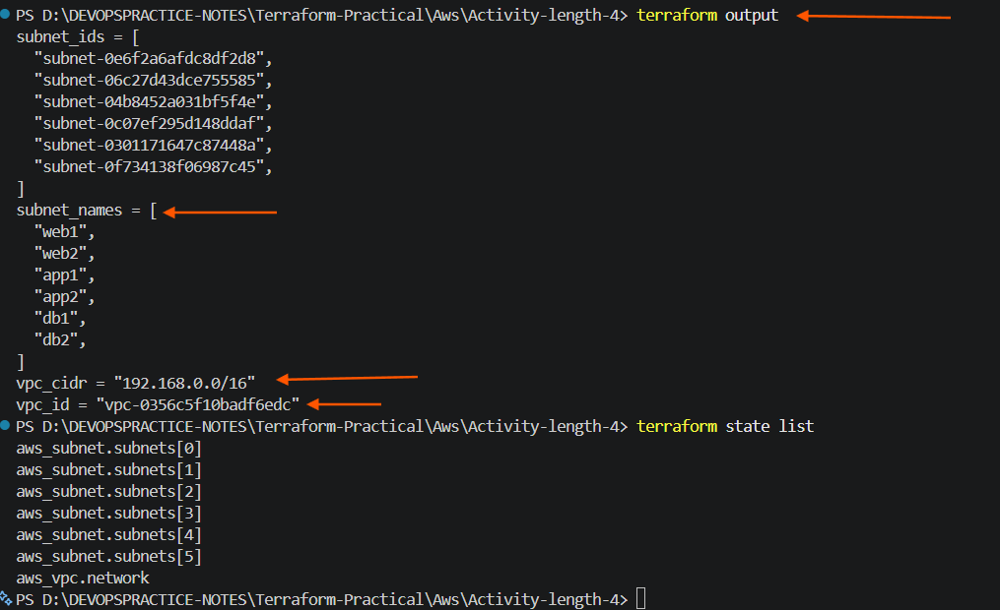

# Visual Summary

Your infrastructure now looks like this:

```sh

                AWS

                  │
                  │
        VPC (192.168.0.0/16)
                  │
   ┌──────────────┼──────────────┐
   │              │              │
web1           web2          app1
192.168.0.0    192.168.1.0   192.168.2.0

   │              │              │

app2           db1           db2
192.168.3.0    192.168.4.0   192.168.5.0
```

---
---


# Activity 2: Create a Network in Azure

* Objective
* In this activity, you will learn how to create:
  * Resource Group
  * Virtual Network (VNet)
using Terraform.

# we will create one Virtual Network (VNet) and three subnets inside it.

```sh

Azure Subscription
        │
        ▼
Resource Group
        │
        ▼
Virtual Network (VNet)
Name : ntier
CIDR : 10.0.0.0/16
Region : East US
        │
        ├──────────────┬──────────────┐
        │              │              │
        ▼              ▼              ▼
      web            app             db
   10.0.0.0/24   10.0.1.0/24    10.0.2.0/24

```

***Step 1: Virtual Network (VNet)***

* The large outer box represents the Virtual Network (VNet).
  * name is `ntier`
  * Its address space is: `10.0.0.0/16`
  * Region: `EastUS`

* Think of a VNet as a big private network in Azure.

# Step 2: Address Space

* The VNet uses: `10.0.0.0/16`
* A /16 network contains a large range of IP addresses.
* Inside this range, you create smaller subnetworks.

# Step 3: Subnets

* Inside the VNet there are three subnets.
  * Web Subnet
```
Name : web

CIDR : 10.0.0.0/24
```

* Usually used for:
  * Web Servers
  * Load Balancers
  * Frontend applications

# App Subnet

```
Name : app

CIDR : 10.0.1.0/24
```
* Usually contains:
  * Application Servers
  * APIs
  * Business Logic

# DB Subnet

```
Name : db

CIDR : 10.0.2.0/24
```
* Usually contains:
  * SQL Database
  * MySQL
  * PostgreSQL
  * Backend Databases


# Why Three Subnets?

* In real companies, we don't put everything in one subnet.
* Instead, we separate resources.

```
Internet
     │
     ▼
Web Subnet

     │
     ▼
App Subnet

     │
     ▼
DB Subnet
```
* Benefits include: 
    * Better security
    * Easier network management
    * Network Security Groups (NSGs) can have different rules for each subnet
    * Follows a typical 3-tier architecture

# Terraform Resources You'll Create

* To match this diagram, you'll create:

```
azurerm_resource_group

azurerm_virtual_network

azurerm_subnet "web"

azurerm_subnet "app"

azurerm_subnet "db"
```

# Expected Azure Resources

* After terraform apply, Azure should contain:

```
Resource Group
        │
        ▼
ntier-rg

        │
        ▼
Virtual Network
ntier
10.0.0.0/16

        │
 ┌──────┼─────────┐
 │      │         │
 ▼      ▼         ▼
web    app       db

10.0.0.0/24
10.0.1.0/24
10.0.2.0/24
```

* [Terraform azure providers](https://registry.terraform.io/providers/hashicorp/azurerm/latest/docs)
  * azurerm (Hashicorp) this is most widely used
  * azapi (Microsoft) few customers use this as well

***
1. Every Terraform Resource Has Two Names
  * Look at this: 
  * `resource "azurerm_resource_group" "base" {}`

  * A resource declaration always has this format:
  * `resource "<RESOURCE_TYPE>" "<LOCAL_NAME>" {}`

  * So here:
```
resource "azurerm_resource_group" "base"
          │                         │
          │                         │
          │                         └── Local name (used only inside Terraform)
          │
          └── Resource type
```
  * SO
```
| Part | Meaning |
|------|---------|
| `azurerm_resource_group` | Azure Resource Group resource type |
| `base` | Terraform's local name (nickname) |
```

* Terraform understands it like this:

```
Terraform

Local Name
──────────────

base
   │
   │
   ▼
Azure Resource Group

Real Name
──────────────

ntier
```
# Now Let's Look at This

* `resource "azurerm_virtual_network" "ntier" {}`
* Then What Is the Real VNet Name?
* Why Use ${}?
  * This is called string interpolation.
  * It means:
    * `Put a variable inside text.`
  
  * Example:
    * `name = "${var.resource_group.name}-net"`
  
  * Suppose
```

* 
var.resource_group.name

=

ntier
```
  * Terraform produces
    * `ntier-net`

  * Another example:
    * `name = ${var.environment}-rg`
    * if `environment = dev`
      * Result
        * `dev-rg`
    
    * If `environment = prod`
      * Result
        * `prod-rg`

# Now the Subnet

* You asked:
  * `resource "azurerm_subnet" "subnets" {}`
  * Again
    * Resource Type = `azurerm_subnet`
    * Terraform Local Name = `subnets`
    * This is NOT the subnet name.

    * The real subnet name comes from = `name = var.subnets[count.index].name`
    * Let's see how.
    * Your variables are:
```sh
subnets = [
  {
    name = "web"

  },

  {
    name = "app"

  },

  {
    name = "db"
  }
]
```

* Iteration 1
  * `count.index = 0`

* Terraform reads
  * `var.subnets[0].name`
  * Result: 
    * `web`
  
  * Azure creates
```
Subnet

web
```

* Iteration 2
  * `count.index = 1`
  * Result 
    * `app`


* Iteration 3
  * `count.index = 2`
  * Result
    * `db`

# The Biggest Lesson

* A Terraform resource has two different kinds of names:

```sh
resource "azurerm_virtual_network" "ntier" {

    name = "ntier-net"

}
```
| Thing | Value | Purpose |
|--------|-------|---------|
| Resource Type | `azurerm_virtual_network` | What kind of Azure resource to create |
| Local Name | `ntier` | Used only inside Terraform to reference this resource |
| Azure Resource Name | `ntier-net` | The actual name you'll see in the Azure Portal |


# The same pattern applies to every resource:

```
resource "<RESOURCE_TYPE>" "<LOCAL_NAME>" {

  name = "<REAL_AZURE_NAME>"
}
```

* Once you understand this distinction between the Terraform local name and the actual Azure resource name, reading Terraform becomes much easier.

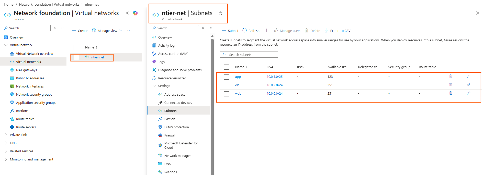
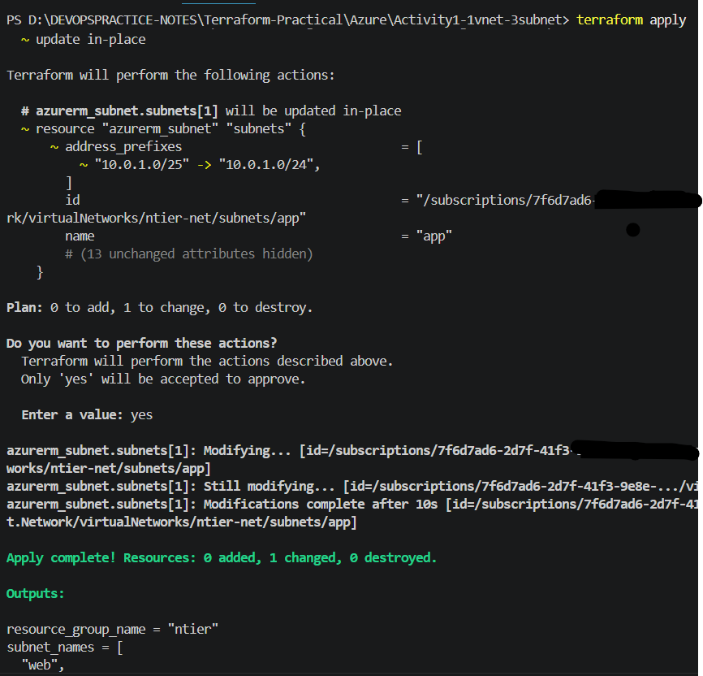
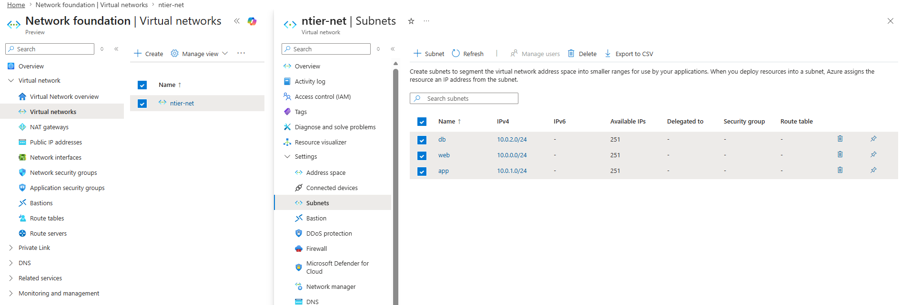

# tflint.hcl

```sh
plugin "azurerm" {
    enabled = true
    version = "0.32.0"
    source  = "github.com/terraform-linters/tflint-ruleset-azurerm"
}
```

# main.tf

```sh


# Resource Group

resource "azurerm_resource_group" "base" {

  name     = var.resource_group.name
  location = var.resource_group.location

}

# Virtual Network

resource "azurerm_virtual_network" "ntier" {

  name                = "${var.resource_group.name}-net"
  resource_group_name = azurerm_resource_group.base.name
  location            = azurerm_resource_group.base.location

  address_space = [
    var.vnet_address_space
  ]

  depends_on = [
    azurerm_resource_group.base
  ]

}

# Subnets

resource "azurerm_subnet" "subnets" {

  count = length(var.subnets)

  name                 = var.subnets[count.index].name
  resource_group_name  = azurerm_resource_group.base.name
  virtual_network_name = azurerm_virtual_network.ntier.name

  address_prefixes = [
    var.subnets[count.index].address_space
  ]

  depends_on = [
    azurerm_resource_group.base,
    azurerm_virtual_network.ntier
  ]

}
```

# output.tf

```sh

output "resource_group_name" {
  value       = azurerm_resource_group.base.name
  description = "This is the name of resource group"
}

output "vnet_id" {
  value       = azurerm_virtual_network.ntier.id
  description = "This is the id of vnet "
}

output "subnets_id" {
  value       = azurerm_subnet.subnets[*].id
  description = "This is the ids of subnets"

}

output "subnet_names" {
  value       = azurerm_subnet.subnets[*].name
  description = "This is the name of subnets"

}
```
# provider.tf

```
# Configure the Microsoft Azure Provider

provider "azurerm" {

  #configuration options

  features {}
}
```

# terraform.tfvars

```sh
resource_group = {
  name     = "ntier"
  location = "eastus"
}

vnet_address_space = "10.0.0.0/16"

subnets = [
  {
    name          = "web"
    address_space = "10.0.0.0/24"
  },

  {
    name          = "app"
    address_space = "10.0.1.0/24"
  },


  {
    name          = "db"
    address_space = "10.0.2.0/24"
  }
]
```

# variables

```sh
variable "resource_group" {

  type = object({
    name     = string
    location = string
  })

  description = "Resource Group information"

}

variable "vnet_address_space" {

  type        = string
  description = "CIDR range of Virtual Network"

}

variable "subnets" {

  type = list(object({
    name          = string
    address_space = string
  }))

  description = "Subnets information"

}
```

# version.tf

```sh
# Azure Provider source and version being used

terraform {

  required_version = ">= 1.10.0"

  required_providers {
    azurerm = {
      source  = "hashicorp/azurerm"
      version = ">= 4.14.0"
    }
  }


}

```

