***05/Jan/2025***

# Terraform

***Topic: Terraform locals***

* [offical docs](https://developer.hashicorp.com/terraform/language/values/locals)
    * Official Definition
        * What are Locals?
            * `Locals are variables that exist only inside your Terraform code.`
            * `Think of them as temporary variables that help you avoid repeating the same values multiple times.`
        
        * Real-Life Example
            * Imagine you're writing your address 20 times.
            * Without locals:
```
Company:
OpenAI

Office:
OpenAI

Invoice:
OpenAI

ID Card:
OpenAI
```

   * You are repeating the same value again and again.
   * Instead, define it once:
     * `company = OpenAI` 
   
   * Then use:
```
Company = company
Office = company
Invoice = company
ID Card = company
```

* This is exactly what locals do.

***Syntax***

```
locals {
  local_name = value
}
```

***Example:***

```
locals {
  company = pana
}
```

* Now anywhere in Terraform: `local.company`
* returns: `pana`
---

* Think of It Like Variables
    * Example:
```
variable "region" {

}
```
* Used as: `var.resion` 
---

* Locals are similar.
    * Example: 

```
locals {
  environment= "dev"
}
```

* Used as: `local.environment`

* Notice the difference 

| Variables | Locals |
|-----------|--------|
| `var.region` | `local.environment` |

* Variables vs Locals
    * This is the most important difference.

* Variables
    * `Variables receive values from outside Terraform.`

* Example:
    * `terraform apply -var-file="terraform.tfvars"`

* Terraform reads:
    * `region = eastus`
    * from your `terraform.tfvars`

---

# Locals

* Locals are created inside Terraform.
    * Example:
```
locals {
  company = "ccb"
}
```

* No one passes this value.
* Terraform creates it internally.

# Visual Difference

```
User
   │
   ▼
terraform.tfvars
   │
   ▼
Variables
(var.region)


Terraform
creates
itself
   │
   ▼
locals {
 company = "ccb"
}
```


# Example 1 (Without Locals)

* Suppose you write:

```
resource "azurerm_resource_group" "rg" {
  name = "pana-dev" 

}

resource "azurerm_virtual_network" "vnet" {
  name = "pana-dev-network"
}

resource "azurerm_storage_accounts" "sa" {
  name = "panadevstorage"
}
```

* See how many times you repeat: `pana`

# Example 2 (With Locals)

```
locals {
  project = "pana"
}
```

* Now 

```
resource "azurerm_resource_group" "rg" {
  
  name = "${local.project}-dev"
}

resource "resource_virtual_network" "vnet" {

  name = "${local.projet}-network"


}

resource "resource_storage_account" "sa" {
  
  name = "${local.project}-storgae"
}
```

* Now if the project changes from `pana` to `ccb`

* You only change one line: 

```
locals {
    project = "ccb" 
}
```

* Everything updates automatically.

# Another Example

```
locals {
  owner = "Anil"
}

```

* Now:

```
tags {
  owner = local.owner
}
```

* Terraform becomes: `Owner = Anil`
---

# Why Do DevOps Engineers Use Locals?

* Suppose you have 100 resources.
* Every resource needs:

```
Environment = dev
Owner = Anil
Project = Pana
```

* Without locals:

```
tags = {

  Environment = "dev"

  Owner = "Anil"

  Project = "Pana"

}
```

* repeated 100 times.

* Instead:

```
locals {

  environment = "dev"

  Owner = "Anil"

  Project = "Pana"

}

```

* Now:

```
tags = {

  Environment = local.environment

  Owner = local.owner 

  Project = local.project
}
```

* Much cleaner.

---

# Variables vs Locals (Interview Question)

| Variables | Locals |
|-----------|--------|
| Receive values from users or `terraform.tfvars` | Defined inside Terraform |
| Can change for different environments | Used for internal reusable values |
| Access with `var.name` | Access with `local.name` |

# When Should You Use Locals?

* You are repeating the same value in many places.
* You want cleaner code.
* You want to build names dynamically.
* You want to avoid hardcoding values multiple times.

---

# Example from Azure

* Suppose your Resource Group name is: `ntier`

* Instead of writing: `ntier-network`

* you can write:

```
locals {
  
  suffix = "network"

}
```

* Then: `name = "${var.resource_group.name}-${local.suffix}"`
  
* Terraform produces: `ntier-network`

---

# Key Points for Your Notes

* Terraform Locals

```

• Locals are internal variables used only inside Terraform.

• They help avoid repeating the same values multiple times.

• Locals cannot be passed from terraform.tfvars.

• Variables are accessed using:   var.variable_name

• Locals are accessed using:      local.local_name

• Use locals for:

  - Reusable values
  - Naming conventions
  - Tags
  - Prefixes
  - Suffixes
  - Calculated values

Syntax:

locals {

  project = "Pana"
}


Usage: local.project 
 
```


# Conditional Expressions
  * [Offical docs](https://developer.hashicorp.com/terraform/language/expressions/conditionals)

* What is a Conditional Expression?
  * `A conditional expression allows Terraform to make a decision.`
  
* Instead of always using one value, Terraform asks:
  * `If this condition is true, use one value. Otherwise, use another value.`

# Real-Life Example

* Suppose you're going to the office.
  * Decision:

```
If it is ranning
  carry an umbrella 

Else 
  Don't carry an umbrella
```
* This is a conditional expression.

*** Another Example***

```
If salary > 50,000
  Buy Iphone

Else 
  Buy Andriod
```

* Terraform works exactly the same way.


***Syntax***

`condition ? true_value : false_value`

* Read it as:

```
If condition is True
  use true_vale

Else 
  use false_value
```

***Example 1***

```
variable "environment" {

  default = "dev" 
}

locals {

  vm_size = var.environment == "prod" ? "standard_D4s_v3" : "standard_B2s"

}
```
* Terraform asks:
* `Is environment == prod?`
* If yes:
  * `Standard_D4s_v3`

* If no:
  *  `Standard_B2s`

* Visual Flow

```
            Is environment = prod?

                      │
             ┌────────┴────────┐
             │                 │
            YES               NO
             │                 │
             ▼                 ▼
 Standard_D4s_v3      Standard_B2s

```

***Example 2***

* Suppose:

```
variable "create_vm" {

  default = true 
}
```

* Then 

```
locals {

  message = var.create_vm ? "VM will be created" : "VM will not created"

}
```

* If 

```
created_vm = true
```

* Output

```
Vm will be created
```

* If
```
create_vm = false
```

* Output

```
VM will not be created
```

# Example 3 (Azure)

* suppose:

```
variable "environment" {
  default = "dev"

}

```
* Then 

```
locals {
  resource_group_name = var.environment == "prod" ? "prod-rg" : "dev-rg"
}
```

* If 

```
environment = prod
```

* Result

```
prod-rg
```

* Otherwise

```
dev-rg
```

# Example 4 (AWS)

```
variable "environment" {

  default = "dev"

}
```

```
resource "aws_instance" "server" {

  instance_type = var.environment == "prod" ? "t3.large" : "t2.micro" 

}
```
* Terraform decides:

```
Production

↓

t3.large
```

```
Development

↓

t2.micro
```


# Breaking the Syntax

* Example:

```
var.environment == "prod" ? "t3.large" : "t2.micro"
```

* Break it into parts:

| Part | Meaning |
|-------|---------|
| `var.environment == "prod"` | Condition |
| `?` | If true |
| `"t3.large"` | True value |
| `:` | Else |
| `"t2.micro"` | False value |


# Comparison Operators

* Conditional expressions usually use comparison operators.

| Operator | Meaning |
|----------|---------|
| `==` | Equal |
| `!=` | Not Equal |
| `>` | Greater Than |
| `<` | Less Than |
| `>=` | Greater Than or Equal |
| `<=` | Less Than or Equal |


*  Example

* `var.environment == "prod"`

* asks: 

* `Is environment equal to prod`
---


# Variables vs Conditional

* Without conditional

    * `instance_type = "t2.micro"`

* Always creates
    * `t2.micro`

* With conditional
    * `instance_type = var.environment == "prod" ? "t3.large" : "t2.micro"`

* Terraform decides automatically.

---

# Real DevOps Use Cases

* Conditional expressions are commonly used for:

  * Choosing VM size
  * Choosing AWS EC2 instance type
  * Naming resources
  * Creating production vs development resources
  * Tags
  * Storage account SKU
  * Load Balancer SKU

* Interview Question

  * What is a conditional expression? 
    * `A conditional expression is a Terraform feature that allow you to choose between two valuse based on the condition.`
    * syntax
      * `condition ? true_value : false_value`
---

***Notes for Your DevOps Notebook***
```sh
# Terraform Conditional Expressions

## Definition

- Conditional expressions allow Terraform to make decisions based on a condition.

- Syntax:
  - condition ? value_true : value_false

- Read as:

If condition is TRUE
    Use true_value

Else
    Use false_value

# Example:

- variable "environment" {
  default = "dev"

}

locals {

  vm_size = var.environment == "prod" ? "standard_D4s_v3" : "Standard_B2s" 
}

# Result:

- environment = prod
→ Standard_D4s_v3

- environment = dev
→ Standard_B2s

# Comparison Operators

== Equal 
!= Not Equal
> Greater Than
>= grater Than or Equal
< Less Than
<= Less Than or Equal 


# Real-world Uses

- VM Size

- EC2 Instance Type

- Resource Names

- Tags

- Production vs Development Deployments

# 

Think like this:

Is environment equal to "prod"?

        |
   ┌────┴────┐
   │         │
  YES       NO
   │         │
   ▼         ▼
Standard   Standard_B2s
_D4s_v3     


# Example 2

Suppose:

variable "age" {
  default = 20 
}

Now 

locals {
  status = var.age >= 18 ? "Adult" : "Minor" 
}

- Terraform asks:
    - Is age >= 18?

- If age = 20

20 >= 18

TRUE

↓

Adult

- If age = 15

15 >= 18

FALSE

↓

Minor

```
---

# Real DevOps Example

* Imagine your company has two environments:

***Development***

```
Environment: dev

Users: 5

Traffic: Low
```

* A small VM is enough:
  * `Standard_B2s`

***Production***

```
Environment: prod

Users: 20,000

Traffic: High

```

* Now you need a larger VM:

  * `Standard_D4s_v3`

* Instead of maintaining two different Terraform files, you can use one file with a conditional expression.


* Why do we use Conditional Expressions?
  * `Conditional expressions allow Terraform to choose between two values based on a condition. They help us write reusable code for different environments like development, testing, and production without duplicating configuration.`

---

***Look at this code***

```sh
variable "backup_enable" {

  default = true 
}

locals {
  backup_policy = "var.backup_enable" ? "Daily_backup" : "No_backup" 
}

# Forget Terraform for a minute. Let's focus on only this part:

- var.backup_enabled ? "Daily Backup" : "No Backup"

- Read it like this:

- If backup_enabled is TRUE → use "Daily Backup"
Otherwise → use "No Backup"

# This is exactly the same as writing:

IF backup_enabled == true
    Daily Backup
ELSE
    No Backup

# Step 1: What is the value?
  - We have 
    - backup_enabled = true

  - So Terraform asks:
    - Is backup_enabled TRUE?

- Answer: yes

# Step 2: Which side does Terraform choose?

* The syntax is:
  - condition ? true_vale : false_value

* Our code is:
  - var.backup_enable ? "Daily Backup" : "No Backup" 

# Break it apart:

Condition
↓
var.backup_enabled

If TRUE
↓
"Daily Backup"

If FALSE
↓
"No Backup"


```

# Terraform Revision Notes
**Level:** Beginner
**Topics Covered:** Introduction → Conditional Expressions

---

# 1. What is Terraform?

Terraform is an **Infrastructure as Code (IaC)** tool developed by HashiCorp.

It allows us to create, update, and destroy cloud resources using code instead of manually creating them from the cloud portal.

Example:

Instead of manually creating:

- VPC
- Subnet
- EC2
- Resource Group
- Virtual Network

We write Terraform code, and Terraform creates them automatically.

---

# 2. Infrastructure as Code (IaC)

Infrastructure is managed using code.

Instead of clicking in AWS or Azure Portal:

Portal
↓

VPC
↓

Subnet
↓

EC2

We write:

```hcl
resource "aws_vpc" "network" {
  ...
}
```

Benefits:

- Automation
- Repeatability
- Version Control
- Less Human Error
- Faster Deployments

---

# 3. Terraform Workflow

```
Write Code
     │
     ▼
terraform init
     │
     ▼
terraform fmt
     │
     ▼
terraform validate
     │
     ▼
terraform plan
     │
     ▼
terraform apply
     │
     ▼
Infrastructure Created
```

Destroy resources:

```bash
terraform destroy
```

---

# 4. Provider

A Provider tells Terraform which cloud platform to connect to.

AWS

```hcl
provider "aws" {
  region = var.region
}
```

Azure

```hcl
provider "azurerm" {
  features {}
}
```

---

# 5. Variables

Variables make Terraform code reusable.

Without Variable

```hcl
cidr_block = "10.0.0.0/16"
```

With Variable

```hcl
cidr_block = var.vpc_cidr
```

Actual value comes from:

```text
terraform.tfvars
```

Example

```hcl
vpc_cidr = "10.0.0.0/16"
```

---

# 6. terraform.tfvars

Stores actual values.

Example

```hcl
region = "ap-south-1"

vpc_cidr = "192.168.0.0/16"
```

variables.tf only declares variables.

terraform.tfvars provides values.

---

# 7. Resource

A Resource is an actual cloud object.

AWS Example

```hcl
resource "aws_vpc" "network" {
```

Azure Example

```hcl
resource "azurerm_resource_group" "base" {
```

Structure

```
resource "TYPE" "LOCAL_NAME"
```

Example

```
resource "aws_vpc" "network"
```

Type

```
aws_vpc
```

Local Name

```
network
```

---

# 8. Resource References

Syntax

```
RESOURCE_TYPE.LOCAL_NAME.ATTRIBUTE
```

Example

```hcl
aws_vpc.network.id
```

Breakdown

```
aws_vpc
↓

Resource Type

network
↓

Terraform Local Name

id
↓

Attribute
```

Azure Example

```hcl
azurerm_resource_group.base.name
```

Returns

```
ntier
```

---

# 9. Outputs

Outputs display values after apply.

Example

```hcl
output "vpc_id" {
  value = aws_vpc.network.id
}
```

Useful for

- IDs
- Names
- IPs
- URLs

---

# 10. count

Used to create multiple resources using one block.

Without count

```
Subnet1

Subnet2

Subnet3

Subnet4
```

With count

```hcl
count = 4
```

Terraform creates

```
Subnet[0]

Subnet[1]

Subnet[2]

Subnet[3]
```

---

# 11. count.index

Terraform starts counting from 0.

```
count = 4

↓

0

1

2

3
```

Example

```hcl
cidr_block = var.subnet_cidr[count.index]
```

Iteration

```
0 → 192.168.0.0/24

1 → 192.168.1.0/24

2 → 192.168.2.0/24

3 → 192.168.3.0/24
```

---

# 12. length()

Returns the number of elements in a list.

Example

```hcl
count = length(var.subnet_cidr)
```

If list has

```
6
```

Terraform creates

```
6 Resources
```

Advantage

No need to manually change count.

---

# 13. Splat Expression (*)

Syntax

```hcl
aws_subnet.subnets[*].id
```

Meaning

Get the IDs of ALL subnet resources.

Returns

```
Subnet1 ID

Subnet2 ID

Subnet3 ID
```

Example

```hcl
aws_subnet.subnets[*].tags["Name"]
```

Returns

```
web

app

db
```

---

# 14. Locals

Locals are internal variables.

Example

```hcl
locals {
  project = "pana"
}
```

Use

```hcl
local.project
```

Returns

```
pana
```

Difference

Variables

- Value comes from user

Locals

- Value is defined inside Terraform code

---

# 15. Conditional Expressions

Syntax

```hcl
condition ? true_value : false_value
```

Read as

```
If condition is TRUE

↓

Use first value

Else

↓

Use second value
```

Example

```hcl
var.environment == "prod" ? "Standard_D4s_v3" : "Standard_B2s"
```

If

```
environment = prod
```

Result

```
Standard_D4s_v3
```

If

```
environment = dev
```

Result

```
Standard_B2s
```

Important:

Terraform returns the selected value, NOT true or false.

---

# Common Interview Questions

### What is Terraform?

Terraform is an Infrastructure as Code (IaC) tool used to provision and manage infrastructure using code.

---

### What is a Provider?

A Provider is a plugin that enables Terraform to communicate with cloud platforms like AWS or Azure.

---

### What is a Resource?

A Resource represents a cloud object such as a VPC, EC2 instance, Resource Group, or Virtual Network.

---

### What is count?

count is a meta-argument used to create multiple instances of the same resource.

---

### What is count.index?

count.index is the current index of the resource being created. It starts from 0.

---

### What does length() do?

length() returns the number of elements in a list or string.

---

### What is a Local?

A Local is an internal variable defined inside Terraform configuration for reuse.

---

### What is a Conditional Expression?

A Conditional Expression chooses between two values based on a condition.

Syntax

```
condition ? true_value : false_value
```

---

# Quick Revision

✅ Provider → Connect Terraform to Cloud

✅ Variable → Input values

✅ terraform.tfvars → Actual values

✅ Resource → Cloud object

✅ Resource Reference → Access resource attributes

✅ Output → Display values after apply

✅ count → Create multiple resources

✅ count.index → Current resource number

✅ length() → Count list elements

✅ [*] → Get attribute from all resources

✅ Locals → Internal variables

✅ Conditional Expression → Decision making in Terraform

---

# Golden Formula

```
terraform.tfvars
        │
        ▼
Variables
        │
        ▼
Resources
        │
        ▼
Count
        │
        ▼
count.index
        │
        ▼
Functions
(length)
        │
        ▼
Locals
        │
        ▼
Conditional Expressions
        │
        ▼
Outputs
```
***[Conditional Expression](https://developer.hashicorp.com/terraform/language/expressions/conditionals)***


# Activity 3: Complete AWS Network


* Final Architecture
```sh
                    Internet
                        │
                        │
                 Internet Gateway
                        │
                        │
                  Public Route Table
                        │
          ┌─────────────┴─────────────┐
          │                           │
          ▼                           ▼
    Public Subnet 1             Public Subnet 2
    172.16.0.0/24              172.16.1.0/24

===================================================

                 Private Route Table
                        │
          ┌─────────────┴─────────────┐
          │                           │
          ▼                           ▼
    Private Subnet 1            Private Subnet 2
    172.16.2.0/24              172.16.3.0/24

===================================================

                Entire Network

               VPC
          172.16.0.0/16
```

* What are we creating?

| Resource | Count | Why? |
|----------|------:|------|
| VPC | 1 | Private Network |
| Internet Gateway | 1 | Internet Access |
| Public Route Table | 1 | Route internet traffic |
| Private Route Table | 1 | Internal traffic only |
| Public Subnets | 2 | Web Servers |
| Private Subnets | 2 | App / DB Servers |

* ***Step 1 — Create VPC***

* What is a VPC?
  * A VPC (Virtual Private Cloud) is your own private network inside AWS.
  * Think of it as buying land before building a house.
  * Without land,
  * you cannot build:
    * EC2
    * Database
    * Load Balancer
    * Subnets
  * Everything must exist inside a VPC.

  * Real World Example
  * Imagine you are building a society.
```sh
Society
│
├── Building A
├── Building B
├── Garden
└── Parking
```
* AWS is exactly the same.

```sh
VPC
│
├── Subnet
├── EC2
├── Database
└── Load Balancer
```

***AWS Portal***

* Create VPC

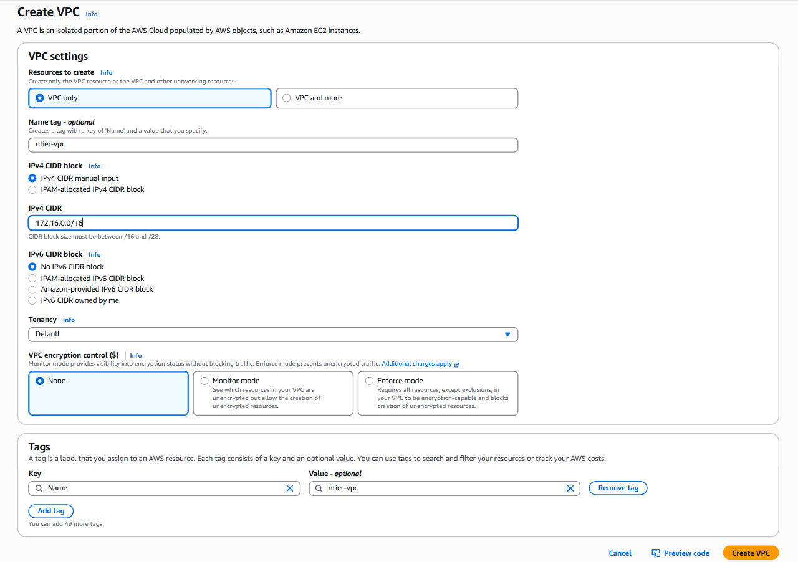
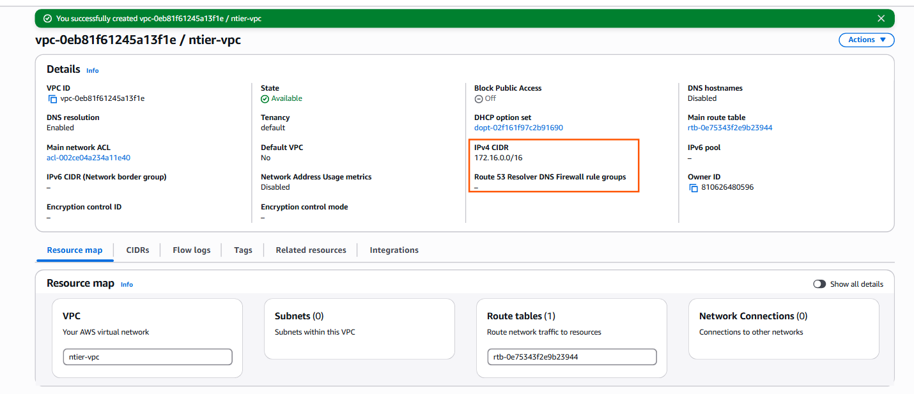

* Step 2 — Create Internet Gateway
  * What is an Internet Gateway?
    * Without an Internet Gateway,
    * your VPC cannot communicate with the Internet.
        * Think of it as the main gate of your society.
```sh
Road

↓

Main Gate

↓

Society
```
* AWS

```sh
Internet

↓

Internet Gateway

↓

VPC
```

* Without this gate, nothing can enter or leave.

* AWS Portal
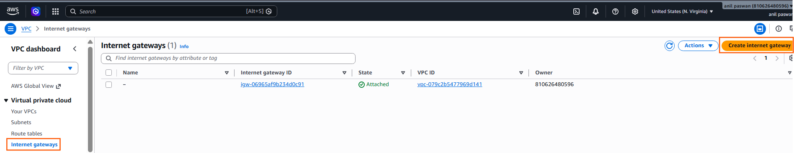
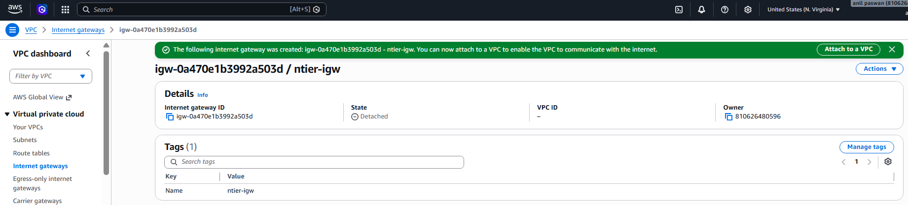
* After cretaed IGW 
  * we have to attached VPC to Internet Gateway
    * Click -> Actions --> Attach to VPC --> Choose --> ntier-vpc --> Click --> Attach

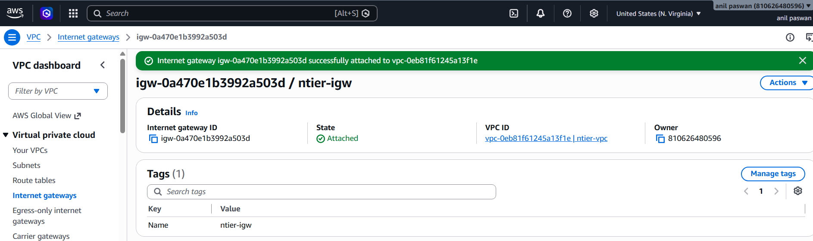


* Now Connection is ready.

```sh
Internet

↓

IGW

↓

VPC
```
* What have we actually done?
  * Most beginners just click buttons without understanding why. Let's understand it.
  * Imagine you build a new apartment.
    * `Your Apartment`
    * Can people from outside come inside?
      * `No.`
    * You need a main gate.

```
Road
   │
   ▼
Main Gate
   │
   ▼
Apartment
```
* AWS is exactly the same.

```
Internet
      │
      ▼
Internet Gateway
      │
      ▼
VPC
```

* The Internet Gateway (IGW) is the main gate of your VPC.
* Without it,
  * Nobody can enter.
  * Nobody can leave.

* Does creating an Internet Gateway mean the Internet is working?
    * `No`

* Right now your architecture is:
```sh
Internet
      │
      ▼
Internet Gateway
      │
      ▼
      VPC
```
* That's all.
* There is no path from the VPC to the Internet yet.
* Think about this:
* You built a society.
```
Road
   │
Main Gate
   │
Society
```
* But inside the society, there is no road leading to the main gate.
* Can a car reach the gate? `No.`
* Exactly the same thing happens in AWS.

***So what is missing?***
  * We need to tell AWS:
    * "If someone wants to go to the Internet, which path should they take?"
        * `That path is called a Route.`
        * `Routes are stored inside a Route Table.`

***_Step 3 — Route Tables_***

  * Before creating them, understand what a Route Table is.

***What is a Route Table?***
  * A Route Table is like Google Maps.
  * Imagine you are driving.
  * You ask: `How do I reach Mumbai?`
  * Google Maps replies:
```
Take Highway 44

↓

Take Expressway

↓

Reach Mumbai
```
* Google Maps gives you the route.
* AWS works the same way.
* Whenever a server wants to send traffic, AWS asks:
    * `Where should I send this packet?`
    * `The Route Table answers.`

* Without Route Table
```
EC2

↓

I want Internet

↓

???

↓

No idea

↓

Packet dropped
```


* With Route Table

```
EC2

↓

I want Internet

↓

Route Table

↓

Go to Internet Gateway

↓

Internet
```
***Why do we need TWO Route Tables?***

* Look at your tutor's diagram.
```
          Public Subnets

      Web Server

      Web Server


-------------------------------

         Private Subnets

      App Server

      Database
```

* Should the Database be directly accessible from the Internet? `No`
* Should the Application Server be directly accessible? `No`
* Only the Web Servers should receive Internet traffic.
* That's why we create:
```
Public Route Table

↓

Internet Allowed
```

* and 
```
Private Route Table

↓

Internet NOT Allowed
```

* Final Architecture

```
                   Internet
                       │
                       ▼
                Internet Gateway
                       │
          ┌────────────┴────────────┐
          │                         │
          ▼                         ▼
 Public Route Table        Private Route Table
          │                         │
     Public Subnets          Private Subnets
```

***Step 4 — Create the Public Route Table***

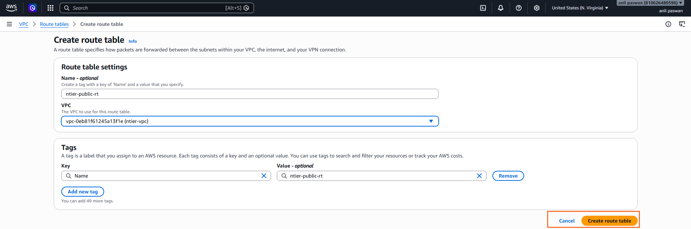

***Step 5 — Create the Private Route Table***

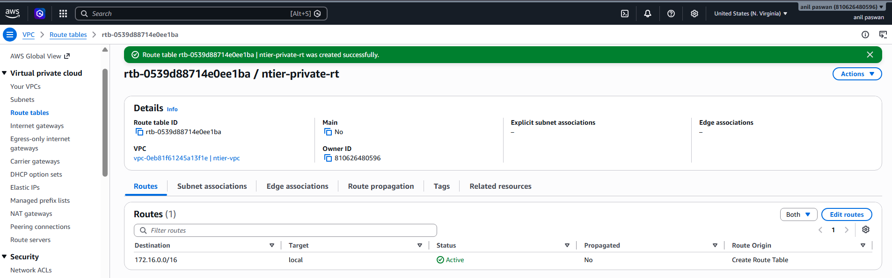

* Current Architecture

```
                    Internet
                        │
                        │
                 Internet Gateway
                        │
                        │
                 +----------------+
                 |    ntier-vpc   |
                 | 172.16.0.0/16  |
                 +----------------+
                  │             │
                  │             │
                  ▼             ▼
        Public Route      Private Route
            Table             Table
```
* Notice something...
* There are no subnets yet.
* There are no routes yet.
* There are no EC2 instances yet.
* So the route tables are currently empty containers waiting for routing rules.

***What is a Route?***

* This is one of the most important networking concepts.
* Suppose you live in Nagpur.
* You want to go to Mumbai.
* How do you know which road to take?
* You use Google Maps.
```
Nagpur

↓

Google Maps

↓

Mumbai
```

* Google Maps tells you

```
Take Highway 53

↓

Take Expressway

↓

Reach Mumbai
```

* AWS works exactly the same.
---

* Suppose an EC2 instance wants to communicate.
```
EC2

↓

Where should I send this packet?
```

* AWS checks
  * Route Table
    * The Route Table answers
```
Use Internet Gateway

or

Stay inside VPC

or

Use NAT Gateway

or

Use VPN
```

* Think of Route Table as Google Maps

```
Packet

↓

Route Table

↓

Destination Found

↓

Send Packet
```

* Without Route Table

```
Packet

↓

???

↓

Dropped
```

* Why do we need TWO Route Tables?
  * Your tutor's architecture
```
Internet

↓

Web Server

↓

Application Server

↓

Database
```

* Should Web Server have Internet? `Yes`
  * Because users access the website.
    * Therefore
```
Public Route Table

↓

Internet Access
```
```
Private Route Table

↓

No Internet Access
```
---

***Public Route Table***

* Imagine
```
Internet

↓

Web Server
```
* Public Route Table contains

```
Destination

0.0.0.0/0

↓

Internet Gateway
```

* Meaning
```
Any Internet traffic

↓

Internet Gateway
```

***Private Route Table***

  * Private Route Table contains
  * No Internet route.
  * Meaning
```
Database

↓

Internet

❌ Not Allowed
```

* So what is missing now?
* Right now your Public Route Table is empty.
* Let's verify that.

* `0.0.0.0/0` means It allows communication with any IP address.
    * Think of a Route Table like Google Maps
    * Imagine you're in Nagpur.
    * You ask Google Maps:
      * "How do I reach Mumbai?"
    * Google Maps doesn't decide whether you're allowed to go.
      * It only tells you which road to take.
      * A Route Table works exactly the same way.

* What does 0.0.0.0/0 actually mean?
    * Any IPv4 destination in the world.
    * The /0 means match all IPv4 addresses.
      * Examples:
        * `8.8.8.8        (Google DNS)`
        * `1.1.1.1        (Cloudflare)`
        * `142.250.x.x    (Google)`
        * `104.x.x.x      (GitHub)`
        * `20.x.x.x       (Microsoft Azure)`
    
    * All of these match:
        * `0.0.0.0/0`
        * `Because /0 means everything.`

* Then what does this route mean?
    * Suppose your Route Table contains:

| Destination | Target |
|-------------|--------|
| 0.0.0.0/0 | Internet Gateway |

   * This means: `If the destination is anywhere outside my VPC, send the packet to the Internet Gateway.`

   * Notice the wording:
      * It says send. It does not say allow.

***Why do we need BOTH routes?***

  * Every VPC has this automatically:

| Destination | Target | Purpose |
|-------------|--------|---------|
| `172.16.0.0/16` | Local | Communication inside the VPC |

  * We manually add:

| Destination | Target | Purpose |
|-------------|--------|---------|
| `0.0.0.0/0` | Internet Gateway | Communication with the Internet |

---

* Now that you understand 0.0.0.0/0, go ahead and:
1. Open ntier-public-rt
2. Go to the Routes tab
3. Click Edit routes
4. Add route-
    - `Destination: 0.0.0.0/0`
    - `Target: Internet Gateway`
    - `- Select ntier-igw`
5. Save the changes.

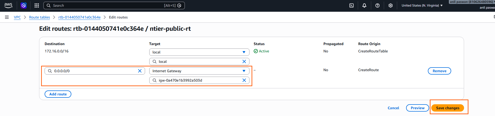
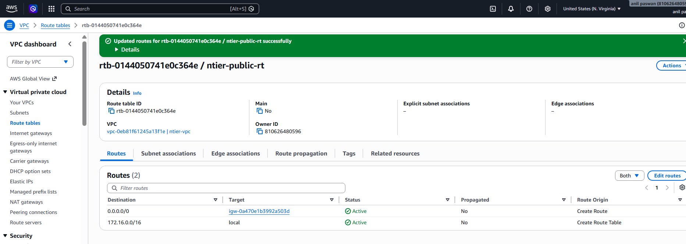

* Your architecture is currently:

```
                    Internet
                        │
                        ▼
               Internet Gateway
                        │
                        ▼
              Public Route Table
          0.0.0.0/0 → Internet
```

* There are no subnets connected to this route table.
* It's like building a highway but not connecting any villages to it.

* Final Architecture

```
                    Internet
                        │
                        ▼
                Internet Gateway
                        │
                        ▼
              Public Route Table
             0.0.0.0/0 → IGW
                    │
        ┌───────────┴───────────┐
        │                       │
        ▼                       ▼
 Public Subnet 1         Public Subnet 2
 ```

 * Now only these subnets can use the Internet.
  * What about Private Subnets?
```
Private Route Table

↓

Local only
```
* No Internet route.

***Now let's create the subnets***

* According to your tutor's diagram, we'll create 4 subnets:

| Subnet | Type | CIDR | AZ |
|---------|------|------|----|
| public-1 | Public | 172.16.0.0/24 | ap-south-1a |
| public-2 | Public | 172.16.1.0/24 | ap-south-1b |
| private-1 | Private | 172.16.2.0/24 | ap-south-1a |
| private-2 | Private | 172.16.3.0/24 | ap-south-1b |

---

***Step 6 — Create Public Subnet***

* Why are we putting public-1 and private-1 in the same Availability Zone (us-east-1a)?
* Think of one Availability Zone as one building.
```
us-east-1a

├── Public Subnet
│      └── Web Server
│
└── Private Subnet
       └── App Server
```

* The Web Server can communicate with the App Server within the same AZ, which can reduce latency.

* Then we repeat the same pattern in another Availability Zone for high availability.

```
us-east-1b

├── Public Subnet
│      └── Web Server
│
└── Private Subnet
       └── App Server
```

* If `us-east-1a` goes down, the infrastructure in `us-east-1b` can continue serving traffic.

***How AWS Companies Actually Build It***

* A common production setup looks like this:

```
                    Internet
                        │
                Internet Gateway
                        │
        ┌───────────────┴───────────────┐
        │                               │
     us-east-1a                     us-east-1b
        │                               │
   Public Subnet                  Public Subnet
        │                               │
      EC2 Web                       EC2 Web
        │                               │
        └───────────────┬───────────────┘
                        │
                 Load Balancer
                        │
        ┌───────────────┴───────────────┐
        │                               │
    Private Subnet                 Private Subnet
        │                               │
     App Server                     App Server
        │                               │
        └───────────────┬───────────────┘
                        │
                    Database
```

* Why two public subnets? → To keep the web tier available if one AZ fails.
* Why two private subnets? → To keep the application tier available if one AZ fails.
* Why Internet Gateway? → To allow internet connectivity for public resources.
* Why separate route tables? → So public and private subnets can have different routing behavior.

* Understanding the reason behind each component is what separates someone who has memorized AWS from someone who can design and troubleshoot real cloud infrastructure.

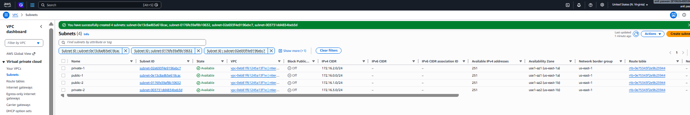

* Your Network Architecture

```
                     Internet
                         │
                         │
                  Internet Gateway
                         │
                         │
                 Public Route Table
             0.0.0.0/0 → Internet Gateway
                         │
          ┌──────────────┴──────────────┐
          │                             │
     public-1                     public-2
   172.16.0.0/24               172.16.1.0/24
      us-east-1a                 us-east-1b


====================================================
            Internal VPC Communication
====================================================


          ┌──────────────┴──────────────┐
          │                             │
     private-1                    private-2
   172.16.2.0/24               172.16.3.0/24
      us-east-1a                 us-east-1b
          │                             │
          └──────────────┬──────────────┘
                         │
                 Private Route Table
               172.16.0.0/16 → local
```
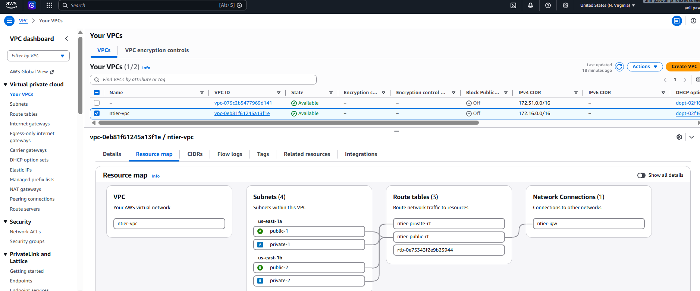

* Why did we create 2 Public and 2 Private subnets?

  * Suppose your application has:
    - Frontend
    - Backend
    - Database

* A common production architecture is:

```
Internet
      │
Load Balancer
      │
──────────────────────────────
Public Subnets
──────────────────────────────

Frontend Server 1 (AZ-A)

Frontend Server 2 (AZ-B)

──────────────────────────────
Private Subnets
──────────────────────────────

Application Server 1 (AZ-A)

Application Server 2 (AZ-B)

Database Server 1 (AZ-A)

Database Server 2 (AZ-B)
```
* Why?
  * If AZ-A goes down:
    - Frontend 2
    - Application 2
    - Database 2

  * continue running in AZ-B.
  * This is called High Availability (HA).

---

* In real AWS production environments, we solve this by adding a NAT Gateway.

```
Internet
     │
Internet Gateway
     │
Public Subnet
     │
NAT Gateway
     │
Private Route Table
     │
Private Subnets
```

* This allows:
  - Private servers to access the Internet outbound (for updates, package downloads, APIs).
  - The Internet cannot initiate connections to the private servers. 

---
* we now manually built the same type of network that is commonly used in production AWS environments:
- ✅ 1 VPC
- ✅ 1 Internet Gateway
- ✅ 2 Availability Zones
- ✅ 2 Public Subnets
- ✅ 2 Private Subnets
- ✅ 2 Route Tables
- ✅ Public routing to the Internet
- ✅ Private routing within the VPC
- ✅ Proper subnet-to-route-table associations
- ✅ High Availability across two AZs

* This manual setup will make the Terraform implementation much easier to understand because you'll know exactly what each Terraform resource is creating behind the scenes.

***Complete AWS Network***

* One Route Table can be associated with many subnets.
  * Example:
```
                   Public Route Table
              +--------------------------+
              | 10.0.0.0/16 → local      |
              | 0.0.0.0/0 → IGW          |
              +--------------------------+
                    ▲      ▲      ▲
                    │      │      │
              Public1  Public2  Public3
```

* All three public subnets use the same Route Table.

* Example with 100 Public Subnets
```
Public Route Table
        ▲
        │
 ┌──────┼──────────────────────────┐
 │      │      │      │      │      │
 ▼      ▼      ▼      ▼      ▼      ▼
S1     S2     S3     S4    ...    S100
```
* Every subnet follows the same routing rules.
* AWS allows this.

* Then why do we create multiple Route Tables?
  * Because different subnets need different rules.
  * For example:

***Public Subnets***
* Need Internet.

```
Destination      Target
------------------------------
0.0.0.0/0        Internet Gateway
```

***Private Subnets***
  * Should not have direct Internet access.
* They might have:
```
Destination      Target
------------------------------
0.0.0.0/0        NAT Gateway
```
* or sometimes no Internet route at all.

* So normally we create:
```
VPC
│
├── Public Route Table
│      ▲
│      │
│  Public-1
│  Public-2
│  Public-3
│
└── Private Route Table
       ▲
       │
   Private-1
   Private-2
   Private-3
```

* Notice something:
- One Public Route Table is shared by all Public Subnets.
- One Private Route Table is shared by all Private Subnets.

* Why do we create an Internet Gateway?
  * `An Internet Gateway connects our VPC to the Internet. Without an Internet Gateway, resources inside the VPC cannot communicate with the Internet.`
  * Think of it like this:
```
My House (VPC)

↓

Main Gate (Internet Gateway)

↓

Road (Internet)
```

* Why do we create a Route Table?
  * A Route Table works exactly like Google Maps.
  * It tells AWS: `Where should I send this network traffic?`
  * For example:
```
Destination

10.0.0.0/16

↓

Stay inside VPC
```
* Another rule:
```
Destination

0.0.0.0/0

↓

Internet Gateway
```
* So the Route Table is simply a list of routing rules.
* `A Route Table contains routing rules that tell AWS where network traffic should go.`
* Examples:
    - Stay inside VPC
    - Go to Internet Gateway
    - Go to NAT Gateway
    - Go to VPN

* Let's revise everything you've learned so far.

| Resource | Purpose |
|----------|---------|
| `aws_vpc` | Creates a VPC |
| `aws_internet_gateway` | Connects the VPC to the Internet |
| `aws_route_table` | Stores routing rules |
| `aws_route` | Adds a route (for example, `0.0.0.0/0 → IGW`) |
| `aws_subnet` | Creates a subnet inside the VPC |
| `aws_route_table_association` | Connects a subnet to a Route Table |

* Public vs Private Subnet

| Public Subnet | Private Subnet |
|---------------|----------------|
| Web Server | Database |
| Load Balancer | Redis |
| Bastion Host | Internal APIs |
| NAT Gateway | Backend Services |

* What Makes a Subnet Private?
  * `"A Private Subnet means map_public_ip_on_launch = false."`
  
***resource vs data***

| Use | When? |
|------|--------|
| `resource` | Create a new AWS resource |
| `data` | Read an existing AWS resource |

* So What Does NAT Gateway Do?
  * Visual Flow 

```
Private EC2
10.0.10.20
      │
      ▼
NAT Gateway
      │
Changes Source Address
      │
10.0.10.20
      ▼
3.110.55.25 (Elastic IP)
      │
      ▼
Internet
```
* This process is called Network Address Translation (NAT).

* That's where the name NAT Gateway comes from.

* Why does a NAT Gateway require an Elastic IP?
  * A NAT Gateway communicates with the public internet on behalf of instances in private subnets. Since private IP addresses are not routable on the internet, the NAT Gateway needs a public IP. AWS uses an Elastic IP so the NAT Gateway has a static public address for outbound communication.

* Why don't we place the NAT Gateway inside a Private Subnet?
  * Because the NAT Gateway itself must be able to reach the Internet Gateway.
  * So AWS requires the NAT Gateway to be placed in a Public Subnet.

* Architecture
```
                        Internet
                            │
                            ▼
                    Internet Gateway
                            │
                            ▼
                     Public Subnet
                            │
                      NAT Gateway
                            ▲
                            │
                 Private Route Table
                            ▲
                            │
                      Private Subnet

```

* If the NAT Gateway were inside a private subnet, it wouldn't have a route to the Internet Gateway, so it couldn't forward traffic to the internet.


1. Elastic IP
= `aws_eip.nat` 
  * = Gives the NAT Gateway a permanent Public IP.

2. NAT Gateway
= `aws_nat_gateway.nat`
  * =  Allows Private EC2 instances to access the internet.

3. Private Route
= `aws_route.private_nat` 
```
destination_cidr_block = "0.0.0.0/0"
nat_gateway_id         = (known after apply)


```
* This means:
```
If destination is Internet

↓

Send traffic to NAT Gateway
```

****Final Architecture***

```
                           Internet
                               ▲
                               │
                        Internet Gateway
                               ▲
                               │
                   Public Route Table
                 0.0.0.0/0 → Internet Gateway
                               ▲
        ┌──────────────────────┼──────────────────────┐
        │                      │                      │
        ▼                      ▼                      ▼
    Public-1               Public-2             Public-3
        │
        │
        ▼
   NAT Gateway
   Elastic IP
        ▲
        │
        │
      Private Route Table
      0.0.0.0/0 → NAT Gateway
        ▲
   ┌────┼────┐
   ▼    ▼    ▼
Private-1
Private-2
Private-3
```

# ec2 
```md


# =============================================================================
# Create AWS VPC
# This resource creates a new Virtual Private Cloud (VPC) in AWS.
# CIDR: 10.0.0.0/16
# Name: ntier
# =============================================================================

resource "aws_vpc" "base" {

  # CIDR block of the VPC
  cidr_block = "10.0.0.0/16"

  # Tags help identify resources in AWS Console
  tags = {
    Name = "ntier"
  }

}

# This Internet Gateway connects the VPC to the Internet.

resource "aws_internet_gateway" "igw" {
  # Attach an internet getway to thge VPC
  # aws_vpc.base.id means:
  # "Get the ID of the VPC whose Terraform local name is 'base'."

  vpc_id = aws_vpc.base.id

  # Tags help identify the Internet Gateway in AWS Console.

  tags = {

    Name = "ntier-igw"
  }
}

# Create Public Route Table
# This Route Table will be used by public subnets.


resource "aws_route_table" "public" {
  # Associate this Route Table with the VPC
  vpc_id = aws_vpc.base.id

  # Name shown in AWS Console

  tags = {
    Name = "ntier-public-rt"
  }
}

# Create Public Route
# This route sends all Internet traffic (0.0.0.0/0)
# to the Internet Gateway.

resource "aws_route" "public_internet" {
  # Attach this route to the Public Route Table
  route_table_id = aws_route_table.public.id

  # Any destination outside the VPC
  destination_cidr_block = "0.0.0.0/0"

  # Send the traffic to the Internet Gateway

  gateway_id = aws_internet_gateway.igw.id


}

# Create Public Subnet 1
# This subnet will be used to launch public EC2 instances.

resource "aws_subnet" "public_1" {

  # The subnet belongs to this VPC
  vpc_id = aws_vpc.base.id

  # CIDR block for this subnet

  cidr_block = "10.0.0.0/24"

  # Availability Zone

  availability_zone = "us-east-1a"

  # Automatically assign Public IP to EC2 instances
  map_public_ip_on_launch = true

  # Tags 

  tags = {
    Name = "public-1"
  }
}


# Create aws route_table_association for public subnet 1
# Creates a relationship (association) between a subnet and a route table.

resource "aws_route_table_association" "public_1" {
  # Associate the Public Route Table with this subnet

  subnet_id = aws_subnet.public_1.id

  route_table_id = aws_route_table.public.id
}

# public subnet 2

resource "aws_subnet" "public_2" {

  # The subnet belongs to this VPC

  vpc_id = aws_vpc.base.id

  availability_zone = "us-east-1b"

  map_public_ip_on_launch = true

  # CIDR block for this subnet

  cidr_block = "10.0.1.0/24"

  tags = {
    Name = "public-2"
  }
}

# Create aws route_table_association for public subnet 2

resource "aws_route_table_association" "public_2" {
  # Associate the Public Route Table with this subnet

  subnet_id = aws_subnet.public_2.id

  route_table_id = aws_route_table.public.id

}


# public subnet 3

resource "aws_subnet" "public_3" {

  # this subnet belongs to this VPC 
  vpc_id = aws_vpc.base.id

  cidr_block = "10.0.2.0/24"

  availability_zone = "us-east-1c"

  map_public_ip_on_launch = true

  tags = {
    Name = "public-3"
  }
}


# Create aws route_table_association for public subnet 3

resource "aws_route_table_association" "public_3" {
  # Associate the Public Route Table with this subnet

  subnet_id = aws_subnet.public_3.id

  route_table_id = aws_route_table.public.id

}

# Create Private Subnet 1
# This subnet will be used to launch private EC2 instances.

resource "aws_subnet" "private_1" {
  # The subnet belongs to the VPC 
  # No map_public_ip_on_launch here.
  # The default is false, so EC2 instances won't get Public IPs.

  vpc_id = aws_vpc.base.id

  # CIDR block for this subnet

  cidr_block = "10.0.10.0/24"

  availability_zone = "us-east-1a"

  tags = {
    Name = "private-1"
  }
}


# create Private Subnet 2

resource "aws_subnet" "private_2" {

  vpc_id = aws_vpc.base.id

  cidr_block = "10.0.11.0/24"

  availability_zone = "us-east-1b"

  tags = {
    Name = "private-2"
  }


}

# create Private Subnet 3

resource "aws_subnet" "private_3" {

  vpc_id = aws_vpc.base.id

  cidr_block = "10.0.12.0/24"

  availability_zone = "us-east-1c"

  tags = {
    Name = "private-3"
  }
}

# Create Private Route Table 1

resource "aws_route_table" "private" {
  vpc_id = aws_vpc.base.id

  # Name shown in AWS Console

  tags = {
    Name = "ntier-private-rt"
  }
}

# Create aws route_table_association for private subnet 1

resource "aws_route_table_association" "private_1" {
  subnet_id      = aws_subnet.private_1.id
  route_table_id = aws_route_table.private.id

}


# Create aws route_table_association for private subnet 2
resource "aws_route_table_association" "private_2" {
  subnet_id      = aws_subnet.private_2.id
  route_table_id = aws_route_table.private.id
}

# Create aws route_table_association for private subnet 3
resource "aws_route_table_association" "private_3" {

  subnet_id = aws_subnet.private_3.id

  route_table_id = aws_route_table.private.id

}

# NAT Gateway

resource "aws_eip" "nat" {
  domain = "vpc"

  tags = {
    Name = "ntier-nat-eip"
  }
}

resource "aws_nat_gateway" "nat" {
  allocation_id = aws_eip.nat.id

  subnet_id = aws_subnet.public_1.id

  tags = {
    Name = "ntier-nat-gateway"
  }
}


# aws route for private subnets to use NAT Gateway

resource "aws_route" "private_nat" {
  #Create a route inside the Private Route Table
  route_table_id = aws_route_table.private.id

  # Any destination outside the VPC
  destination_cidr_block = "0.0.0.0/0"

  # Send the traffic to the NAT Gateway / Inside the Private Route Table, if the destination is 0.0.0.0/0 (the internet), send the traffic to the NAT Gateway.
  nat_gateway_id = aws_nat_gateway.nat.id

}

# security group for public EC2 instances

resource "aws_security_group" "sg" {
  name        = "allow_all_traffic"
  description = "Allow all inbound and outbound traffic"
  vpc_id      = aws_vpc.base.id

  tags = {
    Name = "allow_all_traffic"

  }
}


resource "aws_vpc_security_group_ingress_rule" "http" {
  security_group_id = aws_security_group.sg.id
  cidr_ipv4         = "0.0.0.0/0"
  from_port         = 80
  to_port           = 80
  ip_protocol       = "tcp"

}


resource "aws_vpc_security_group_ingress_rule" "ssh" {
  security_group_id = aws_security_group.sg.id
  cidr_ipv4         = "0.0.0.0/0" #Allow everyone from anywhere on the Internet.
  from_port         = 22
  to_port           = 22
  ip_protocol       = "tcp"
}

resource "aws_vpc_security_group_ingress_rule" "https" {
  security_group_id = aws_security_group.sg.id
  cidr_ipv4         = "0.0.0.0/0"
  from_port         = 443
  to_port           = 443
  ip_protocol       = "tcp"
}


resource "aws_vpc_security_group_egress_rule" "all_outbound" {
  security_group_id = aws_security_group.sg.id
  cidr_ipv4         = "0.0.0.0/0"
  ip_protocol       = "-1"
}

# key pair for EC2 instances

resource "aws_key_pair" "terraform" {
  key_name   = "terraform-key"
  public_key = file("c:/Users/Paswa/.ssh/id_ed25519.pub")
}

# ec2 instance for public subnet1 

resource "aws_instance" "web" {
  ami                    = "ami-0b6d9d3d33ba97d99" # Amazon Linux 2 AMI (HVM), SSD Volume Type
  instance_type          = "t3.micro"
  subnet_id              = aws_subnet.public_1.id
  vpc_security_group_ids = [aws_security_group.sg.id]
  key_name               = aws_key_pair.terraform.key_name # Use the key pair created earlier"

  tags = {
    Name = "web-server"
  }
}

#### outputs.tf 

# public ip

output "public_ip" {
  value       = aws_instance.web.public_ip
  description = "The public IP address of the EC2 instance"
}

# Output 2 - Private IP

output "private_ip" {
  value       = aws_instance.web.private_ip
  description = "The private IP address of the EC2 instance"
}

# Output 3 - EC2 ID

output "instance_id" {
  value       = aws_instance.web.id
  description = "The ID of the EC2 instance"
}

# Output 4 - VPC ID

output "vpc_id" {
  value       = aws_vpc.base.id
  description = "The ID of the VPC"
}

# Output 5 - Security Group ID
output "security_group_id" {
  value       = aws_security_group.sg.id
  description = "The ID of the security group"
}


```

# How Variables Work

```md
variables.tf
        │
        ▼
Defines the variable

        │
        ▼
terraform.tfvars
Gives the value

        │
        ▼
main.tf
Uses the value
```

# Stage 2

***main.tf***

```md

resource "aws_vpc" "base" {

  # CIDR block of the VPC
  cidr_block = var.vpc_cidr

  # Tags help identify resources in AWS Console
  tags = {
    Name = var.vpc_name
  }

}

# This Internet Gateway connects the VPC to the Internet.

resource "aws_internet_gateway" "igw" {

  vpc_id = aws_vpc.base.id

  tags = {

    Name = var.aws_igw_name
  }
}

# Create Public Route Table
# This Route Table will be used by public subnets.


resource "aws_route_table" "public" {
  # Associate this Route Table with the VPC
  vpc_id = aws_vpc.base.id

  # Name shown in AWS Console

  tags = {
    Name = "ntier-public-rt"
  }
}

# Create Public Route. This route sends all Internet traffic (0.0.0.0/0) to the Internet Gateway.

resource "aws_route" "public_internet" {
  # Attach this route to the Public Route Table
  route_table_id = aws_route_table.public.id

  # Any destination outside the VPC
  destination_cidr_block = "0.0.0.0/0"

  # Send the traffic to the Internet Gateway

  gateway_id = aws_internet_gateway.igw.id

}

# Create Public Subnet 1 and associate it with the Public Route Table. This subnet will be used to launch public EC2 instances.

resource "aws_subnet" "public_1" {

  vpc_id                  = aws_vpc.base.id
  cidr_block              = var.public_subnet_cidr
  availability_zone       = var.availability_zone
  map_public_ip_on_launch = true

  tags = {
    Name = var.public_subnet_name
  }
}


# public subnet 2

resource "aws_subnet" "public_2" {

  vpc_id = aws_vpc.base.id

  availability_zone = var.availability_zone_2

  map_public_ip_on_launch = true

  cidr_block = var.public_subnet_2_cidr

  tags = {
    Name = var.public_subnet_2_name
  }
}

# public subnet 3

resource "aws_subnet" "public_3" {

  # this subnet belongs to this VPC 
  vpc_id = aws_vpc.base.id

  cidr_block = var.public_subnet_3_cidr

  availability_zone = var.availability_zone_3

  map_public_ip_on_launch = true

  tags = {
    Name = var.public_subnet_3_name
  }
}

# Create aws route_table_association for public subnet 

resource "aws_route_table_association" "public_1" {

  subnet_id = aws_subnet.public_1.id

  route_table_id = aws_route_table.public.id
}


resource "aws_route_table_association" "public_2" {
  # Associate the Public Route Table with this subnet

  subnet_id = aws_subnet.public_2.id

  route_table_id = aws_route_table.public.id

}


# Create aws route_table_association for public subnet 3

resource "aws_route_table_association" "public_3" {
  # Associate the Public Route Table with this subnet

  subnet_id = aws_subnet.public_3.id

  route_table_id = aws_route_table.public.id

}

# Create Private Subnet 1
# This subnet will be used to launch private EC2 instances.

resource "aws_subnet" "private_1" {


  vpc_id = aws_vpc.base.id

  cidr_block = var.private_subnet_cidr

  availability_zone = var.availability_zone

  tags = {
    Name = var.private_subnet_name
  }
}


# create Private Subnet 2

resource "aws_subnet" "private_2" {

  vpc_id = aws_vpc.base.id

  cidr_block = var.private_subnet_2_cidr

  availability_zone = var.availability_zone_2

  tags = {
    Name = var.private_subnet_2_name
  }


}

# create Private Subnet 3

resource "aws_subnet" "private_3" {

  vpc_id = aws_vpc.base.id

  cidr_block = var.private_subnet_3_cidr

  availability_zone = var.availability_zone_3

  tags = {
    Name = var.private_subnet_3_name
  }
}

# Create Private Route Table 1

resource "aws_route_table" "private" {
  vpc_id = aws_vpc.base.id

  # Name shown in AWS Console

  tags = {
    Name = "ntier-private-rt"
  }
}

# Create aws route_table_association for private subnet 1

resource "aws_route_table_association" "private_1" {
  subnet_id      = aws_subnet.private_1.id
  route_table_id = aws_route_table.private.id

}


# Create aws route_table_association for private subnet 2
resource "aws_route_table_association" "private_2" {
  subnet_id      = aws_subnet.private_2.id
  route_table_id = aws_route_table.private.id
}

# Create aws route_table_association for private subnet 3

resource "aws_route_table_association" "private_3" {
  subnet_id      = aws_subnet.private_3.id
  route_table_id = aws_route_table.private.id
}

# NAT Gateway

resource "aws_eip" "nat" {
  domain = "vpc"

  tags = {
    Name = "ntier-nat-eip"
  }
}

resource "aws_nat_gateway" "nat" {
  allocation_id = aws_eip.nat.id

  subnet_id = aws_subnet.public_1.id

  tags = {
    Name = "ntier-nat-gateway"
  }
}


# aws route for private subnets to use NAT Gateway

resource "aws_route" "private_nat" {
  #Create a route inside the Private Route Table
  route_table_id = aws_route_table.private.id

  # Any destination outside the VPC
  destination_cidr_block = "0.0.0.0/0"

  # Send the traffic to the NAT Gateway / Inside the Private Route Table, if the destination is 0.0.0.0/0 (the internet), send the traffic to the NAT Gateway.
  nat_gateway_id = aws_nat_gateway.nat.id

}

# security group for public EC2 instances

resource "aws_security_group" "sg" {
  name        = var.security_group_name
  description = var.security_group_description
  vpc_id      = aws_vpc.base.id

  tags = {
    Name = var.security_group_name

  }
}


resource "aws_vpc_security_group_ingress_rule" "http" {
  security_group_id = aws_security_group.sg.id
  cidr_ipv4         = var.allowed_cidr
  from_port         = var.http_port
  to_port           = var.http_port
  ip_protocol       = "tcp"

}


resource "aws_vpc_security_group_ingress_rule" "ssh" {
  security_group_id = aws_security_group.sg.id
  cidr_ipv4         = var.allowed_cidr #Allow everyone from anywhere on the Internet.
  from_port         = var.ssh_port
  to_port           = var.ssh_port
  ip_protocol       = "tcp"
}

resource "aws_vpc_security_group_ingress_rule" "https" {
  security_group_id = aws_security_group.sg.id
  cidr_ipv4         = var.allowed_cidr
  from_port         = var.https_port
  to_port           = var.https_port
  ip_protocol       = "tcp"
}


resource "aws_vpc_security_group_egress_rule" "all_outbound" {
  security_group_id = aws_security_group.sg.id
  cidr_ipv4         = "0.0.0.0/0"
  ip_protocol       = "-1"
}

# key pair for EC2 instances

resource "aws_key_pair" "terraform" {
  key_name   = var.aws_key_name
  public_key = file(var.public_key_path)
}

# ec2 instance for public subnet1 

resource "aws_instance" "web" {
  ami                         = var.ami_id # Amazon Linux 2 AMI (HVM), SSD Volume Type
  instance_type               = var.instance_type
  associate_public_ip_address = true
  subnet_id                   = aws_subnet.public_1.id
  vpc_security_group_ids      = [aws_security_group.sg.id]
  key_name                    = aws_key_pair.terraform.key_name # Use the key pair created earlier"

  tags = {
    Name = var.instance_name
  }
}


```
***outputs.tf***

```md
# public ip

output "public_ip" {
  value       = aws_instance.web.public_ip
  description = "The public IP address of the EC2 instance"
}

# Output 2 - Private IP

output "private_ip" {
  value       = aws_instance.web.private_ip
  description = "The private IP address of the EC2 instance"
}

# Output 3 - EC2 ID

output "instance_id" {
  value       = aws_instance.web.id
  description = "The ID of the EC2 instance"
}

# Output 4 - VPC ID

output "vpc_id" {
  value       = aws_vpc.base.id
  description = "The ID of the VPC"
}

# Output 5 - Security Group ID
output "security_group_id" {
  value       = aws_security_group.sg.id
  description = "The ID of the security group"
}

```

***providers.tf***

```md

# providers 

terraform {
  required_providers {
    aws = {
      source  = "hashicorp/aws"
      version = "~>6.62.0"
    }
  }
}

provider "aws" {
  region = var.region
}


```

***variables.tf***

```md
# This file contains the variables used in the Terraform configuration.

variable "region" {
  description = "The AWS region to deploy resources in"
  type        = string
  default     = "us-east-1"
}

variable "instance_type" {
  description = "The type of EC2 instance to use for the web server"
  type        = string
  default     = "t3.micro"

}

variable "aws_key_name" {
  description = "The name of the key pair to use for SSH access to the EC2 instance"
  type        = string
  default     = "terraform-key"

}

variable "ami_id" {
  description = "The ID of the Amazon Machine Image (AMI) to use for the EC2 instance"
  type        = string
  default     = "ami-0b6d9d3d33ba97d99" # Amazon Linux 2 AMI (HVM), SSD Volume Type
}


variable "vpc_cidr" {
  description = "The CIDR block for the VPC"
  type        = string
  default     = "10.0.0.0/16"

}

variable "public_subnet_cidr" {
  description = "The CIDR block for the public subnet"
  type        = string
  default     = "10.0.0.0/24"

}

variable "public_subnet_2_cidr" {
  description = "The CIDR block for the second public subnet"
  type        = string
  default     = "10.0.1.0/24"

}

variable "public_subnet_3_cidr" {
  description = "The CIDR block for the third public subnet"
  type        = string
  default     = "10.0.2.0/24"

}

variable "public_subnet_name" {
  description = "The name of the public subnet"
  type        = string
  default     = "public-subnet_1"
}

variable "public_subnet_2_name" {
  description = "The name of the second public subnet"
  type        = string
  default     = "public-subnet_2"
}

variable "public_subnet_3_name" {
  description = "The name of the third public subnet"
  type        = string
  default     = "public-subnet-3"
}


variable "private_subnet_cidr" {
  description = "The CIDR block for the private subnet"
  type        = string
  default     = "10.0.10.0/24"

}

variable "private_subnet_2_cidr" {
  description = "The CIDR block for the second private subnet"
  type        = string
  default     = "10.0.11.0/24"
}

variable "private_subnet_3_cidr" {
  description = "The CIDR block for the third private subnet"
  type        = string
  default     = "10.0.12.0/24"
}

variable "private_subnet_name" {
  description = "The name of the private subnet"
  type        = string
  default     = "private-subnet-1"
}

variable "private_subnet_2_name" {
  description = "The name of the second private subnet"
  type        = string
  default     = "private-subnet-2"
}

variable "private_subnet_3_name" {
  description = "The name of the third private subnet"
  type        = string
  default     = "private-subnet-3"
}


variable "availability_zone" {
  description = "The availability for the first subnet"
  type        = string
  default     = "us-east-1a"

}

variable "availability_zone_2" {
  description = "The availability for the second subnet"
  type        = string
  default     = "us-east-1b"

}

variable "availability_zone_3" {
  description = "The availability for the third subnet"
  type        = string
  default     = "us-east-1c"

}

variable "public_key_path" {
  description = "The path to the public key file for the key pair"
  type        = string
  default     = "c:/Users/Paswa/.ssh/id_ed25519.pub"

}

variable "private_key_path" {
  description = "The path to the private key file for the key pair"
  type        = string
  default     = "c:/Users/Paswa/.ssh/id_ed25519"

}

variable "instance_name" {
  description = "The name of the EC2 instance"
  type        = string
  default     = "nginx-web-server"

}

variable "security_group_name" {
  description = "The name of the security group"
  type        = string
  default     = "allow_all_traffic"
}

variable "security_group_description" {
  description = "The description of the security group"
  type        = string
  default     = "Allow all inbound and outbound traffic"
}

variable "http_port" {
  description = "The port for HTTP traffic"
  type        = number
  default     = 80
}

variable "https_port" {
  description = "The port for HTTPS traffic"
  type        = number
  default     = 443
}


variable "ssh_port" {
  description = "The port for ssh traffic"
  type        = number
  default     = 22

}

#One production note for later: allowed_cidr = "0.0.0.0/0" means SSH is open to the entire Internet-
# -For a real production environment, SSH would normally be restricted to a trusted source or replaced with another access mechanism-
# -Don't change it now; we're learning the variable mechanism first.

variable "allowed_cidr" {
  description = "The CIDR block to allow inbound traffic from"
  type        = string
  default     = "0.0.0.0/0"
}


variable "egress_rule_all" {
  description = "the egress rule for the security group to allow all outbound traffic"
  type        = string
  default     = "-1"
}


variable "vpc_name" {
  description = "The name of the VPC"
  type        = string
  default     = "ntier-vpc"

}

variable "aws_igw_name" {
  description = "The name of the Internet Gateway"
  type        = string
  default     = "ntier-igw"
}


```


---

# Activity-3 — Complete structure


* Eventually our folder will look like this:

```sh
main.tf
variables.tf
outputs.tf
network.tf
provider.tf
terraform.tf
security.tf
sample.tfvar
locals.tf
```

***Step 1 — variables.tf***

```sh
# public subnet

variable "public_subnets" {
  type = list(object({
    name = string
    cidr = string
    az   = string
  }))
}
```

***Step 2 — What Activity-3 will create***

* network.tf creates:

```sh
VPC
│
├── Internet Gateway
│
├── Public Route Table
│   ├── Public Subnet 1
│   ├── Public Subnet 2
│   └── ...
│
└── Private Route Table
    ├── Private Subnet 1
    ├── Private Subnet 2
    └── ...
```

***Step 3 — Create terraform.tf***

* What this does: It tells Terraform 
```
Terraform version
       +
AWS provider
       +
AWS provider source
       +
minimum provider version
```

```sh 
terraform {
  required_providers {
    aws = {
      source  = "hashicorp/aws"
      version = ">= 5.82.2"
    }
  }

  required_version = ">= 1.10.0"
}
```

***Step 4 — Create providers.tf***

```sh
# Configure the AWS Provider
# This means the AWS provider gets its region from:
# Therefore, we'll need a region variable.

provider "aws" {
    region = "us-east-1"
}
```
***Step 5 — Add the basic variables***

```sh
variable "region" {
  type        = string
  description = "AWS region"
  default     = "ap-south-1"
}

variable "vpc_cidr" {
  type        = string
  description = "VPC CIDR block"
}

variable "network_name" {
  type        = string
  description = "Name of the network"
  default     = "ntier"
}

variable "public_subnets" {
  type = list(object({
    name = string
    cidr = string
    az   = string
  }))

  description = "Public subnet configuration"
}
```

---

1. count = local.public_subnet_count != 0 ? 1 : 0
* means: 

```sh
Are there any public subnets?
        │
       YES
        │
        ▼
Create 1 public route table
```
* If there are no public subnets:

```sh
public_subnet_count = 0
        │
        ▼
Create 0 route tables
```

* Understand the ? : syntax 
* This is called a ternary expression: `condition ? value_if_true : value_if_false`
* Our condition is: `local.public_subnet_count != 0`

* So: 

```
If public subnet count is not 0 → 1
Otherwise                      → 0
```
* Why only 1 route table?
* Because later we will have: 

```
Public Subnet 1 ──┐
Public Subnet 2 ──┼──> One Public Route Table
Public Subnet 3 ──┘
```

# Explanation

* Terraform count and Ternary — Very Simple Explanation
1. What are we trying to do?
    * We have public subnets.
    * For example:
```
Public Subnet 1
Public Subnet 2
Public Subnet 3
```
* All these subnets need to use a Public Route Table.
* We want:

```
3 Public Subnets
      │
      ├──────────────┐
      │              │
      ▼              ▼
   Subnet 1       Route Table
   Subnet 2       (only 1)
   Subnet 3
```

* so : We need one route table, not three route tables.

2. First understand public_subnet_count

* In our locals.tf we have: 

```tf
locals {
    anywhere = "0.0.0.0/0"
    public_subnet_count = length(var.public_subnets)
}
```

* The important part is: `length(var.public_subnets)`

* length() simply means: `Count how many items are inside the list.`

* For example:

```
public_subnets = [
    {
        name = "web-1"
        cidr = "10.10.10.0/24"
        az   = "us-east-1a" 
    },

    {
        name = "web-1"
        cidr = "10.10.11.0"
        az   = "us-east-1b"
    }
]
```

* There are 2 objects.
* Therefore: `public_subnet_count = 2`


3. Now understand this condition

* `local.publiv_subnet_count != 0`
* Read it in normal English: `Is the number of public subnets not equal to zero?`
* `!= means: not equal to`

* So: `2 != 0` is: `TRUE`
* Because 2 is not zero.

* But: `0 != 0` is: `FALSE`

4. Now understand ? :

* This is called a ternary expression.
    * The basic structure is: `condition ? if_true : if_false`
    * Think of it like a simple question: `QUESTION ? YES : NO`
    * For example:
        * `Is it raining? ? Take umbrella : Don't take umbrella`
    
    * In Terraform:
        * `local.public_subbnet_count != 0 ? 1 : 0`

* means:

```
Are there public subnets?

       YES → 1
       NO  → 0
```
* That's all 

5. Put everything together

* Our complete line is:
* `count = local.public_subnet_count != 0 ? 1 : 0`
* Read it like this: `If there is at least one public subnet, create 1 route table. Otherwise create 0 route tables.`
    
6. Example 1 — We have 2 public subnets

* suppose: `public_subnet_count = 2`
* Terraform checks: `2 != 0` we can read like: `2 is not equal to 0.`
* Answer: `TRUE`

* So: `TRUE → 1`

* Therefore: `count = 1`

* Terraform creates: `1 Public Route Table`
---

7. Example 2 — We have 0 public subnets

* Suppose: `public_subnet_count = 0`
* Terraform checks: `0 != 0`
* Answer: `FALSE`
* So: `FALSE → 0`
* Therefore: `count = 0`

* Terraform creates: `0 Public Route Tables`
---

8. Why don't we create 3 route tables?

* Suppose we have: 
```
Public Subnet 1
Public Subnet 2
Public Subnet 3
```

* A beginner might think:

```
Subnet 1 → Route Table 1
Subnet 2 → Route Table 2
Subnet 3 → Route Table 3
```

* But we don't need that.
* We can have:
```
             ┌── Public Subnet 1
             │
One Public ──┼── Public Subnet 2
Route Table  │
             └── Public Subnet 3
```

* All three public subnets can use the same route table.

* Therefore: 
```
3 Public Subnets
       │
       ▼
1 Public Route Table

```
* This is why: `count = local.public_subnet_count != 0 ? 1 : 0`
* does not say: `count = local.public_subnet_count`
* If we did that: `3 public subnets → 3 route tables`
---

9. The most important thing to remember
* Don't try to memorize the Terraform syntax yet.
    * Just remember this sentence:
        * `If public subnets exist, create one public route table. If they don't exist, create zero.`
    * Then the Terraform code: `count = local.public_subnet_count != 0 ? 1 : 0`
    * is simply the Terraform way of writing that sentence.

---

# Simple cheat sheet

```
| Code       | Simple meaning                           |
|------------|------------------------------------------|
| `length()` | Count items                              |
| `!=`       | Not equal to                             |
| `?`        | If true                                  |
| `:`        | Otherwise                                |
| `count`    | How many copies of the resource to create|
| `? 1 : 0`  | Create 1 or create 0                     |
```
---

* Final picture

```
var.public_subnets
        │
        ▼
length()
        │
        ▼
public_subnet_count
        │
        ▼
Is count != 0?
     /       \
   YES        NO
    │          │
    ▼          ▼
 count = 1   count = 0
    │          │
    ▼          ▼
1 route      0 route
table        tables
```

* One key point: count is controlling how many route-table resources Terraform creates. It is not saying how many subnets the route table can handle.

* Suppose when you see: `local.public_subnet_count != 0`
* read it as: `is the number of public subnets not equal to zero`
---

* `cidr_block = var.public_subnets[count.index].cidr`
* What does this mean?
    * We have our variable: `var.public_subnet`
    * It contains multiple subnet objects.
* For example:

```tf

public_subnets = [
    {
        name = "web-1"
        cidr_block = "10.10.10.0/24"
        az = "us-east-1a"
    },

    {
        name = "web-2"
        cidr_block = "10.10.11.0/24"
        az = "us-east-1b"
    }
]

```
* Terraform gives each item an index: 
```
index 0 → web-1
index 1 → web-2
```
* so : `count.index`

* means: which subnet currently are creating?
* Therefore: `var.public_subnet[count.index].cidr`

* means: `go to the subnet object and take its cidr value.

***Example***
* for the 1st subnet: `count.index`

* Terraform gets:

```
var.public_subnets[0].cidr
        ↓
10.10.10.0/24
```
* For the second: `count.index = 1`
* Terraform gets: 
```
var.public_subnets[1].cidr
        ↓
10.10.11.0/24
```

* So finally:
```
public_subnets list
       │
       ├── [0] → 10.10.10.0/24 → AWS Subnet 1
       │
       └── [1] → 10.10.11.0/24 → AWS Subnet 2
```
---

# Step 8 — Add the tags to the Public Subnet

* Now we add only the name tag.
* Update your block to:
```sh
# Public Subnet

resource "aws_subnet" "public" {
    vpc_id            = aws_vpc.base.id
    cidr_block        = var.public_subnets[count.index].cidr
    availability_zone = var.public_subnets[count.index].az
    count             = local.public_subnet_count

    tags = {
        Name = var.public_subnets[count.index].name
    }
}
```
* What does this do?
* Your public_subnets objects have a name:

```sh
public_subnets = [
  {
    name = "web-1"
    cidr = "10.10.10.0/24"
    az   = "us-east-1a"
  },
  {
    name = "web-2"
    cidr = "10.10.11.0/24"
    az   = "us-east-1b"
  }
]
```

* Terraform uses: `var.public_subnets[count.index].name`
* So:
```
count.index = 0
       ↓
web-1
```
* and

```sh
count.index = 1
       ↓
web-2
```
* AWS will therefore show:
```sh
Public Subnet 1 → web-1
Public Subnet 2 → web-2
```
---

# Step 9 — Associate Public Subnets with the Public Route Table

* Now we connect: `Public Subnet → Public Route Table`
* Add this below your public subnet resource in `network.tf`:

```sh
# Public Route Table Association

resource "aws_route_table_association" "public" {
    count          = local.public_subnet_count
    subnet_id      = aws_subnet.public[count.index].id
    route_table_id = aws_route_table.public[0].id
}
```

* Understand it simply
* we have 
```sh
Public Subnet 1 ──┐
Public Subnet 2 ──┼──> Public Route Table
Public Subnet 3 ──┘
```
* count 
* `count = local.public_subnet_count`
* If we have 2 public subnets: `count = 2`

* Terraform creates 2 associations.

* `subnet_id`
    * `subnet_id = aws_subnet.public[count.index].id `
    * This means:
        *  Which public subnet should I connect?
* For the first:
```
count.index = 0
        ↓
aws_subnet.public[0]
```
* For the second:

```
count.index = 1
        ↓
aws_subnet.public[1]
```

* route_table_id
* `route_table_id = aws_route_table.public[0].id`
* This is important.
* Remember our route table has: `count = local.public_subnet_count != 0 ? 1 : 0`
* So we deliberately created only one public route table.
* Therefore: `aws_route_table.public[0]`
* means: `Give me the first—and only—public route table.`

***Final picture***

```sh
                 Internet
                    ▲
                    │
          Internet Gateway
                    ▲
                    │
          Public Route Table
                    ▲
             ┌──────┴──────┐
             │             │
        Public Subnet 1  Public Subnet 2
```

---

# Step 10 — Add `private_subnets` to `variables.tf`

* Open Activity-3/variables.tf.
* we currently have:
```sh
variable "public_subnets" {
  type = list(object({
    name = string
    cidr = string
    az   = string
  }))
}
```

* and below we have 

```sh
variable "private_subnets" {
  type = list(object({
    name = string
    cidr = string
    az   = string
  }))
  description = "private subnets"
}
```

* Why are we doing this?
* Earlier we created: `2 public_subnets`

* Now we create: `2 private_subnets`

* for something like: `app-1 and app-2`

* Each private subnet also needs three pieces of information:
```sh
name
cidr
az
```

* For example:

```sh
private_subnets = [
  {
    name = "app-1"
    cidr = "10.10.0.0/24"
    az   = "us-east-1a"
  },
  {
    name = "app-2"
    cidr = "10.10.1.0/24"
    az   = "us-east-1b"
  }
]
```

---

# Step 11 — Add the Private Subnet Count

* Now we update `locals.tf.`
* You currently have:

```sh
locals {
  anywhere            = "0.0.0.0/0"
  public_subnet_count = length(var.public_subnets)
}
```

* Add one new line:

```sh
locals {
  anywhere             = "0.0.0.0/0"
  public_subnet_count  = length(var.public_subnets)
  private_subnet_count = length(var.private_subnets)
}
```
* What does this mean?
* Exactly like the public subnet count: `private_subnet_count = length(var.private_subnets)`
* means: `Count how many private subnet objects are inside var.private_subnets.`

* For example:
```sh
private_subnets = [
  {
    name = "app-1"
    cidr = "10.10.0.0/24"
    az   = "us-east-1a"
  },
  {
    name = "app-2"
    cidr = "10.10.1.0/24"
    az   = "us-east-1b"
  }
]
```
* There are 2 objects, so: `private_subnet_count = 2`

* Why do we need this?
* Later, when we create: `resource "aws_subnet" "private"`
* we will use: `count = local.private_subnet_count`
* So: 
```sh
2 private subnet objects
        ↓
2 AWS private subnets
```

# Step 12 — Create the Private Subnet Resource

* Now we create the actual AWS private subnets.  
* Add this below your public subnet resources in network.tf:

```sh
# Private Subnet

resource "aws_subnet" "private" {
    vpc_id            = aws_vpc.base.id
    count             = local.private_subnet_count
    cidr_block        = var.private_subnets[count.index].cidr
    availability_zone = var.private_subnets[count.index].az
}
```

* Understand the important parts
  * count: `count = local.private_subnet_count`

* If you have: `private_subnet_count = 2`
* Terraform creates:
```
aws_subnet.private[0]
aws_subnet.private[1]
```

* cidr_block: `cidr_block = var.private_subnets[count.index].cidr`
* Terraform takes the CIDR from the current private subnet object.
* For example:

```
private_subnets[0].cidr
        ↓
10.10.0.0/24
```

* and 

```
private_subnets[1].cidr
        ↓
10.10.1.0/24
```

* availability_zone: `availability_zone = var.private_subnets[count.index].az`
* Similarly:
```
private_subnets[0].az
        ↓
us-east-1a
```
* and:
```
private_subnets[1].az
        ↓
us-east-1b
```


* So the flow is:
```
private_subnets
      │
      ├── [0] → app-1 → 10.10.0.0/24 → us-east-1a
      │
      └── [1] → app-2 → 10.10.1.0/24 → us-east-1b
```
---

# Step 13 — Add a Name Tag to the Private Subnets

* 

```sh
# Private Subnet

resource "aws_subnet" "private" {
    vpc_id            = aws_vpc.base.id
    count             = local.private_subnet_count
    cidr_block        = var.private_subnets[count.index].cidr
    availability_zone = var.private_subnets[count.index].az

    tags = {
        Name = var.private_subnets[count.index].name
    }
}
```

* What does this do?
* It takes the name from each object.
* For example:
```sh
private_subnets = [
  {
    name = "app-1"
    cidr = "10.10.0.0/24"
    az   = "us-east-1a"
  },
  {
    name = "app-2"
    cidr = "10.10.1.0/24"
    az   = "us-east-1b"
  }
]
```

* Terraform creates:
```sh 
Private Subnet 1 → app-1
Private Subnet 2 → app-2
```

---

# Step 14 — Create the Private Route Table

* Now we create the private route table.
* private subnet resource in network.tf:

```sh
# Private Route Table

resource "aws_route_table" "private" {
    count  = local.private_subnet_count != 0 ? 1 : 0
    vpc_id = aws_vpc.base.id

    tags = {
        Name = "${var.network_name}-private"
    }
}
```

* Understand it simply. We already created:
```sh
VPC
├── Internet Gateway
├── Public Route Table
├── Public Subnets
└── Private Subnets
```

* Now we're creating: `Private Route Table`

* Just like the public subnets need a route table, the private subnets also need a route table.
* If we have: 
```
Private Subnet 1
Private Subnet 2
```

* we can use:
```
        One Private Route Table
             │
       ┌─────┴─────┐
       ▼           ▼
 Private 1     Private 2

```

* That's why we use: 
  * `count = local.private_subnet_count != 0 ? 1 : 0`
  * It means:
    * If private subnets exist → create 1 private route table.
    * If no private subnets exist → create 0.

* One important difference from the public route table
* Our public route table has:
```
route {
    cidr_block = local.anywhere
    gateway_id = aws_internet_gateway.gw.id
}
```
# Step 15 — Associate Private Subnets with the Private Route Table

* Now we connect: `Private Subnet → Private Route Table`

* Add this below the private route table:

```
# Private Route Table Association

resource "aws_route_table_association" "private" {
    count          = local.private_subnet_count
    subnet_id      = aws_subnet.private[count.index].id
    route_table_id = aws_route_table.private[0].id
}
```

* Understand it simply

* If we have:
```
Private Subnet 1
Private Subnet 2
```
* and one private route table:

```
             Private Route Table
                    │
             ┌──────┴──────┐
             ▼             ▼
       Private Subnet 1  Private Subnet 2
```

* count 
  * `count = local.private_subnet_count`

* If there are 2 private subnets:
  * `count = 2`

* Terraform creates 2 associations.
  * subnet_id: `subnet_id = aws_subnet.private[count.index].id`
  * This connects each private subnet.

* route_table_id: `route_table_id = aws_route_table.private[0].id`

* Remember, we created one private route table: `count = local.private_subnet_count != 0 ? 1 : 0`
* So [0] refers to that one route table.
* Current network structure

* The Internet Gateway is the door between the VPC and the Internet.


```sh

                              INTERNET
                                  │
                                  │
                                  ▼
                    ┌─────────────────────────┐
                    │   Internet Gateway      │
                    │   aws_internet_gateway  │
                    │          .gw            │
                    └────────────┬────────────┘
                                 │
                                 │
┌────────────────────────────────┴────────────────────────────────┐
│                         AWS VPC                                 │
│                    aws_vpc.base                                 │
│                                                                 │
│   VPC CIDR: var.vpc_cidr                                        │
│   Name: var.network_name                                        │
│                                                                 │
│       ┌───────────────────────────┐                             │
│       │     PUBLIC SIDE           │                             │
│       │                           │                             │
│       │  ┌─────────────────────┐  │                             │
│       │  │ Public Route Table  │  │                             │
│       │  │                     │  │                             │
│       │  │ 0.0.0.0/0           │  │                             │
│       │  │       ↓             │  │                             │
│       │  │ Internet Gateway    │  │                             │
│       │  └──────────┬──────────┘  │                             │
│       │             │             │                             │
│       │      ┌──────┴──────┐      │                             │
│       │      │             │      │                             │
│       │      ▼             ▼      │                             │
│       │  ┌────────┐   ┌────────┐  │                             │
│       │  │Public  │   │Public  │  │                             │
│       │  │Subnet 1│   │Subnet 2│  │                             │
│       │  │        │   │        │  │                             │
│       │  │ web-1  │   │ web-2  │  │                             │
│       │  └────────┘   └────────┘  │                             │
│       │                           │                             │
│       └───────────────────────────┘                             │
│                                                                 │
│       ┌───────────────────────────┐                             │
│       │     PRIVATE SIDE          │                             │
│       │                           │                             │
│       │  ┌─────────────────────┐  │                             │
│       │  │ Private Route Table │  │                             │
│       │  │                     │  │                             │
│       │  │     No route yet    │  │                             │
│       │  │      ← Next step    │  │                             │
│       │  └──────────┬──────────┘  │                             │
│       │             │             │                             │
│       │      ┌──────┴──────┐      │                             │
│       │      │             │      │                             │
│       │      ▼             ▼      │                             │
│       │  ┌────────┐   ┌────────┐  │                             │
│       │  │Private │   │Private │  │                             │
│       │  │Subnet 1│   │Subnet 2│  │                             │
│       │  │        │   │        │  │                             │
│       │  │ app-1  │   │ app-2  │  │                             │
│       │  └────────┘   └────────┘  │                             │
│       │                           │                             │
│       └───────────────────────────┘                             │
│                                                                 │
└─────────────────────────────────────────────────────────────────┘

```

# Step 16 — Add the Private Route

* Now we need to decide where private subnet traffic should go.
* At this point, our private route table exists, but it has no route.
* For the instructor's Activity-3 code, the private route table initially remains without an Internet/NAT route. The next network component in the source sequence is the NAT Gateway.
* So we should not add a private 0.0.0.0/0 route yet. That route will point to the NAT Gateway after we create it.

* Current flow
```
Private Subnet
      │
      ▼
Private Route Table
      │
      │
      └── No default route yet
```

* The target flow we are building is:
```
Private Subnet
      │
      ▼
Private Route Table
      │
      │ 0.0.0.0/0
      ▼
NAT Gateway
      │
      ▼
Internet Gateway
      │
      ▼
Internet
```

* Important
* We have not created the NAT Gateway yet, so don't add this:

* Current structure is 

```sh
VPC
│
├── Internet Gateway
│
├── Public Route Table
│   │
│   └── 0.0.0.0/0 → Internet Gateway
│
├── Public Subnets
│   ├── Public Subnet 1
│   └── Public Subnet 2
│
├── Public Route Table Association
│   ├── Public Subnet 1 → Public Route Table
│   └── Public Subnet 2 → Public Route Table
│
├── Private Subnets
│   ├── Private Subnet 1
│   └── Private Subnet 2
│
├── Private Route Table
│
└── Private Route Table Association
    ├── Private Subnet 1 → Private Route Table
    └── Private Subnet 2 → Private Route Table
```

---

# Step 17 — Add the Web Security Group Variable

* Now we move to the Security Group part of the Activity-3.
* First, we only define the variable. We will create the actual security group resource later.

* Open `variables.tf`.
* Add
```sh
variable "web_security_group" {
  type = object({
    name        = optional(string, "web-sg")
    description = optional(string, "This is security group for web server")

    rules = list(object({
      cidr_ipv4   = optional(string, "0.0.0.0/0")
      from_port   = number
      to_port     = number
      ip_protocol = optional(string, "tcp")
    }))
  })

  description = "web security group"
}
```
* One small thing to understand
* Rules: `rules = list(object({` 
  * means: `rules is a list, and every item in that list must be an object with these fields.`
  * For example:
```sh
security_group = {
  rules = [
    {
      from_port = 22
      to_port   = 22
    },
    {
      from_port = 5000
      to_port   = 5000
    }
  ]
}
```

* Think of it as:
```sh
security_group
      │
      ├── name
      ├── description
      │
      └── rules
           │
           ├── Rule 1
           │    ├── from_port
           │    ├── to_port
           │    ├── cidr_ipv4
           │    └── ip_protocol
           │
           └── Rule 2
                ├── from_port
                ├── to_port
                ├── cidr_ipv4
                └── ip_protocol
```


* Don't worry about the whole block yet
* The important idea is 

```sh
web_security_group
       │
       ├── name
       ├── description
       └── rules
             │
             ├── from_port
             ├── to_port
             ├── cidr_ipv4
             └── ip_protocol
```
* For example, later the instructor's sample.tfvars provides:
```
web_security_group = {
  rules = [{
    from_port = 22
    to_port   = 22
  }, {
    from_port = 5000
    to_port   = 5000
  }]
}
```

* This means the web security group will have rules for:

```
Port 22
Port 5000
```

# Step 17 — Complete Security Group Setup
* We already created the web security-group variable. Now let's complete the security-group section according to the instructor's Activity-3 structure.

1. variables.tf
* Add the database security group variable below your existing security_group variable:
```sh
variable "db_security_group" {
  type = object({
    name        = optional(string, "db-sg")
    description = optional(string, "Security group for database server")

    rules = list(object({
      cidr_ipv4   = optional(string, "0.0.0.0/0")
      from_port   = number
      to_port     = number
      ip_protocol = optional(string, "tcp")
    }))
  })

  description = "database security group"
}
```

Now our variables represent two security groups:
```
security_group
      │
      └── Web servers

db_security_group
      │
      └── Database servers
```

2. Create security.tf

```sh
# Web security group

resource "aws_security_group" "web_sg" {
    vpc_id = aws_vpc.base.id 
    name = var.web_security_group.name
    description = var.web_security_group.description

    tags = {
        Name = var.web_security_group.name
    }

    depends_on = [aws_vpc.base]
}

# Ingress rules for web security group

resource "aws_vpc_security_group_ingress_rule" "web_sg_ingress" {
    count = length(var.web_security_group.rules)

    security_group_id = aws_security_group.web-sg.id 
    cidr_ipv4 = var.web_security_group.rules[count.index].cidr_ipv4
    from_port = var.web_security_group.rules[count.index].from_port
    to_port = var.web_security_group.rules[count.index].to_port
    ip_protocol = var.web_security_group.rules[count.index].ip_protocol
}


# Egress rules for web security group

resource "aws_vpc_security_group_egress_rule" "default" {
    security_group_id = aws_security_group.web_sg.id 
    cidr_ipv4 = local.anywhere
    ip_protocol = -1

}


# Database security group

resource "aws_security_group" "db"{
    vpc_id = aws_vpc.base.id
    name = var.db_security_group.name
    description = var.db_security_group.description

    tags = {
        Name = var.db_security_group.name
    }
    depends_on = [aws_vpc.base]

}

# Ingress rules for database security group

resource "aws_vpc_security_group_ingress_rule" "db_sg_ingress" {
    security_group_id = aws_security_group.db.id
    cidr_ipv4 = var.db_security_group.rules[0].cidr_ipv4
    from_port = var.db_security_group.rules[0].from_port
    to_port = var.db_security_group.rules[0].to_port
    ip_protocol = var.db_security_group.rules[0].ip_protocol
}


# Egress rules for database security group

resource "aws_vpc_security_group_egress_rule" "default" {
    security_group_id = aws_security_group.db.id
    cidr_ipv4 = local.anywhere
    ip_protocol = -1 # Allow all outbound traffic 

}


```

3. Understand the architecture

* We now have:

```sh
                         VPC
                          │
             ┌────────────┴────────────┐
             │                         │
             ▼                         ▼
       Web Security Group       DB Security Group
             │                         │
             │                         │
             ▼                         ▼
        Web Servers               Database
```

* The important thing is that we have two different security groups.
* Web Security Group
```
Web Security Group
       │
       ├── Inbound rules
       │     ├── Port 22
       │     └── Port 5000
       │
       └── Outbound
             └── All
```

*  Database Security Group

```
DB Security Group
       │
       ├── Inbound rules
       │     └── Port 3306
       │
       └── Outbound
             └── All
```

* The exact ports will come from your `.tfvars` values.

4. The important Terraform concept here

* This is the same pattern we already learned with subnets:

* `count = length(var.security_group.rules)`
* Suppose:

```
rules = [
  {
    from_port = 22
    to_port = 22
  },

  {
    from_port = 5000
    to_port = 5000

  }
]
```
* There are 2 rule objects.
* Therefore: `length(rules) = 2`

* Terraform creates:
```
aws_vpc_security_group_ingress_rule.base[0]
aws_vpc_security_group_ingress_rule.base[1]
```
*  And:
```
var.security_group.rules[count.index]
```

* means:
```
Rule 0 → first rule
Rule 1 → second rule
```
* This is the same `count.index` concept you learned with: `var.public_subnets[count.index]`

5. One important line
* `ip_protocol = -1` 
  * in the egress rule.
  * For this configuration, `-1` means: `Allow all IP protocols.`

* And: `cidr_ipv4 = local.anywhere`
* means: `0.0.0.0/0`

* So the egress rule is essentially:
```
Allow outbound traffic
from this security group
to anywhere
for all protocols.
```

6. Our current Activity-3 architecture

```sh
                              INTERNET
                                  │
                                  ▼
                         Internet Gateway
                                  │
                    ┌─────────────┴─────────────┐
                    │           VPC             │
                    │                           │
                    │     PUBLIC               │
                    │       │                   │
                    │       ▼                   │
                    │ Public Route Table        │
                    │       │                   │
                    │   ┌───┴────┐              │
                    │   ▼        ▼              │
                    │ Public   Public           │
                    │ Subnet   Subnet            │
                    │   │        │              │
                    │   └───┬────┘              │
                    │       │                   │
                    │   Web Security            │
                    │      Group                │
                    │                           │
                    │     PRIVATE              │
                    │       │                   │
                    │       ▼                   │
                    │ Private Route Table       │
                    │       │                   │
                    │   ┌───┴────┐              │
                    │   ▼        ▼              │
                    │ Private  Private          │
                    │ Subnet   Subnet            │
                    │   │        │              │
                    │   └───┬────┘              │
                    │       │                   │
                    │   DB Security             │
                    │      Group                │
                    │                           │
                    └───────────────────────────┘
```
* This is much closer to the real multi-tier AWS network structure we are learning.
---

* Let's understand our sample.tfvars
  * Think of  `sample.tfvars` as our input/value file.
  * Our variables.tf defines: `"What information do I need?"`
  * Our sample.tfvars provides: `"Here are the actual values."`

1. Region 
  * `region = "us-east-1"` 
  * We are telling Terraform: Create our AWS infrastructure in Veginia region.

2. VPC

```sh
vpc_cidr     = "10.10.0.0/16"
network_name = "ntier"`
```
* So our VPC will have:

```
Name → ntier
CIDR → 10.10.0.0/16
```

3. Private Subnets

```sh
private_subnets = [
  {
    name = "app-1"
    cidr = "10.10.0.0/24"
    az   = "us-east-1a"
  },
  {
    name = "app-2"
    cidr = "10.10.1.0/24"
    az   = "us-east-1b"
  }
]
```
* We have 2 private subnet objects.
* Therefore: `private_subnet_count = 2`

*  Our Terraform code creates:
```sh
Private Subnet 1
    Name → app-1
    CIDR → 10.10.0.0/24
    AZ   → us-east-1a

Private Subnet 2
    Name → app-2
    CIDR → 10.10.1.0/24
    AZ   → us-east-1b
```
---

4. Public Subnets

```sh
public_subnets = [
  {
    name = "web-1"
    cidr = "10.10.10.0/24"
    az   = "us-east-1a"
  },
  {
    name = "web-2"
    cidr = "10.10.11.0/24"
    az   = "us-east-1b"
  }
]
```

* Again, we have 2 objects.
* So: `public_subnet_count = 2`

* Our Terraform creates:

```
Public Subnet 1
    Name → web-1
    CIDR → 10.10.10.0/24
    AZ   → us-east-1a

Public Subnet 2
    Name → web-2
    CIDR → 10.10.11.0/24
    AZ   → us-east-1b
```

5. Web Security Group

```
security_group = {
  rules = [
    {
      from_port = 22
      to_port   = 22
    },
    {
      from_port = 5000
      to_port   = 5000
    }
  ]
}
```

* We have two rules:
```
Rule 1 → Port 22
Rule 2 → Port 5000
```

* Because our variable has: `cidr_ipv4 = optional(string, "0.0.0.0/0")`
* and: `ip_protocol = optional(string, "tcp")`
* we don't have to write those values every time.
* Terraform uses the defaults:
```
CIDR     → 0.0.0.0/0
Protocol → tcp
```

* So conceptually:
```
Web Security Group
       │
       ├── TCP 22
       │
       └── TCP 5000
```

6. Database Security Group
```
db_security_group = {
  rules = [
    {
      from_port = 3306
      to_port   = 3306
    }
  ]
}
```

*  We have one database rule: `TCP 3306`
* Port 3306 is the port used by MySQL.
* So:
```
DB Security Group
       │
       └── TCP 3306
```

* Our complete input flow
* This is the important part:
```sh
                 sample.tfvars
                      │
        ┌─────────────┼─────────────┐
        │             │             │
        ▼             ▼             ▼
       VPC          Subnets     Security Groups
        │             │             │
        │        ┌────┴────┐     ┌───┴────┐
        │        │         │     │        │
        ▼        ▼         ▼     ▼        ▼
    10.10.0/16 Public   Private Web      DB
              Subnets   Subnets   SG      SG
```

* One important thing
* `sample.tfvars` is not automatically loaded by Terraform.

* Later, when we run Terraform, we'll explicitly tell Terraform to use it:
  * `terraform plan -var-file="sample.tfvars"`
* and:
  * `terraform apply -var-file="sample.tfvars"`

# Step 19 — Add terraform.tf and providers.tf

1. Create terraform.tf

* Add:
```
terraform {
  required_providers {
    aws = {
      source  = "hashicorp/aws"
      version = ">= 5.82.2"
    }
  }

  required_version = ">= 1.10.0"
}
```
* What does this do?
```sh
Terraform
   │
   ├── Terraform version must be >= 1.10.0
   │
   └── AWS provider
          │
          ├── Source: hashicorp/aws
          └── Version: >= 5.82.2
```

* `required_providers`
```
# Our configuration needs the AWS provider.
required_providers {
  aws = {   
```

* `source`
  * This tells Terraform where the AWS provider comes from. `source = "hashicorp/aws"`

* `version`
  * `Use AWS provider version 5.82.2 or newer.`

*  `required_version`
  * `required_version = ">= 1.10.0"` Our Terraform CLI should be version 1.10.0 or newer.

---

2. Create providers.tf

* Now create: `providers.tf`
* Add:
```
provider "aws" {
  region = var.region
}
```
* This connects our Terraform configuration to AWS.

* We have:
  * `region = "us-east-1"`
  * in our sample.tfvars.
---

3. Check the complete variable/value relationship

```sh
variables.tf                         sample.tfvars

variable "region"          ←──────→  region = "us-east-1"

variable "vpc_cidr"        ←──────→  vpc_cidr = "10.10.0.0/16"

variable "network_name"    ←──────→  network_name = "ntier"

variable "public_subnets"  ←──────→  public_subnets = [...]

variable "private_subnets" ←──────→  private_subnets = [...]

variable "web_security_group" ←───→  web_security_group = {...}

variable "db_security_group"  ←───→ db_security_group = {...}
```
---

# Our VPC ntier is created with:
- 4 subnets
- ntier-private
- ntier-public
- ntier-igw

# Activity-3

| Instructor's Activity-3 | Our Activity-3 | Status |
|---|---|---|
| VPC | VPC | Done |
| Internet Gateway | Internet Gateway | Done |
| Private Route Table | Private Route Table | Done |
| Public Route Table | Public Route Table | Done |
| Private Subnets | Private Subnets | Done |
| Public Subnets | Public Subnets | Done |
| Private Route Associations | Private Route Associations | Done |
| Public Route Associations | Public Route Associations | Done |
| Web Security Group | Web Security Group | Done |
| Web Ingress Rules | Web Ingress Rules | Done |
| Web Egress Rule | Web Egress Rule | Done |
| DB Security Group | DB Security Group | Done |
| DB Ingress Rules | DB Ingress Rule | Done |
| DB Egress Rule | DB Egress Rule | Done |

---


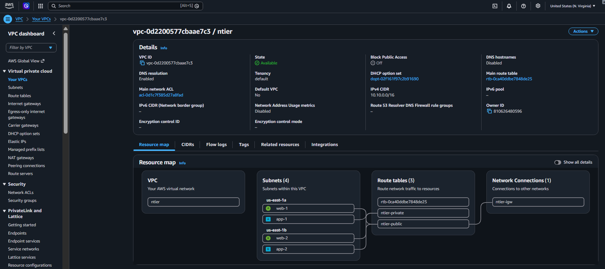

---